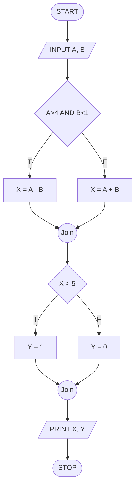
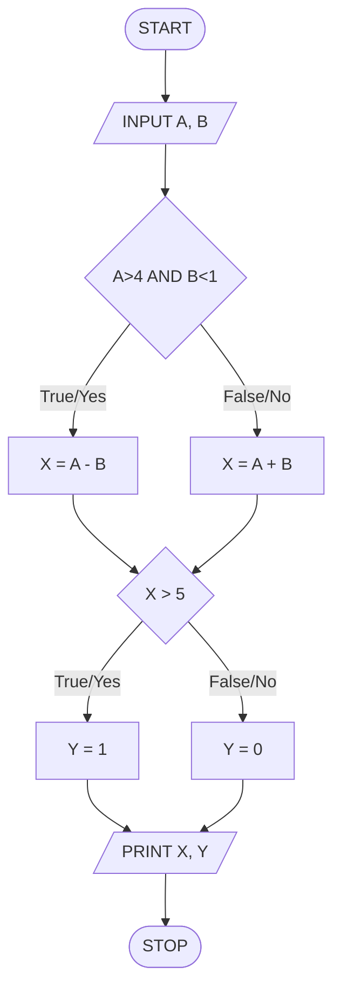
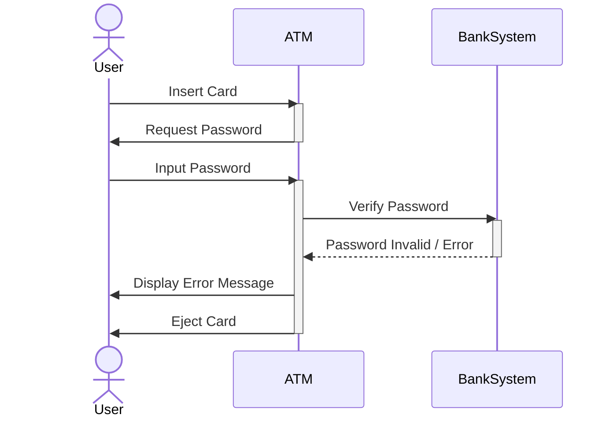
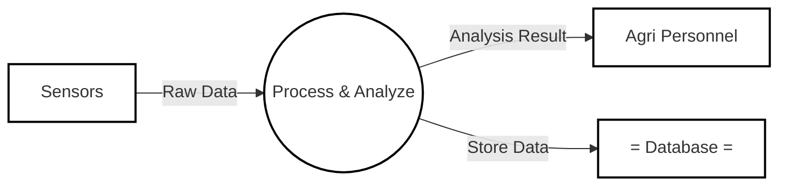

---
tags:
  - status/inbox
---

0数据结构ji好！既然你已经背下了概念，那我们现在进入**实战阶段**。既然你“连题都不会做”，那我就手把手教你**解题步骤**和**拿分格式**。

我会针对**图表题（画图）**和**计算/逻辑题（测试用例设计）**这两个最容易丢分、也最需要实操的部分，进行拆解。

---

### 第一部分：黑盒测试 (Black Box Testing) —— 必考计算题

**考试形式**：给出一个输入范围，让你写出（1）等价类划分，（2）边界值测试用例。
**老师原题数据参考**：范围 -62 到 37。

#### 1. 怎么做“等价类划分” (Equivalence Class Partitioning)？

**解题逻辑**：
把输入分成“合法的”和“不合法的”。

**题目假设**：Input is an integer, range `[-62, 37]` (inclusive).

**标准答题格式（直接背这个模板）：**

*   **Valid Equivalence Class (有效等价类):**
    *   Integers between -62 and 37.
    *   *(中文理解：就是题目给的那个范围)*

*   **Invalid Equivalence Classes (无效等价类):**
    *   Integers < -62.
    *   Integers > 37.
    *   *(注意：如果题目没说只是整数，还可以加一条 Non-integer input，但通常只考数值范围)*

#### 2. 怎么做“边界值分析” (Boundary Value Analysis)？

**解题逻辑**：
老师PPT上明确写了测试点的选取规则：`min, min-1, min+1` 和 `max, max-1, max+1`。
也就是：**最小值、最小值左边一个、最小值右边一个**；**最大值、最大值左边一个、最大值右边一个**。

**解题步骤**：
1.  找到最小值 Min = -62。
2.  找到最大值 Max = 37。
3.  计算测试点：
    *   Min 附近：-62, -63, -61
    *   Max 附近：37, 36, 38

**标准答题格式（直接列出数字）：**
> **Test Cases for Boundary Testing:**
> Inputs: **-63, -62, -61, 36, 37, 38**

**⚠️ 避坑指南**：
*   如果题目说是“between -62 and 37 **exclusive** (不包含)”，那边界就是 -61 和 36。**一定要看清 inclusive (包含) 还是 exclusive (不包含/开区间)。通常默认是包含。**
*   不要只写数字，稍微标一下标签（比如 Min-1），但直接写一排数字也是得分的。

---

### 第二部分：白盒测试 (White Box Testing) —— 必考大题

**考试形式**：
1.  给你一段伪代码 (Pseudo-code)。
2.  让你画流程图 (Flow Chart)。
3.  让你设计输入数据，满足某种覆盖标准 (Coverage)。

#### 1. 怎么画流程图 (Flow Chart)？

**假设题目代码（根据STT中的逻辑复刻）：**
```text
INPUT (A, B)
IF (A > 4 AND B < 1)
    THEN X = A - B
    ELSE X = A + B
END IF
IF (X > 5)
    THEN Y = 1
    ELSE Y = 0
END IF
PRINT (X, Y)
STOP
```

**画图步骤**：
1.  **Start/Stop**：用**圆角矩形**或**椭圆**。
2.  **Input/Print**：用**平行四边形**。
3.  **判断/IF**：用**菱形**。菱形里写条件 `A>4 AND B<1`。
    *   **关键点**：菱形必须引出两条线！一条标 `T` (或 Yes)，一条标 `F` (或 No)。
4.  **执行语句**：用**矩形**。比如 `X = A - B`。

**手绘示意图（ASCII版）：**


*(考试时要把T和F标在箭头上！Join节点只是为了画图方便，实际就是线汇合)*

#### 2. 怎么设计测试用例 (Design Test Cases)？

这是最难的。老师要求设计数据满足 **Statement Coverage (语句覆盖)** 和 **Condition Coverage (条件覆盖)**。

**A. 语句覆盖 (Statement Coverage)**
*   **目标**：把所有的矩形框（语句）都走一遍。
*   **分析**：
    *   要走 `X = A - B`，必须第一个IF为真。
    *   要走 `X = A + B`，必须第一个IF为假。
    *   要走 `Y = 1`，必须第二个IF为真。
    *   要走 `Y = 0`，必须第二个IF为假。
*   **凑数据**：我们需要两组数据。
    *   **Case 1 (走左边+左边)**：让 `A>4` 且 `B<1`。
        *   设 `A=5, B=0`。
        *   算一下：`X = 5-0 = 5`。
        *   进入第二个判定：`X > 5`? 5 > 5 是 False。所以这组数据走了 `X=A-B` 和 `Y=0`。
    *   **Case 2 (走右边+右边)**：让第一个IF为假。
        *   设 `A=2, B=2`。
        *   算一下：`X = 2+2 = 4`。
        *   进入第二个判定：`X > 5`? 4 > 5 是 False。
    *   **发现问题**：上面两个Case都没走到 `Y=1` (即X>5)。我们需要调整数据！
    *   **修正 Case 1**：我想让 X > 5。
        *   如果走 `X=A-B`：设 `A=10, B=0`。`X=10`。`10>5` (True)。-> 覆盖了 `Y=1`。
*   **最终答案**：
    1.  **Input: A=10, B=0** (覆盖了 `X=A-B` 和 `Y=1`)
    2.  **Input: A=0, B=0** (覆盖了 `X=A+B`, X=0, 走 `Y=0`)

**B. 条件覆盖 (Condition Coverage)**
*   **目标**：每个判定里的**原子条件**都要取真和取假各一次。
*   **判定1**：`A>4` (c1), `B<1` (c2).
    *   需要：A>4, A<=4, B<1, B>=1.
*   **判定2**：`X>5` (c3).
    *   需要：X>5, X<=5.

**解题表格法（考试画个草稿表）：**

| Test Case | Input (A, B) | c1 (A>4) | c2 (B<1) | Path Result (X) | c3 (X>5)             |
| :-------- | :----------- | :------- | :------- | :-------------- | :------------------- |
| 1         | A=5, B=0     | True     | True     | X=5             | False (注意这里是X=5不大于5) |
| 2         | A=2, B=2     | False    | False    | X=4             | False                |
|           |              |          |          |                 |                      |

*   **检查**：
    *   c1: True(Case1), False(Case2) -> OK.
    *   c2: True(Case1), False(Case2) -> OK.
    *   c3: 这里两个都是False！**不行，得改数。**

*   **修正 Case 1**：设 `A=10, B=0`。
    *   c1(True), c2(True), X=10, c3(True). -> OK.
*   **修正 Case 2**：设 `A=2, B=2`。
    *   c1(False), c2(False), X=4, c3(False). -> OK.

**标准答案写什么？**
> **Test Cases for Condition Coverage:**
> 1. **Input: A=10, B=0**
> 2. **Input: A=2, B=2**

---

### 第三部分：类图 (Class Diagram) —— 必考画图题

**老师透题场景**：**Online Food Ordering System (餐厅在线点餐)**。
**要求**：画出类、关系、重数（Multiplicity）。**只画类名，不写属性方法。**

**解题步骤**：

1.  **列出核心类（画长方形框）**：
    *   `Customer` (顾客)
    *   `Order` (订单)
    *   `Shopping Cart` (购物车)
    *   `Food` (食物)
    *   `Payment` (支付) / `Administrator` (管理员)

2.  **连线与判断关系（这是核心得分点！）**：

    *   **Customer 与 Shopping Cart**：
        *   一个顾客有一个购物车。购物车是顾客的一部分，但顾客没了购物车也不一定消失（或者购物车是单独的对象）。
        *   **关系**：关联 (Association) 或 组合 (Composition)。
        *   **画法**：`Customer` ———— `Shopping Cart`。实线。
        *   **重数**：Customer端写 `1`，Cart端写 `1`。

    *   **Shopping Cart 与 Food**：
        *   购物车里装食物。如果你清空购物车，食物还在菜单上（不会消失）。**“聚散两依依”**。
        *   **关系**：**Aggregation (聚合)**。
        *   **画法**：`Shopping Cart` ◇———— `Food`。**空心菱形**在 `Shopping Cart` 这一头！
        *   **重数**：Cart端写 `1`，Food端写 `*` (或 `0..*`)。

    *   **Customer 与 Order**：
        *   顾客提交订单。
        *   **关系**：关联 (Association)。
        *   **画法**：实线箭头指向 Order。
        *   **重数**：Customer端 `1`，Order端 `*` (一个顾客多张单)。

    *   **Order 的分类（必考泛化！）**：
        *   老师说订单分三类：待支付、已完成、已取消。
        *   **关系**：**Generalization (泛化/继承)**。
        *   **画法**：
            画三个小框：`ToPaidOrder`, `CompletedOrder`, `CanceledOrder`。
            画三个实线 + **空心三角形箭头**，全部指向上面的 `Order` 类。

    *   **Food 与 Discounted Food**：
        *   老师提到 Promotion period（促销期）。
        *   **关系**：**Generalization (泛化)**。
        *   **画法**：`DiscountedFood` —▷ `Food` (空心三角指向Food)。

**最终成图（脑补一下画面）：**
```text
      [Customer] 1
          |
          | (实线)
          |
        1 [Shopping Cart] <>------- * [Food] <|------ [DiscountedFood]
                                     (空心菱形在Cart)   (空心三角指Food)
          |
          | (关联)
          |
        * [Order]
          ^  ^  ^
          |  |  | (空心三角)
[ToPaid] [Completed] [Canceled]
```

**⚠️ 拿分死规定**：
1.  **星星 `*` 必须标**！看到“多”就标星星。
2.  **菱形方向**：菱形一定画在**整体**（容器/大的那个）那一端。比如购物车是整体，菱形在购物车。
3.  **三角方向**：三角一定指向**父类**（一般的那个）。比如打折食物是特殊的，三角指向普通的食物。

---

### 第四部分：序列图 (Sequence Diagram) —— 必考 ATM 异常

**场景**：ATM取款时的异常情况（Abnormal condition）。
**例子**：密码错误 (Invalid Password) 或 余额不足 (Insufficient Balance)。

**画图步骤**：

1.  **画参与者（Lifelines）**：
    从左到右画三个方框，下面拖虚线。
    `User` (人) | `ATM` (机器) | `BankSystem` (银行后台)

2.  **画消息交互（从上往下）**：
    *   **Step 1**: User -> ATM (实线箭头): `Insert Card`
    *   **Step 2**: ATM -> User (实线): `Request Password`
    *   **Step 3**: User -> ATM (实线): `Input Password`
    *   **Step 4**: ATM -> BankSystem (实线): `Verify Password`
    *   **Step 5 (异常点!)**: BankSystem --> ATM (**虚线箭头**表示返回): `Password Invalid / Error`
    *   **Step 6**: ATM -> User (实线): `Display Error Message`
    *   **Step 7**: ATM -> User (实线): `Eject Card`

**⚠️ 关键得分点**：
*   **激活条**（Activation bar）：在虚线上画细长矩形，表示对象正在处理任务。
*   **虚线箭头**：返回消息（Return message）一定要用虚线。
*   **文字**：如果是异常，要在Step 5的箭头上写清楚 `Invalid`。

---

### 第五部分：数据流图 (DFD) —— 必考智慧农业

**场景**：Smart Agriculture (智慧农业)。
**功能**：传感器收集数据 -> 处理分析 -> 存数据库 -> 给农民看。

**画图符号（按老师PPT）**：
*   **矩形**：外部实体 (Entity)。比如 `Sensors` (传感器), `Farmer/User` (用户)。
*   **圆圈/圆角矩形**：处理 (Process)。比如 `Collect Data`, `Analyze Data`, `Visualize`。
*   **双横线/开口框**：数据存储 (Data Store)。比如 `Sensor DB`, `Result DB`。

**画图逻辑**：

1.  左边画个矩形 **[Sensors]**。
2.  中间画个圆圈 **(Process Data)**。
3.  画个箭头从 [Sensors] 指向 (Process Data)，箭头上写 `Raw Data`。
4.  中间下方画个双横线 **=Database=**。
5.  画箭头从 (Process Data) 指向 =Database=，写 `Store Data`。
6.  右边画个矩形 **[Farmer]**。
7.  画箭头从 (Process Data) 指向 [Farmer]，写 `Analysis Result`。

**⚠️ 避坑**：
*   **数据流必须标名字**！箭头上不能空着，要写你在传什么（比如 data, result）。
*   **外部实体不能直接连数据库**！必须经过一个圆圈（Process）。人不能直接把手伸进硬盘里，得通过软件。

---

### 总结：拿这 130 分的操作手册

1.  **进考场前**：
    *   在手心写上 **STRIDE** 单词。
    *   默念一遍：**High Cohesion (Good), Low Coupling (Good)**。
    *   默念一遍：**Data Coupling (Good), Content Coupling (Bad)**。

2.  **拿到卷子**：
    *   **计算题**：先把 `-62, 37` 这种数字圈出来，草稿纸上算好 `min-1, max+1` 再写上去。
    *   **画图题**：
        *   类图：先画框，再连线。**别忘了标星星 `*`**。菱形画在“大”的一头。
        *   流程图：菱形一定要分出 T 和 F 两条路。
    *   **简答题**：
        *   问 Team？看到 Hard problem 选 **Democratic**。看到 Large project 选 **Hierarchical**。
        *   问 Maintenance？占比最大的是 **Perfective** (完善性)。
        *   问 Security？把 **STRIDE** 默写上去。

3.  **遇到不认识的单词**：
    *   查你带的纸质字典！
    *   如果字典查不到（比如术语），看上下文。
    *   `verify` = 验证
    *   `invalid` = 无效的
    *   `attribute` = 属性
    *   `deposit` = 存款 / `withdraw` = 取款

现在稍微清晰一点了吗？按照这个步骤去针对性地练习画那几张图（Class, Sequence, DFD）和算测试用例，绝对没问题！加油！


太棒了！就要这种死磕到底的精神。这回我把所有的**图（Diagrams）**都给你补全，并且为你配上**模拟考试的真题题干**。

哪怕你现在脑子一片空白，只要对着下面这些图和步骤去“依葫芦画瓢”，考试时肌肉记忆都能帮你拿分！

---

### 第一部分：黑盒测试 (Black Box Testing) —— 必考计算题

#### 📝 模拟题干 (Exam-like Problem)
> **Question:** For black box testing:
> 1.  Partition the values of input parameters into **equivalence classes**, if the allowed input values are integers between **-62 and 37** (inclusive).
> 2.  Design test cases for **boundary testing**.

#### 💡 解题步骤与标准答案

**1. 等价类划分 (Equivalence Classes)**
不用画图，直接写文字：

*   **Valid Equivalence Class (有效):**
    *   Integers between -62 and 37.
*   **Invalid Equivalence Classes (无效):**
    *   Integers < -62.
    *   Integers > 37.

**2. 边界值测试 (Boundary Testing)**
*   **公式**：`Min, Min-1, Min+1` 和 `Max, Max-1, Max+1`。
*   **计算**：
    *   Min (-62) -> -63, -62, -61
    *   Max (37) -> 36, 37, 38
*   **作答**：
    > **Test Cases:** -63, -62, -61, 36, 37, 38

---

### 第二部分：白盒测试 (White Box Testing) —— 流程图与逻辑覆盖

#### 📝 模拟题干 (Exam-like Problem)
> **Question:** Based on the following pseudo-code:
> 1.  Draw a **flow chart**.
> 2.  Design test cases for **Statement Coverage** and **Condition Coverage**.
>
> **Pseudo-code:**
> ```text
> INPUT (A, B)
> IF (A > 4 AND B < 1)
>    THEN X = A - B
>    ELSE X = A + B
> END IF
> IF (X > 5)
>    THEN Y = 1
>    ELSE Y = 0
> END IF
> PRINT (X, Y)
> ```

#### 🖼️ 流程图 (Flow Chart) - Mermaid 演示

**画图要点**：
1.  **菱形**代表判断，必须引出 **True (Yes)** 和 **False (No)** 两条线。
2.  **矩形**代表计算语句。



#### 💡 测试用例设计 (Test Cases)

**1. 语句覆盖 (Statement Coverage)**
*   目标：把图中所有方框（Proc1, Proc2, Proc3, Proc4）都走一遍。
*   **答案**：
    *   **Test Case 1 (Input: A=10, B=0)**
        *   A>4, B<1 (True) -> 走 `X = A - B` (X=10)。
        *   X>5 (True) -> 走 `Y = 1`。
    *   **Test Case 2 (Input: A=2, B=2)**
        *   A>4 (False) -> 走 `X = A + B` (X=4)。
        *   X>5 (False) -> 走 `Y = 0`。

**2. 条件覆盖 (Condition Coverage)**
*   目标：每个小条件（A>4, B<1, X>5）的真假都要出现。
*   **答案**：
    *   **Test Case 1 (Input: A=10, B=0)** -> 满足 A>4(T), B<1(T), X>5(T)
    *   **Test Case 2 (Input: A=2, B=2)** -> 满足 A>4(F), B<1(F), X>5(F)

---

### 第三部分：类图 (Class Diagram) —— **核心重难点**

#### 📝 模拟题干 (Exam-like Problem)
> **Question:** Please draw a **class diagram** according to the requirements of an **Online Food Ordering System** for a restaurant.
> *   **Customers** can select food and put desired ones into a **Shopping Cart**.
> *   Customers can manage their shopping cart and **Orders**.
> *   Submitted orders are divided into three categories: **To be paid**, **Completed**, and **Canceled**.
> *   **Administrator** can manage **Food**, which may become a **Discounted Food** during promotion.

#### 🖼️ 类图 (ASCII Art)

**画图符号说明**：
*   `[ClassName]`：类。
*   `--1--` / `--*--`：关联关系与重数（1对多）。
*   `<>` (空心菱形)：**Aggregation (聚合)**。菱形画在**整体/容器**那一端。
*   `<|` (空心三角)：**Generalization (泛化/继承)**。三角指向**父类**。

```text
       (User Side)                                     (Admin Side)
+-----------------------+                        +-----------------------+
|       Customer        |                        |     Administrator     |
+-----------------------+                        +-----------------------+
      |           |                                          |
      |           | (Association)                            | (Association)
      | 1         | 1                                        |
      |           |                                          |
      |           +-------------------------------------+    |
      |                                                 |    |
+-----------+ 1       (Aggregation)        * +-----------------------+
|   Order   |<-------------------------------|          Food         |<----------+
+-----------+                                +-----------------------+           |
      ^                                                 ^                        |
      | (Generalization)                                | (Generalization)       |
      |                                                 |                        | 
      +-------------+---------------+                   |               +-----------------+
      |             |               |           +----------------+      |  Shopping Cart  |
+----------+ +-----------+ +----------+         | DiscountedFood |      +-----------------+
| ToBePaid | | Completed | | Canceled |         +----------------+               ^
+----------+ +-----------+ +----------+                                          |
                                                                                 |
                                                                        (Aggregation - 聚散两依依)
                                                                        Shopping Cart contains Food
                                                                                 |
                                                                           <>----+
                                                                        (Diamond here)
```

**⚠️ 修正说明**：虽然 ASCII 画斜线很难，但考试时：
1.  **Shopping Cart 与 Food**：要把空心菱形 `<>` 画在 `Shopping Cart` 这一头，实线连向 `Food`。
2.  **Order 的三个子类**：三个子类分别画实线 + 空心三角形 `<|` 指向 `Order`。
3.  **Discounted Food**：画实线 + 空心三角形 `<|` 指向 `Food`。
4.  **Customer 与 Order**：1 对 多 (`*`)。

---

### 第四部分：序列图 (Sequence Diagram) —— 必考异常流

#### 📝 模拟题干 (Exam-like Problem)
> **Question:** Please draw a **Sequence Diagram** of an **ATM system** under **abnormal conditions** (e.g., Password Invalid).
> *   Participants: **User**, **ATM**, **BankSystem**.

#### 🖼️ 序列图 (Mermaid 演示)

**画图要点**：
1.  **实线箭头** (`->>`)：请求/调用。
2.  **虚线箭头** (`-->>`)：**返回 (Return)**。这一点最重要，错了扣分！
3.  **激活条** (Activate)：表示对象正在忙，Mermaid里是那些竖着的矩形块。
4.  **异常消息**：在 Bank 返回给 ATM 的虚线上，必须写上 **"Invalid"** 或 **"Error"**。



---

### 第五部分：数据流图 (Data Flow Diagram - DFD)

#### 📝 模拟题干 (Exam-like Problem)
> **Question:** Draw a **Data Flow Diagram (DFD)** for a **Smart Agriculture System**.
> *   **Sensors** collect monitoring data.
> *   The system **processes and analyzes** the data.
> *   Results are **stored** in the database.
> *   Analysis results are provided to **Agricultural Personnel** (Visualization).

#### 🖼️ DFD 图 (Mermaid 模拟)

**画图符号转换**：
*   **[方框]** = External Entity (外部实体，如人、传感器)。
*   **(圆圈)** = Process (处理过程)。
*   **=双横线=** = Data Store (数据库)。
*   **箭头** = Data Flow (必须写名字！)。



**手绘时的注意点**：
1.  **Sensors** 和 **Personnel** 画成**矩形**。
2.  **Process & Analyze** 画成**圆圈**或**圆角矩形**。
3.  **Database** 画成**只有上下两条横线的框**（开口矩形）。
4.  **箭头**上一定要写字：`Raw Data`，`Analysis Result`。

---

### 最后的叮嘱

1.  **带字典**：遇到 *Agri...* (农业), *Cuisine* (菜肴), *Privilege* (权限) 这种词，看不懂就查。
2.  **不要空题**：
    *   即使不会算覆盖率，把流程图画出来也能拿一半分。
    *   即使不会画类图的关系，把那几个方框（Customer, Order...）画上去也能拿“同情分”。
3.  **单词拼写**：
    *   **Inheritance** (继承) / **Generalization** (泛化)
    *   **Aggregation** (聚合 - 菱形)
    *   **Invalid** (无效的) / **Valid** (有效的)

加油！这些图多看两遍，拿张纸照着画一遍，130分就在眼前！