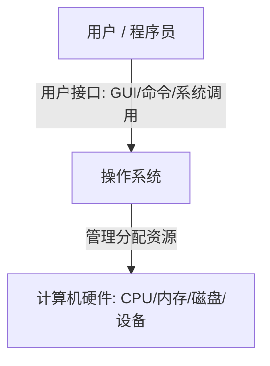
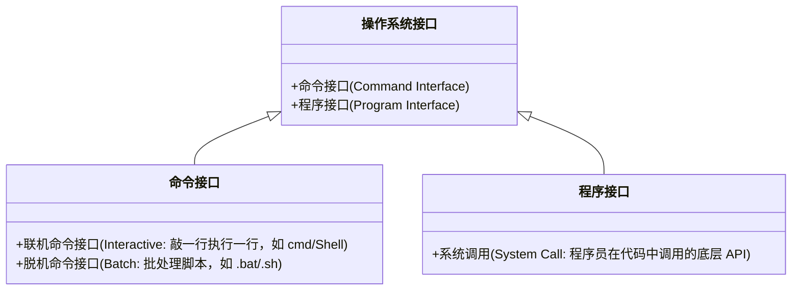
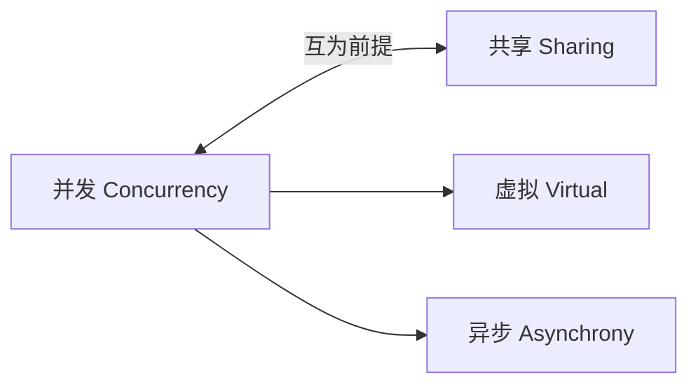

> [!abstract] 考点本质 (直击130分核心)
> 操作系统（OS）是软硬件之间的“大总管”。考研中对它的考查直指核心：
> 1. **它是什么**：系统资源的管理者，用户与硬件之间的接口。
> 2. **它有什么特征**：**并发、共享、虚拟、异步**。其中，**并发和共享是操作系统的最基本特征，互为存在前提**。
> 🎯 **做题铁律：区分“并发”与“并行”，理解“互斥共享”与“同时共享”的本质区别！**

---

### 一、 操作系统的概念与定位

#### 1. 什么是操作系统 (OS)？
操作系统是控制和管理整个计算机系统的**硬件与软件资源**，合理地组织调度计算机的工作和资源分配，并提供**给用户和其他软件方便接口**与环境的**系统软件**。

#### 2. 操作系统的系统定位
*   **承上启下**：对上提供安全、高效的运行环境与接口；对下直接掌控裸机硬件。
*   **资源大总管**：任何程序想用 CPU、存内存、读文件、用设备，都必须通过操作系统审批。

---

### 二、 操作系统的四大核心功能 (资源管理视角)

作为“大总管”，OS 必须管理以下四类软硬件资源：

#### 1. 处理机管理 (CPU 管理)
*   **本质**：解决“谁来上 CPU 运行，运行多久”的问题。
*   **功能**：进程控制、进程同步、进程通信、死锁处理，以及**处理器调度**（分时、抢占等）。

#### 2. 存储器管理 (内存管理)
*   **本质**：多道程序并发时，如何优雅地瓜分和保护有限的物理内存。
*   **功能**：内存分配与回收、地址转换（逻辑 ➜ 物理）、内存保护（防止进程越界窥探），以及**虚拟内存扩展**。

#### 3. 文件管理 (外存管理)
*   **本质**：解决数据在外存（磁盘/SSD）中如何存储、组织和查找。
*   **功能**：文件存储空间的管理、目录管理、文件的读写管理、文件保护与共享。

#### 4. 设备管理 (I/O 管理)
*   **本质**：解决 CPU 速度（极快）与 I/O 设备速度（极慢）之间的矛盾，实现设备共享。
*   **功能**：缓冲区管理、设备分配与回收、设备独立性、虚拟设备（SPOOLing）。

---

### 三、 操作系统作为接口 (用户视角)

操作系统为用户和程序员提供了三种访问其服务的接口：

> [!danger] 🚨 避坑警告：系统调用与库函数的区别
> 很多同学分不清 `printf()` 和系统调用的关系。
> *   **系统调用**：是 OS 提供的最底层、最纯粹的内核服务（比如写磁盘、发送网卡数据）。
> *   **库函数**：是编程语言（如 C 语言）对系统调用的二次封装。`printf()` 最终在底层调用了 `write` 系统调用。
> *   **注意**：**并非所有库函数都会触发系统调用**（如 `abs()` 纯算术函数不需要操作系统插手，而 `malloc()` 申请内存则必须触发系统调用）。

---

### 四、 操作系统的四大特征 (高频命题点❗)

操作系统的四大特征：**并发、共享、虚拟、异步**。

#### 1. 并发 (Concurrency) 与并行 (Parallelism)
*   **并发**：指两个或多个事件在**同一时间段内**交替发生（宏观上同时运行，微观上分时交替）。
*   **并行**：指两个或多个事件在**同一时刻**同时发生（需要多核/多处理机硬件支持）。
*   **考研考点**：单核 CPU 只能**并发**，多核 CPU 可以**并行**。

#### 2. 共享 (Sharing)
指系统中的资源可供内存中多个并发执行的进程共同使用。
*   **互斥共享**：同一时间段内，某资源**只允许一个**进程访问。这种资源称为**临界资源**（如打印机、物理内存中的私有变量）。
*   **同时共享**：同一时间段内，允许多个进程“同时”访问（微观上可能是交替访问，如磁盘、只读文件）。

#### 3. 虚拟 (Virtual)
指把一个物理实体变为若干个逻辑上的对应物。
*   **空分复用技术**：如**虚拟内存**。物理内存只有 16GB，但通过虚拟技术可以让 4 个 8GB 的程序同时跑，感觉上每个程序都独占了极大的空间。
*   **时分复用技术**：如**虚拟处理器**。单核 CPU 通过时钟中断分时轮转，让多个用户感觉自己独占了一个 CPU。

#### 4. 异步 (Asynchrony)
*   **概念**：多道程序环境下，允许多个程序并发执行，但由于资源受限，进程的执行不是一气呵成的，而是以**“停停走走、速度不可预知”**的方式向前推进。
*   **影响**：可能导致执行结果出现**“不确定性”**，因此操作系统必须提供进程同步与互斥机制来约束这种异步性。

---

### 👑 985高分必杀技：并发与共享的“辩证关系”

在 408 选择题中，经常会考察四大特征之间的制约与依赖关系：
1. **并发与共享是操作系统的两个最基本特征**，两者互为存在的前提！
   *   **没有并发，就谈不上共享**（如果同一时间只有一个程序在跑，资源转换根本不需要“共享”给别人）。
   *   **没有共享，并发也无法进行**（如果资源无法共享，多个程序就无法同时装入内存并发执行）。
2. **虚拟以并发为前提**：如果没有并发运行的程序，就没必要把一个物理资源虚拟成多个。
3. **异步以并发为前提**：正是因为并发程序在争抢有限的系统资源，才会导致它们向前推进的速度时快时慢，呈现异步性。

**💡 总结口诀：**
> **并发共享是地基，没有并发共享熄。**
> **虚拟需要并发引，异步源自并发挤。**
