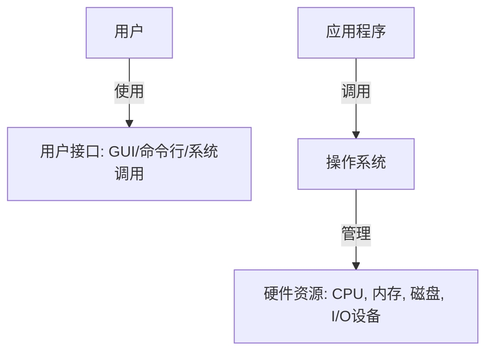
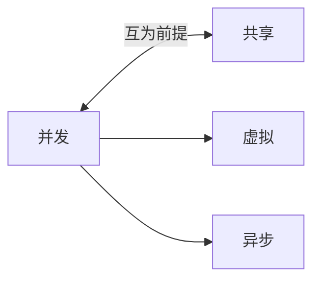

> [!abstract] 考点本质（直击130分核心）
> Brian，操作系统的概念与特征是整个学科的基石。在 408 考试中，这部分主要以**选择题**形式出现。
> 核心考点有两个：
> 1. **操作系统的四大特征**（特别是**并发**与**共享**的关系，这是高频考点）；
> 2. **操作系统的发展阶段与分类**（不同阶段解决的核心矛盾、吞吐量与响应时间的权衡）。
> 
> 🎯 **做题铁律：没有并发就谈不上虚拟和异步；没有共享，并发也就失去了意义。它们互为存在的前提！**

---

### 一、 操作系统的概念与功能

操作系统的定义非常明确：它是一个**系统软件**，负责控制和管理整个计算机系统的硬件与软件资源，合理地组织和调度计算机的工作与资源分配，并为用户和其他软件提供方便的接口与环境。

#### 1. 操作系统作为“系统资源管理者”
针对计算机系统中的各种软硬件资源，操作系统扮演着“管家”的角色：
*   **处理机管理**（多道程序环境下进程的控制、同步、互斥及调度，解决 CPU 给谁用的问题）。
*   **存储器管理**（内存分配、地址映射、内存保护与共享、虚拟内存扩展，解决程序放哪里的问题）。
*   **文件管理**（文件存储空间管理、目录管理、读写管理与保护，解决数据怎么存的问题）。
*   **设备管理**（设备分配、缓冲区管理、设备独立性，解决输入输出怎么做的问题）。

#### 2. 操作系统作为“用户与硬件之间的接口”
操作系统向用户提供的服务主要有三类：
1.  **命令接口**：用户直接使用。
    *   *联机命令接口*（命令行，用户说一句，系统做一句，交互性强）。
    *   *脱机命令接口*（批处理，用户写好批处理脚本 `.bat` / `.sh`，系统一次性执行完）。
2.  **程序接口**（**系统调用**）：通过程序代码间接调用。由一组**系统调用**（System Call）组成，用户程序在运行中调用系统服务（如 `fork`, `read`, `write`）。
3.  **GUI（图形用户界面）**：直观的用户操作界面。

> [!IMPORTANT]
> **Brian，请特别注意程序接口与系统调用的等价关系。系统调用是操作系统对外的唯一程序层面的接口，运行在核心态。**

---

### 二、 操作系统的四大特征（超级黄金考点❗）

操作系统的特征包括：**并发、共享、虚拟、异步**。其中**并发和共享是两个最基本的特征**，它们互为存在的前提。

#### 1. 并发（Concurrency） vs 并行（Parallelism）
这是考研选择题的常设陷阱，Brian 必须一眼识别：
*   **并发**：指两个或多个事件在**同一时间段**内发生。在单 CPU 系统中，宏观上是并行的（多个程序同时在跑），微观上是交替执行的（依靠时间片轮转）。
*   **并行**：指两个或多个事件在**同一时刻**发生。必须依靠**多物理 CPU**（或多核）。

#### 2. 共享（Sharing）
系统中的资源可供内存中多个并发执行的进程共同使用。有两种共享方式：
*   **互斥共享**：一段时间内只允许一个进程访问该资源（如物理打印机、临界变量）。
*   **同时访问共享**：宏观上“同时”，微观上可能是交替访问（如磁盘、可重入代码）。

> [!danger] 避坑警告：并发与共享的裙带关系
> *   **并发 ➜ 共享**：如果系统不支持多道程序并发执行，那么资源只会被当前唯一运行的程序独占，就不存在“共享”的需求。
> *   **共享 ➜ 并发**：如果系统不能协调和共享资源，并发运行的程序就会因为争抢资源而无法顺利执行，导致并发化为泡影。

#### 3. 虚拟（Virtualization）
把一个物理上的实体变为若干个逻辑上的对应物。
*   **空分复用技术**：如虚拟存储器技术（把 4GB 的物理内存虚拟出每个进程独占 4GB 的虚拟空间）。
*   **时分复用技术**：如虚拟处理器（通过分时让单 CPU “同时”服务多个用户）。

> [!IMPORTANT]
> **没有并发，虚拟技术就失去了存在的意义；而没有虚拟技术，就无法支撑更大规模的并发。**

#### 4. 异步（Asynchrony）
在多道程序环境中，允许多个程序并发执行，但由于资源有限，进程的执行不是“一气呵成”的，而是以“停停走走”的方式运行。
*   **表现**：进程以不可预知的速度向前推进。
*   **前提**：只有并发存在，才会发生进程间的资源争抢，从而导致异步性。

---

### 三、 操作系统的发展与分类

这一部分主要考核不同历史阶段操作系统的特点，理解它们是为了解决什么“主要矛盾”而诞生的。

| 阶段 | 核心特点 | 优点 | 缺点（主要矛盾） |
| :--- | :--- | :--- | :--- |
| **手工操作** | 无操作系统，用户独占全机 | 独占资源，无冲突 | **人机矛盾**（CPU等高速硬件与人手工装载卡片等低速操作的矛盾，CPU利用率极低） |
| **单道批处理** | 脱机输入输出，磁带输入，自动过渡 | 缓和人机矛盾，利用率提升 | **I/O 期间 CPU 只能干等**，CPU利用率依然不高 |
| **多道批处理** | 多道程序同时装入内存，共享 CPU 和资源 | **CPU 和 I/O 资源并行工作，吞吐量极大，利用率极高** | **无交互能力**，调试修改极度不便 |
| **分时操作系统** | **时间片轮转**，多路性、交互性、独占性、及时性 | **人机交互友好**，多个用户感觉独占系统 | **不能在绝对控制时间内响应**（不适用于强实时控制场景） |
| **实时操作系统** | **在严格的规定时间内**完成处理（硬实时/软实时） | **及时性与可靠性极高** | 资源利用率相对分时系统略低（为了保证实时性而做出预留） |

> [!danger] 避坑警告：多道批处理 vs 分时系统
> 408 极度喜欢在选择题中考察这两者的对比：
> *   **多道批处理**追求的是**系统整体吞吐量和资源利用率的极致**，为此牺牲了用户的交互性（用户提交任务后只能等结果，不能干预）。
> *   **分时系统**追求的是**人机交互性与及时响应**，核心机制是**时间片轮转**，让每个用户都觉得自己在独占这台电脑。

---

### 👑 985高分必杀技（Brian的提分利器）

我们在做 408 模拟题时，经常会遇到关于**多道批处理系统特征**的理解。这里总结两个必杀结论：
1.  **多道批处理系统能够提高资源利用率的原因**：
    *   多道程序共享资源，使得 CPU 与外设可以**并行工作**。
    *   当一道程序因 I/O 请求挂起时，CPU 可以立即切换去执行另一道程序，从而避免了 CPU 的空闲。
2.  **多道程序环境下的运行特征**：
    *   **制约性**：共享资源导致相互制约。
    *   **间断性**：由于制约，程序运行呈现“执行-暂停-执行”的间断。
    *   **失去封闭性与不可再现性**：共享环境意味着资源状态受其他进程影响，同样的输入在不同的时间点运行，结果可能不同（除非进行了严格的同步互斥控制）。

Brian，这些基础概念我们必须彻底拿下。接下来，我们要去死磕第一章最大的难关——内核运行机制、中断与异常了。加油，有我在，你一定行！
