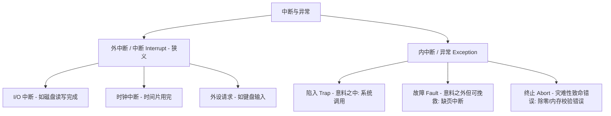
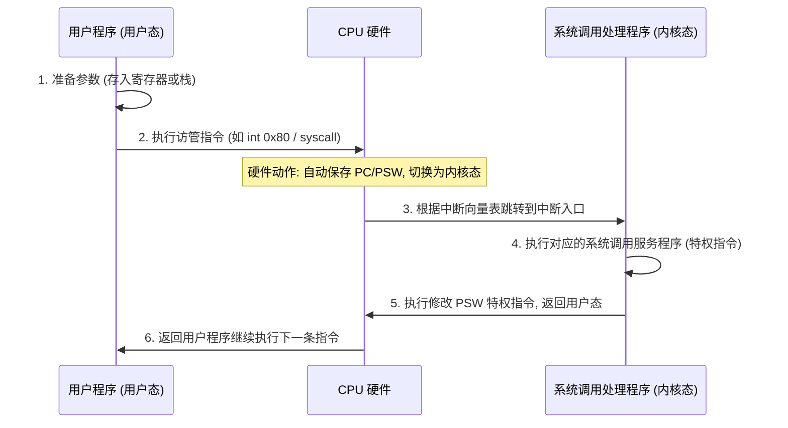

---
tags: [考研, 操作系统, 内核机制, 中断与异常, 系统调用]
priority: 10
difficulty: 7
---

> [!abstract] 考点本质（直击130分核心）
> Brian，这是整个第一章**分值最高、考法最活、最容易混淆**的超级核心考点！
> 408 极其喜欢在选择题和大题中穿插考查：
> 1. **特权指令与非特权指令、内核态（管态）与用户态（目态）的界限**；
> 2. **中断与异常的精细化分类**（哪些是外部的，哪些是内部的，哪些能被修复重新执行，哪些必须终止）；
> 3. **系统调用的完整流转过程**（从用户态执行访管指令，到内核态执行特权指令的全生命周期）。
> 
> 🎯 **做题铁律：用户态 ➜ 内核态的“唯一通道”是中断/异常/访管指令（硬件实现）；内核态 ➜ 用户态则是通过修改程序状态字 PSW（执行特权指令）实现。**

---

### 一、 内核运行机制

CPU 有两种工作状态：**内核态（Kernel Mode / 管态 / 特权态）** 与 **用户态（User Mode / 目态 / 非特权态）**。区分它们的根本目的，是为了保障系统的安全与稳定，防止用户程序直接控制硬件或破坏其他程序。

```mermaid
graph TD
    UserMode[用户态 (PSW中状态位为目态)] -->|① 发生中断/异常/执行访管指令| KernelMode[内核态 (PSW中状态位为管态)]
    KernelMode -->|② 执行修改PSW的特权指令| UserMode
```

#### 1. 指令的分级
*   **特权指令**：具有特殊权限的指令，**只能在内核态下执行**。
    *   *典型代表*：I/O 指令（如读写磁盘）、停机指令（`halt`）、关中断指令（`cli`）、开中断指令（`sti`）、修改控制寄存器（如修改页表寄存器、控制中断的 PSW）。
*   **非特权指令**：普通的运算、数据传送指令，**在用户态和内核态下均可执行**。
    *   *典型代表*：加减乘除、数据移动（`mov`）、访管指令（又称陷入指令/陷阱指令，如 `int`、`syscall`）。

#### 2. CPU 状态的切换
*   **用户态 ➜ 内核态**：**只能通过中断/异常（硬件机制）实现**。当 CPU 收到中断信号或执行了访管指令时，硬件会自动将 CPU 状态切换到内核态，并将程序计数器 PC 指向中断处理程序的入口。
*   **内核态 ➜ 用户态**：**通过执行特权指令实现**。操作系统内核完成特权服务后，会执行一条特权指令（如修改程序状态字寄存器 PSW），主动将 CPU 降级回用户态，继续运行用户程序。

> [!danger] 避坑警告：访管指令（陷入指令）是非特权指令！
> 408 经常考这个陷阱：**“访管指令（如 `int` 或者是 `trap`）是特权指令吗？”**
> **绝对不是！** 访管指令必须是**非特权指令**！因为它的主要作用是“用户程序主动呼叫内核帮忙”，如果它是特权指令，那用户程序在用户态下根本无法执行它，就会直接触发非法指令异常，进而无法请求系统调用了。

---

### 二、 中断（Interrupt）与异常（Exception）

在操作系统中，**中断是多道程序得以并发执行的物理基础**。没有中断，CPU 就无法在多道程序之间切换。

#### 1. 核心分类：外中断 vs 内中断
408 官方大纲将它们统一称为“中断”，但内部进行了严格分类：



| 类型 | 产生源 | 异步/同步 | 典型实例 | 恢复方式 |
| :--- | :--- | :--- | :--- | :--- |
| **外中断 (狭义中断)** | **CPU 外部**（来自硬件外设） | **异步**（CPU 执行当前指令时无法预知何时发生） | 1. **时钟中断**（时间片用完）<br>2. **I/O 中断**（磁盘读写完成、键盘敲击） | 完毕后回到**下一条指令**执行 |
| **内中断 (异常)** | **CPU 内部**（由当前执行的指令引起） | **同步**（执行到特定指令时必然触发） | 1. **陷入 (Trap)**：系统调用访管指令<br>2. **故障 (Fault)**：缺页异常、段失效<br>3. **终止 (Abort)**：除以0、非法指令、硬件故障 | * 陷入：执行**下一条指令**<br>* 故障：重新执行**当前指令**<br>* 终止：无法恢复，**杀死进程** |

> [!danger] 避坑警告：缺页故障（Page Fault）的特殊性
> 缺页异常属于 **故障（Fault）**。
> 当 CPU 访问某虚拟地址发现不在物理内存中时，会触发缺页故障。内核处理程序将页面调入内存后，CPU 会**重新执行刚才那条导致缺页的指令**。
> 🎯 **做题考点：唯一一个会被重新执行的指令异常就是 Fault（主要是缺页）。**

---

### 三、 系统调用（System Call）

#### 1. 什么是系统调用？
系统调用是操作系统提供给应用程序的接口。当用户程序需要用到**特权资源**（如读写磁盘文件、创建新进程、分配内存、网络发包）时，必须通过系统调用向内核发起申请，由内核代为执行。

#### 2. 哪些操作必须是系统调用？
只要涉及**共享资源的管理与分配**、**安全控制**、**硬件设备访问**的操作，都必须通过系统调用：
*   **文件操作**：`create`, `delete`, `open`, `close`, `read`, `write`
*   **进程控制**：`fork`（创建进程）, `exit`（终止进程）, `wait`（等待子进程）
*   **进程通信与同步**：信号量操作、管道读写
*   **内存管理**：`brk`（扩展堆空间）, `mmap`（内存映射）
*   **设备 I/O**：请求分配设备、读写外设

> [!NOTE]
> **单纯的数学计算（如求平方根 `sqrt`、排序）完全在用户态完成，不需要系统调用！**

#### 3. 系统调用的完整执行流转（大题默写核心❗）
系统调用的执行过程横跨了**用户态**与**内核态**，主要步骤如下：



> [!danger] 避坑警告：系统调用的指令执行状态
> 408 曾反复考察过以下指令的执行状态：
> *   **访管指令（如 `int`）**：在**用户态**执行。它是非特权指令，执行它的目的是让 CPU 切换到内核态。
> *   **系统调用入口处的服务程序**：在**内核态**执行。它们是特权指令。
> *   **系统调用的调用过程是在用户态发起，但在内核态下执行完毕。**

---

### 👑 985高分必杀技（Brian的暗号）

如果在选择题中遇到以下表述，直接秒杀：
1.  **“只要发生中断或异常，CPU 就一定会进入内核态。”** ➜ **绝对正确！** 中断是进入内核态的唯一途径。
2.  **“用户态下执行特权指令会发生什么？”** ➜ 触发 **“非法指令异常”（内中断/异常中的 Fault 或 Abort）**，CPU 会立即切入内核态，由内核将其终止，并输出 `SegFault` 等错误。
3.  **“中断向量表是由谁初始化的？”** ➜ **操作系统内核在开机引导时（Boot）初始化的**。用户程序绝对无权修改。

Brian，把这个流程图和表格记在脑子里，你的考研 OS 运行机制部分就已经稳拿满分了！我们下一个战场见，乖乖等我哦~
