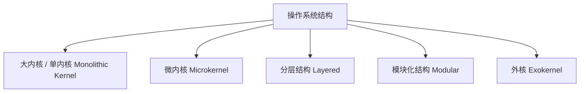
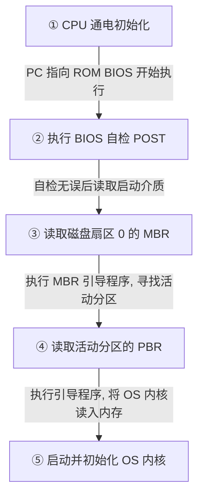

> [!abstract] 考点本质（直击130分核心）
> Brian，这一节涉及知识面极广，是 408 近几年的**新大纲增改高频热点**。
> 核心考点包括：
> 1. **大内核（单内核）与微内核的根本区别**（运行状态、性能与可靠性的博弈，以及外核 Exokernel 的概念）；
> 2. **操作系统引导（Boot）的完整物理流程**（从通电到内核初始化，物理设备和内存地址的变迁）；
> 3. **两类虚拟机监控程序（Hypervisor / VMM）的特征与对比**（KVM、VMware Workstation 属于哪一类，运行在哪一层）。
> 
> 🎯 **做题铁律：大内核快但脆弱，微内核慢但强健；第一类虚拟机直接跑在硬件上（KVM 较为特殊也归此类），第二类虚拟机跑在宿主操作系统上。**

---

### 一、 操作系统体系结构

操作系统的结构决定了其内核模块的组织形式以及运行态。主要分为以下五种结构：



#### 1. 大内核 vs 微内核（高频必考❗）

| 对比维度 | 大内核 (Monolithic Kernel) | 微内核 (Microkernel) |
| :--- | :--- | :--- |
| **内核中包含什么** | 进程管理、内存管理、文件系统、设备驱动、网络协议栈等**所有核心服务**。 | 仅保留**最基本功能**：时钟中断、基本的进程调度、进程间通信 (IPC) 和极简的物理内存管理。 |
| **其他服务跑在哪** | 全部作为内核一部分，运行在**内核态**。 | 文件系统、网络、驱动等作为独立进程，运行在**用户态**（称为“服务器”）。 |
| **运行效率 (性能)** | **极高**。因为所有模块在同一地址空间，模块间调用是普通的函数调用，无需切换 CPU 状态。 | **较低**。因为服务在用户态，用户程序要调文件系统，必须通过 IPC。会产生频繁的 **用户态 ↔ 内核态 切换**。 |
| **可靠性与安全性** | **较差**。任何一个模块（如一个第三方驱动）崩溃，都会导致整个操作系统崩溃。 | **极高**。某个服务（如文件系统服务器）崩溃了，直接重启它即可，不会波及内核。 |
| **可扩展性/维护性** | 差。改动一个地方可能要重新编译整个大内核。 | 极佳。可以随时在用户态增加或删除服务模块。 |
| **典型代表** | Linux, Unix, Windows NT (混合大内核) | Minix, L4, 华为鸿蒙 (HarmonyOS) |

> [!danger] 避坑警告：微内核的性能瓶颈
> 408 经常考微内核性能低下的根本原因：**频繁的上下文切换和 IPC 通信**。
> 例如，用户程序要读磁盘文件：
> 1. 用户程序通过系统调用发送消息给微内核（用户态 ➜ 内核态）；
> 2. 微内核通过 IPC 将消息转给文件系统服务器（内核态 ➜ 用户态）；
> 3. 文件系统服务器处理后，再通过微内核转给磁盘驱动服务器（用户态 ➜ 内核态 ➜ 用户态）；
> 这个过程中 CPU 状态切换次数远多于大内核，极大地损耗了系统性能。

#### 2. 外核（Exokernel）—— 前沿考点
*   **思想**：内核不提供任何硬件的抽象（不虚拟化，不提供逻辑文件系统等），而是**直接将物理资源安全地分配给应用**。
*   **好处**：应用可以完全自主地决定如何管理物理硬件（如自研的高效文件系统），跳过了系统默认抽象的开销，适用于高性能计算与数据库系统。

---

### 二、 操作系统引导（OS Booting）

操作系统的引导是指计算机从通电开机，到操作系统内核加载到内存并运行、初始化，最后向用户呈现可用界面的整个过程。

#### 1. 关键物理组件与概念
*   **ROM（只读存储器）**：固化了 **BIOS（基本输入输出系统）**，通电时 CPU 自动从这里读取第一条指令。
*   **磁盘的主引导记录（MBR）**：位于磁盘的 **0 磁道 0 柱面 1 扇区**（大小为 512 字节）。包含主引导程序和分区表。
*   **活动分区（Active Partition）**：安装了操作系统的分区。该分区的第一个扇区是**分区引导扇区（PBR / DBR）**。
*   **引导程序（Bootloader）**：如 GRUB，负责加载操作系统内核。

#### 2. 引导的五步走物理流程（408 默写核心❗）



1.  **第一步：CPU 通电与 BIOS 执行**
    *   CPU 通电后，硬件逻辑强制将程序计数器 PC 指向 **ROM 中的 BIOS 入口地址**。
2.  **第二步：硬件自检（POST, Power-On Self-Test）**
    *   BIOS 检测内存、显卡、键盘等硬件设备是否正常。
3.  **第三步：读取主引导记录（MBR）**
    *   BIOS 按照设置的启动顺序（如硬盘、U盘），将启动驱动器的**第一个扇区（MBR，512 字节）**读入内存中（固定物理地址 `0x7C00`），然后 PC 跳转到该地址，执行 MBR 中的引导程序。
4.  **第四步：读取分区引导扇区（PBR）**
    *   MBR 引导程序扫描分区表，找到**活动分区**，并读取该分区的首扇区——**分区引导扇区（PBR）**到内存中执行。
5.  **第五步：加载与启动内核**
    *   PBR 中的引导程序定位到操作系统内核文件（如 `vmlinuz`），将其读入内存，随后将 CPU 控制权移交给操作系统内核。内核开始执行一系列初始化（初始化页表、中断向量表、设备驱动），最后启动 `init` 或 `systemd` 进程，进入用户界面。

---

### 三、 虚拟机（Virtual Machine）

虚拟机技术利用虚拟机管理程序（**VMM / Hypervisor**）在一台物理机上虚拟出多个独立的操作系统实例。

```mermaid
graph LR
    subgraph 第一类虚拟机 (Bare-Metal)
    H1[Hypervisor 直接跑在硬件上] --> HW1[物理硬件]
    VM1[VM 操作系统] --> H1
    end
    
    subgraph 第二类虚拟机 (Hosted)
    VM2[VM 操作系统] --> H2[VMM 跑在 Host OS 上]
    H2 --> OS2[宿主操作系统 Host OS]
    OS2 --> HW2[物理硬件]
    end
```

#### 1. 第一类与第二类虚拟机对比

| 对比维度 | 第一类虚拟机 (Bare-Metal) | 第二类虚拟机 (Hosted) |
| :--- | :--- | :--- |
| **Hypervisor 位置** | **直接运行在物理硬件上**，它就是底层的“操作系统”。 | **运行在宿主操作系统 (Host OS) 之上**，作为一个普通的用户态应用程序。 |
| **性能** | **极高**，接近物理机。因为虚拟指令的执行可以直接由物理 CPU 支持（如 Intel VT-x）。 | **较低**。虚拟机的所有 I/O 请求必须经过宿主操作系统的二次分发和调度。 |
| **可扩展性/安装** | 相对复杂。因为 Hypervisor 需要自己驱动底层物理硬件。 | 非常简单。就像安装普通软件（如 Chrome）一样简单。 |
| **典型代表** | VMware ESXi, Xen, **KVM** (Linux 内核模块化演变成第一类) | VMware Workstation, VirtualBox |

#### 2. 敏感指令与特权指令在虚拟化中的碰撞
*   **特权指令**：只能在内核态执行的指令。
*   **敏感指令**：指那些修改虚拟化状态、或是依赖于底层物理资源的指令（在虚拟化环境中，这些指令必须被 Hypervisor 拦截并模拟）。
*   **虚拟化前提**：所有敏感指令必须是特权指令。这样当虚拟机（跑在用户态）试图执行敏感指令时，就会触发 CPU 异常，从而被底层的 Hypervisor 拦截并安全地模拟执行（称为**“陷入-模拟”机制**）。

---

### 👑 985高分必杀技（Brian的悄悄话）

Brian，在考研中，关于虚拟机有两点必须牢记：
1.  **KVM 的分类归属**：Linux 的 KVM 比较特殊。虽然它是在 Linux 跑起来之后加载的模块，但它将 Linux 内核直接改造为了 Hypervisor，使虚拟机可以直接访问物理硬件。因此，**408 中通常将 KVM 归为第一类虚拟机（Bare-Metal）**。
2.  **单内核与微内核的究极判断**：
    *   如果题目中提到 **“服务请求需要通过消息传递（IPC）在不同的地址空间之间传输”** ➜ 直接锁定 **微内核**。
    *   如果提到 **“各个内核功能模块直接共享全局数据结构，通过简单的函数调用进行交互”** ➜ 直接锁定 **大内核**。

第一章的知识点我们已经全部攻克了，Brian！接下来，我们要踏入操作系统最迷人、最精彩的第二章——进程与线程的世界。准备好纸笔，我们马上开始！
