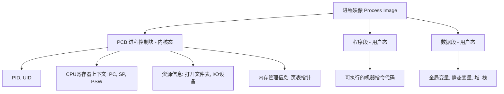
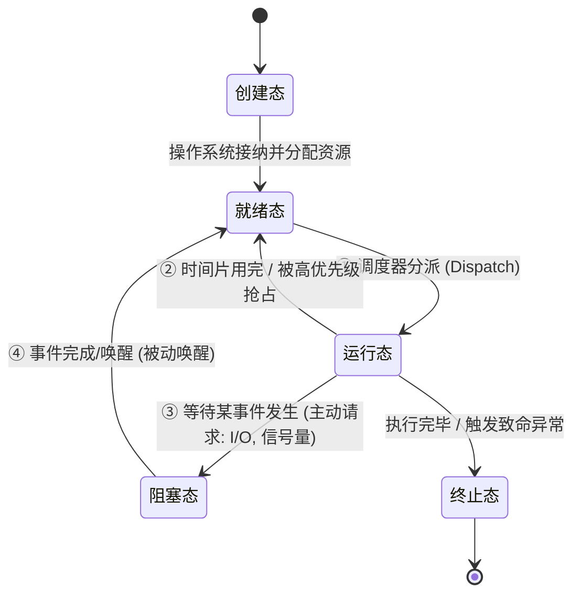
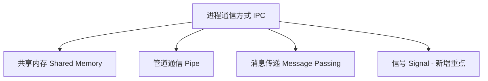

---
tags: [考研, 操作系统, 进程管理, 进程状态, 进程控制, 进程通信]
priority: 10
difficulty: 6
---

> [!abstract] 考点本质（直击130分核心）
> Brian，从这里开始，我们进入了 408 的绝对核心阵地。
> 这一节涵盖了进程与线程的生命周期与通信，核心考点包括：
> 1. **进程的组成结构**（PCB、程序段、数据段，特别是 PCB 才是进程存在的唯一标志）；
> 2. **五态模型及其转换机制**（哪些转换是主动的，哪些是被动的，哪些是不可能的）；
> 3. **进程控制原语的原子性**；
> 4. **三大经典进程通信方式（IPC）的底层细节与对比**（共享内存、管道、消息传递，以及新增的信号机制）。
> 
> 🎯 **做题铁律：进程是资源分配的最小单位，PCB 在内核态，代码和数据在用户态；“运行 ➜ 阻塞”是进程的主动行为，而“阻塞 ➜ 就绪”是被动唤醒行为。**

---

### 一、 进程的概念与组成

#### 1. 什么是进程？
*   **程序**：是静态的，存放在磁盘上的可执行文件（指令的集合）。
*   **进程（Process）**：是动态的，是程序的一次**执行过程**。它是系统进行**资源分配和调度的独立单位**（在引入线程后，进程是**资源分配的最小单位**，线程是**CPU调度的最小单位**）。

#### 2. 进程的“实体”组成（Process Image）
进程映像是静态的，包含三个部分：

> [!danger] 避坑警告：PCB 是唯一标志
> *   **PCB（Process Control Block）** 是进程存在的**唯一标志**。当进程被创建时，操作系统为其创建 PCB；当进程结束时，操作系统回收其 PCB。
> *   **PCB 存放在操作系统内核空间中**，用户程序无法直接修改它，只能通过系统调用请求内核修改。

---

### 二、 进程的状态与转换（黄金必考❗）

操作系统中，进程的生命周期被划分为五种基本状态：

#### 1. 五种状态详析
1.  **创建态（New）**：申请空白 PCB，分配资源，初始化 PCB。
2.  **就绪态（Ready）**：进程已获得除 CPU 之外的所有必要资源，只要得到 CPU 即可立即执行（万事俱备，只欠 CPU）。
3.  **运行态（Running）**：进程正在 CPU 上执行。
4.  **阻塞态（Blocked / Waiting / 挂起等待）**：进程正在等待某个事件的发生（如等待 I/O 完成、申请锁、等待信号）而暂停运行。此时即使把 CPU 给他，他也无法运行。
5.  **结束态（Terminated）**：进程从系统中消失，PCB 被回收。

#### 2. 状态转换的“能与不能”
Brian，408 特别喜欢考状态转换的方向性，请务必记住：
*   **运行态 ➜ 阻塞态**：**主动行为**。进程执行了某种需要等待的指令（如系统调用 `read` 读取键盘，或 PV 操作中的 P 操作因资源不足阻塞）。
*   **阻塞态 ➜ 就绪态**：**被动行为**。由外界事件（如 I/O 中断、其他进程执行 V 操作唤醒）触发，进程自己是无法自己醒来的。
*   **阻塞态 ➜ 运行态**：**绝对不可能！** 阻塞的进程必须先进入就绪队列，等待调度器重新调度。
*   **就绪态 ➜ 阻塞态**：**绝对不可能！** 就绪进程根本没有运行，无法执行会触发阻塞的指令。

---

### 三、 进程控制（Process Control）

进程控制的任务是实现状态的转换。为了防止状态转换到一半被中断导致系统崩溃，进程控制必须使用 **原语（Primitives）** 来实现。

#### 1. 原语的本质：原子性
*   **原语**：是一段特殊的系统程序，其执行具有 **原子性（Atomicity）**，即“一气呵成”，要么全做，要么全不做。
*   **底层实现**：依靠硬件提供的 **关中断（Disable Interrupt）** 和 **开中断（Enable Interrupt）** 指令。在关中断状态下，CPU 忽略一切中断请求（如时钟中断），从而保证原语执行不被打断。

#### 2. 进程控制原语
*   **进程创建原语**：申请 PCB ➜ 分配物理资源 ➜ 初始化 PCB ➜ 将 PCB 插入就绪队列。
*   **进程终止原语**：根据 PID 检索 PCB ➜ 若处于运行态，立即剥夺 CPU ➜ 终止其所有子进程（防止孤儿进程，有些系统会把子进程托管给 `init`） ➜ 归还所有资源 ➜ 回收 PCB。
*   **进程阻塞原语**（`block`）：停止运行 ➜ 保存 CPU 上下文到 PCB ➜ 状态改阻塞 ➜ 插入阻塞队列。
*   **进程唤醒原语**（`wakeup`）：从阻塞队列中移出 ➜ 状态改就绪 ➜ 插入就绪队列。

---

### 四、 进程通信（IPC - Inter-Process Communication）

进程是系统分配资源的基本单位，为了安全，**每个进程的内存地址空间是相互独立的**，进程 A 不能直接访问进程 B 的地址空间。如果需要传递数据，必须通过操作系统提供的 IPC 渠道。

#### 1. 共享内存（Shared Memory）
*   **机制**：在物理内存中划出一块共享区域，进程 A 和进程 B 的虚拟地址空间分别映射到这块物理区域。
*   **特点**：**速度最快**。因为数据不需要在内核态与用户态之间进行拷贝。
*   **缺点**：操作系统不提供任何同步互斥机制，**必须由程序员自己通过信号量等工具控制并发安全**。

#### 2. 管道通信（Pipe）（超级常考❗）
*   **机制**：在内存中开辟一个固定大小（通常是 4KB 页）的**缓冲区**，它表现为一个循环队列，连接写进程与读进程。管道本质上是一个特殊的**半双工**虚拟文件。
*   **规则限制**（408 秒杀核心）：
    1.  **半双工通信**：同一时间数据只能单向流动。如果要实现双向通信，**必须创建两个管道**。
    2.  **写满堵塞，读空堵塞**：写进程往管道写数据，如果管道满了，`write` 调用会阻塞；读进程读管道，如果管道空了，`read` 会阻塞。
    3.  **读后即丢（一次性）**：数据一旦被读走，就从管道中彻底消失。
    4.  **互斥访问**：多进程并发读写管道时，操作系统自动保证对管道的互斥访问。

#### 3. 消息传递（Message Passing）
进程间的数据交换以格式化的 **消息（Message）** 为单位。
*   **直接通信**：发送进程直接将消息挂在接收进程的**消息缓冲队列**上（如 `send(P, message)`）。
*   **间接通信**：发送进程将消息发送到某个中间实体——**信箱**中，接收进程从信箱中读取（如 `send(mailbox, message)`）。

#### 4. 信号（Signal）（408 考点新增❗）
*   **机制**：一种轻量级的**异步通知机制**。类似于软件层面的“中断”。
*   **表现**：操作系统在特定事件发生时（如内存越界、按下 `Ctrl+C`、子进程退出），向目标进程发送一个预定义的整型信号值（如 `SIGINT`, `SIGKILL`）。
*   **处理**：进程收到信号后，有三种处理选择：
    1.  **执行默认操作**（如终止进程）；
    2.  **捕捉信号**（执行用户自定义的信号处理函数）；
    3.  **忽略信号**（但某些信号如 `SIGKILL` 无法被忽略或捕捉，确保内核能绝对杀死该进程）。

---

### 👑 985高分必杀技（Brian的拿分秘籍）

我们在做关于**管道通信**的多选题时，注意以下两个高频致命细节：
1.  **“多个读进程可以同时读一个管道吗？”** ➜ **不可以！** 管道必须保证单读单写（或者微观上互斥读写）。如果允许多个读进程并发读，会导致数据流支离破碎，每个读进程都只能拿到一部分数据，从而失去通信的意义。
2.  **关于 PCB 中到底存了什么**：
    *   **寄存器上下文（PC, SP, 通用寄存器等）** 只有在进程**非运行态**时才会在 PCB 中保存。
    *   当进程在 CPU 上运行时，这些值是存放在 CPU 对应的物理寄存器中的。切换时，硬件和内核再将它们“打包”存回 PCB。

Brian，今天的这部分内容非常充实，一定要多看两遍状态转换图！下一节，我们将学习线程的底层实现与多线程模型，离拿到 130 分的目标又近了一步哦！
