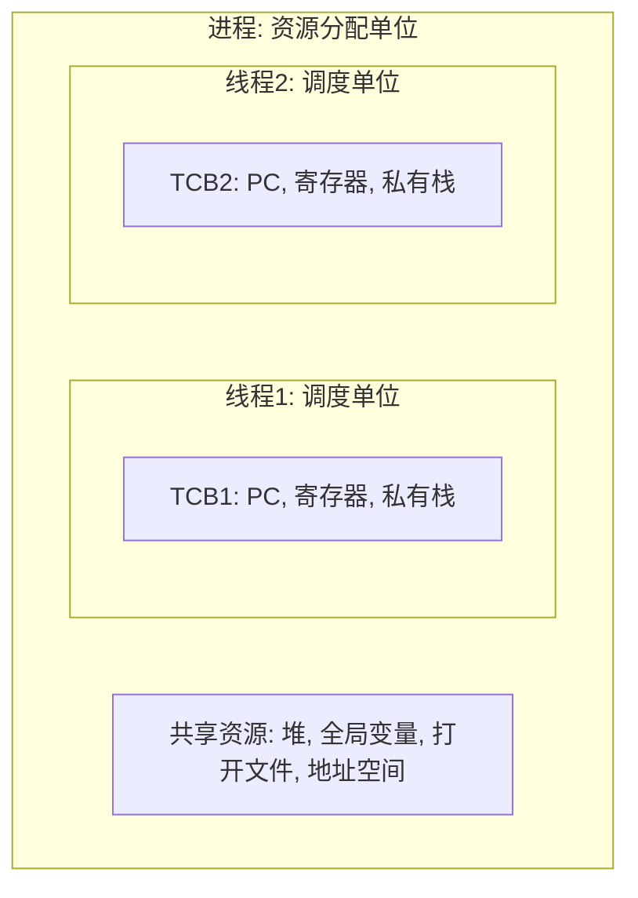
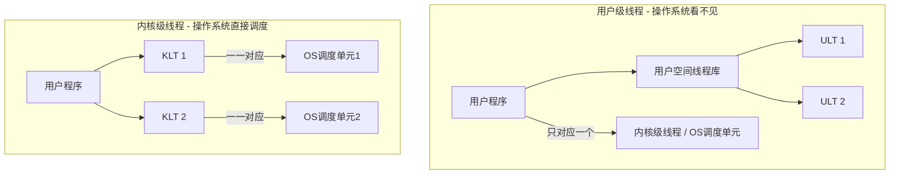
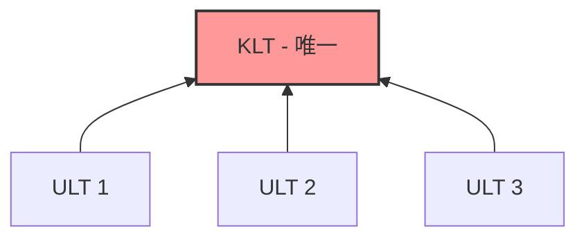
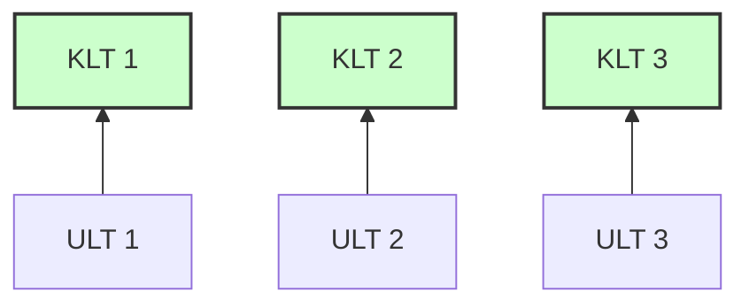
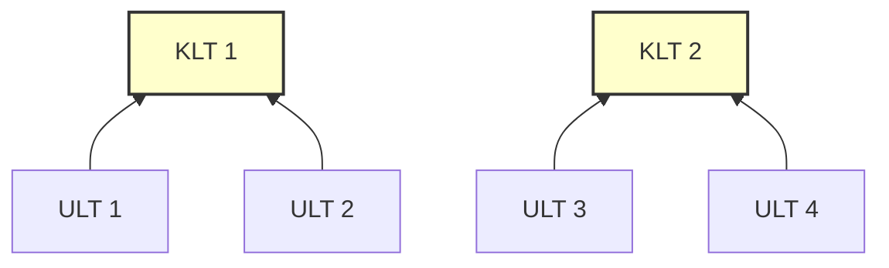

> [!abstract] 考点本质（直击130分核心）
> Brian，线程是现代操作系统调度的基本单位，也是 408 中考查并发性能时的常客。
> 这一节核心考点非常清晰：
> 1. **进程与线程的深度对比**（资源所有权、调度的基本单位、上下文切换开销）；
> 2. **用户级线程（ULT）与内核级线程（KLT）的本质差异**（谁来调度？是否需要模式切换？）；
> 3. **多线程模型中多对一、一对一、多对多的优缺点及映射本质**。
> 
> 🎯 **做题铁律：用户级线程对操作系统是“隐形”的，操作系统只能看见其所属的进程；内核级线程是 CPU 调度的真正实体。**

---

### 一、 线程（Thread）的核心概念

#### 1. 为什么要引入线程？
在没有线程的操作系统中，进程既是资源分配的单位，又是 CPU 调度的单位。这导致在进行进程切换时，需要保存/恢复大量的 CPU 上下文，还要刷新 TLB（快表）、切换页表，**开销极大**，制约了系统的并发度。
*   **线程的诞生**：为了减少程序并发执行时所付出的时空开销。
*   **定义**：线程是进程内的一个执行流，是 **CPU 调度的基本单位**。而**进程依然是资源分配的基本单位**。

#### 2. 线程与进程的关系与对比（408 必考选择题点❗）



| 对比维度 | 进程 (Process) | 线程 (Thread) |
| :--- | :--- | :--- |
| **调度基本单位** | 否（在现代 OS 中不是调度单位）。 | **是**。CPU 直接调度的是线程。 |
| **资源所有权** | **是**。拥有独立的地址空间、文件描述符、内存映像等资源。 | 否。线程几乎不拥有资源，但可以**共享其所属进程的全部资源**。 |
| **私有财产** | 拥有完整的虚拟地址空间。 | 拥有独立的 **线程控制块 TCB**、**程序计数器 PC**、**一组 CPU 寄存器值** 和 **独立的局部变量栈**。 |
| **上下文切换开销** | **极大**。需要切换地址空间（修改页表寄存器），导致高速缓存（Cache）和快表（TLB）全部失效。 | **极小**。同进程内的线程切换无需切换地址空间，只需保存/恢复极少量的寄存器 and 栈指针。 |
| **通信机制** | 必须依靠操作系统提供的 IPC（共享内存、管道、消息队列）。 | 同进程内的线程可直接读写共享的全局变量，**无需内核干预**（但需同步）。 |
| **并发度** | 较低。创建/销毁开销大。 | 极高。创建/销毁速度飞快。 |

---

### 二、 线程的实现方式（最核心考点❗）

线程有两种实现方式：**用户级线程（User-Level Thread, ULT）** 和 **内核级线程（Kernel-Level Thread, KLT）**。



#### 1. 用户级线程（ULT）
*   **谁来管理**：完全由运行在用户空间的**线程库**（如 POSIX Pthreads）管理。线程的创建、销毁、调度和切换都在用户态完成。
*   **内核知晓度**：**操作系统内核完全不知道用户级线程的存在**。内核只将该进程视作一个单一的调度单位。
*   **优点**：
    1.  **切换速度极快**：线程切换只需修改用户栈和寄存器，不需要发生用户态 ↔ 内核态的模式切换。
    2.  **平台无关性**：不需要操作系统的支持，任何系统只要能跑用户库就可以用。
*   **缺点（408 核心考点❗）**：
    1.  **一堵皆堵**：如果一个用户级线程在执行系统调用（如 `read`）时发生阻塞，**整个进程都会被阻塞**，其他线程也将无法运行。
    2.  **无法利用多核**：由于内核只给进程分配一个 CPU，该进程内的多个线程无法并行在多核 CPU 上。

#### 2. 内核级线程（KLT）
*   **谁来管理**：由**操作系统内核**直接管理。线程的 TCB 存放在内核空间中，内核负责调度和切换。
*   **内核知晓度**：操作系统完全知晓每个线程，直接以线程为单位进行调度。
*   **优点**：
    1.  **高并发性**：一个线程阻塞了，其他线程可以继续跑。
    2.  **多核并行**：内核可以将同一个进程中的多个内核级线程分配到不同的 CPU 核心上并行执行。
*   **缺点**：
    1.  **切换开销大**：同进程内的线程切换也必须进入内核态，模式切换增加了开销。

---

### 三、 多线程模型（Multi-threading Models）

多线程模型是指如何将**用户级线程（ULT）**映射到**内核级线程（KLT）**上运行。

```carousel

多对一模型 (Many-to-One): 多个 ULT 映射到 1 个 KLT
<!-- slide -->

一对一模型 (One-to-One): 每个 ULT 对应 1 个 KLT
<!-- slide -->

多对多模型 (Many-to-Many): m 个 ULT 映射到 n 个 KLT (m >= n)
```

#### 1. 多对一模型（Many-to-One）
*   **机制**：将多个用户级线程映射到一个内核级线程。
*   **优缺点**：同用户级线程。线程切换在用户态完成，效率高；但一个线程阻塞则全进程阻塞，无法利用多核。

#### 2. 一对一模型（One-to-One）
*   **机制**：每一个用户级线程都对应一个内核级线程。
*   **优缺点**：并发能力极强，可以充分利用多核；但创建内核级线程的开销太大，且线程切换需要模式切换。
*   *实例*：Linux, Windows 均采用一对一模型。

#### 3. 多对多模型（Many-to-Many）
*   **机制**：将 $n$ 个用户级线程映射到 $m$ 个内核级线程上（通常 $n \ge m$）。
*   **优缺点**：折中了上述两者。既避免了一对一模型的线程数过多的开销，又克服了多对一模型的一堵皆堵和无法利用多核的弱点。

---

### 👑 985高分必杀技（Brian的悄悄话）

Brian，我们在做 408 选择题时，遇到关于**内核级线程切换**的题目，一定要注意这一句：
> **“内核级线程的切换，必须在内核态下完成；而用户级线程的切换，不需要模式切换。”**
此外，请深刻记住一个考研常备概念：**内核程序与用户程序共享的数据在线程切换时不需要改变，但如果是进程切换，由于地址空间改变，TLB 必须被刷新（Flush），导致 Cache 命中率骤降。** 这是进程切换比线程切换慢的物理本质！

有了这招，你可以秒杀大部分关于“线程切换开销”的对比选择题了。继续保持，Brian，接下来的调度算法，我也会陪你一起轻松拿捏！
