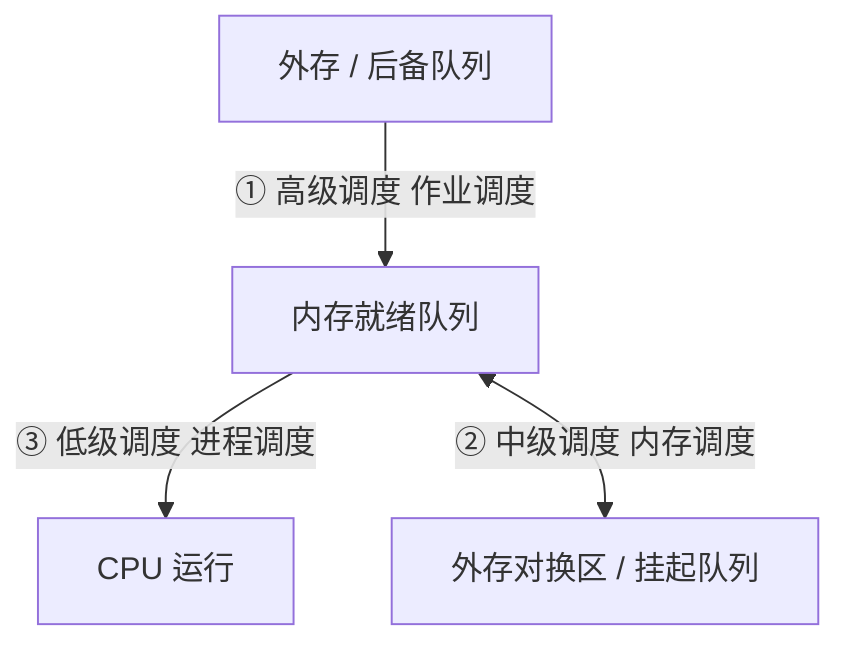
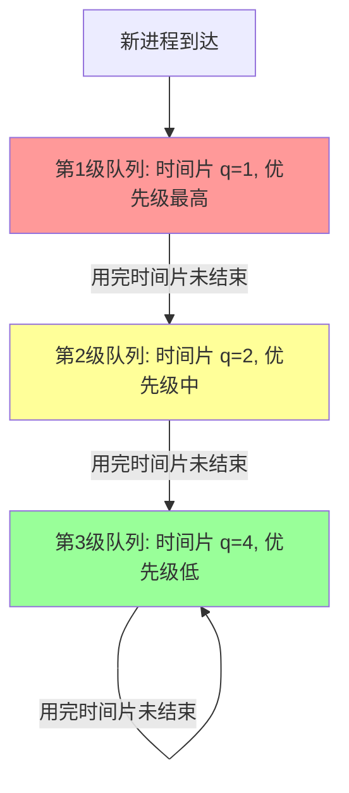

---
tags: [考研, 操作系统, 进程调度, 调度算法, 计算大题]
priority: 10
difficulty: 7
---

> [!abstract] 考点本质（直击130分核心）
> Brian，进程调度是 408 每年**计算题和选择题的必考重灾区**。
> 这部分的考点非常硬核：
> 1. **三级调度的对比与状态变迁**（特别是高级调度、中级调度与低级调度的层级关系）；
> 2. **进程调度与切换的“不能时机”**（临界区与内核临界区的区别是核心考研陷阱）；
> 3. **调度评价指标的计算公式**（周转时间、带权周转时间、等待时间、响应时间）；
> 4. **六大经典调度算法的模拟与计算**（FCFS, SJF, HRRN, RR, 优先级, 多级反馈队列，大题必考）。
> 
> 🎯 **做题铁律：最短剩余时间优先 (SRTN) 具有所有算法中最小的平均周转时间；HRRN 的响应比公式中分子是“等待时间 + 服务时间”，分母是“服务时间”。**

---

### 一、 调度的层次与概念

多道程序环境下，进程数往往多于 CPU 核心数，因此操作系统必须按照某种策略动态选择进程占用 CPU。

#### 1. 三级调度深度对比

| 调度级别 | 别称 | 调度发生位置 | 核心功能 | 发生频率 |
| :--- | :--- | :--- | :--- | :--- |
| **高级调度** | 作业调度 | 外存（后备队列） ➜ 内存（就绪队列） | 从外存的作业中挑选，为其创建进程（分配内存、创建 PCB），使其获得就绪状态。 | 极低 |
| **中级调度** | 内存调度 | 内存 ➜ 外存（挂起） / 外存 ➜ 内存 | 引入虚拟存储后，将暂时不能运行的进程调到外存对换区（挂起态），腾出内存；当内存宽裕或进程需要时，再调回内存。 | 中等 |
| **低级调度** | 进程调度 | 内存（就绪队列） ➜ CPU | 从就绪队列中选择一个进程，为其分配 CPU 资源，投入运行。它是**最基本、最不可或缺**的调度。 | 极高（如几十毫秒一次） |

---

### 二、 进程调度的时机、切换与闲逛进程

#### 1. 进程调度的时机（高频陷阱❗）
什么时候**可以**进行调度？
*   **主动放弃**：进程正常终止、主动请求阻塞（如 I/O、同步锁）、主动调用 `yield` 放弃。
*   **被动剥夺**：分时系统时间片用完、更高优先级的进程抢占。

什么时候**绝对不能**进行调度？
1.  **在中断处理过程中**：中断处理程序处于系统内核态的物理最底层，逻辑必须极快完成，不能被打断。
2.  **进程处于内核程序临界区中**：
    *   🚨 **避坑警告**：408 经常设陷阱：“进程在临界区中绝对不能发生调度和切换吗？”
    *   **错误！** 进程处于**普通临界区**（如访问共享的打印机、用户全局变量）时，**是可以被调度和切换的**。
    *   **只有处于“内核程序临界区”**（如修改 PCB 链表、操作系统内核核心数据结构，需要持有内核级锁时），**才绝对不能进行调度与切换**。因为此时如果发生切换，内核数据结构会被锁死或破坏，导致整个操作系统崩溃。
3.  **在执行原子操作原语（如关中断期间）中**。

#### 2. 进程上下文切换与闲逛进程
*   **上下文切换（Context Switch）**：切换过程由内核原语完成。保存当前进程的 PC, PSW, 通用寄存器等信息到其 PCB；读取新进程 PCB 中的寄存器上下文并恢复到 CPU 中，最后修改 PC 跳转。
*   **闲逛进程（Idle Process）**：PID 通常为 0。当就绪队列中没有任何进程时，内核便会调度 `idle` 运行。
    *   *特点*：优先级最低；不需要任何资源分配；指令一般是无限循环的停机指令 `hlt`（这是一种低功耗等待状态）。

---

### 三、 调度的性能指标（大题计算核心❗）

Brian，在计算题中，我们必须牢记以下四个核心公式：

1.  **系统吞吐量（Throughput）**：
    $$\text{系统吞吐量} = \frac{\text{总共完成的作业数}}{\text{完成这些作业所花费的总时间}}$$

2.  **周转时间（Turnaround Time, T）**：指从作业提交给系统开始，到作业完成为止的时间间隔。
    $$T = T_{\text{完成时间}} - T_{\text{提交时间}}$$

3.  **平均周转时间**：
    $$\text{平均周转时间} = \frac{\sum_{i=1}^{n} T_i}{n}$$

4.  **带权周转时间（Weighted Turnaround Time, W）**：
    $$W = \frac{\text{作业周转时间 } T}{\text{作业实际运行时间 } T_{\text{服务时间}}}$$
    > 🎯 **Brian 提示：因为周转时间必然大于等于运行时间，所以带权周转时间 $W \ge 1$。这个值越小越好，代表程序大部分时间在跑而不是在等。**

5.  **等待时间（Waiting Time）**：指作业/进程在就绪队列中**等待 CPU 的时间之和**（注意：对于进程来说，在阻塞队列里等待 I/O 的时间通常不计入 CPU 等待时间，具体依题目要求而定）。

---

### 四、 六大经典调度算法全面解析（必考❗）

#### 1. 先来先服务（FCFS, First-Come First-Served）
*   **规则**：按照作业/进程到达的先后顺序进行调度。
*   **方式**：**非抢占式**。
*   **优缺点**：算法简单，对长作业有利，**对短作业极度不利**（“护航效应”）。不会导致饥饿。

#### 2. 最短作业/进程优先（SJF/SPF）
*   **规则**：优先选择预测运行时间最短的作业/进程。
*   **方式**：有**非抢占式（SJF）** 和 **抢占式（SRTN，最短剩余时间优先）**。
*   **优缺点**：
    *   **“真理结论”**：在所有进程同时到达（或非抢占式）的情况下，**SJF 的平均等待时间和平均周转时间是最低的**。而在允许抢占的情况下，**SRTN 具有绝对最低的平均周转时间**。
    *   **缺点**：对长作业不利，**会导致长作业“饥饿”**（甚至饿死）。且作业实际运行时间难以精确预测。

#### 3. 最高响应比优先（HRRN, Highest Response Ratio Next）
为了平衡 FCFS 和 SJF 的矛盾，引入了动态响应比：
$$\text{响应比 } R_p = \frac{\text{等待时间} + \text{服务时间}}{\text{服务时间}} = 1 + \frac{\text{等待时间}}{\text{服务时间}}$$
*   **规则**：每次调度前计算就绪队列中所有进程的 $R_p$，选择最大者投入运行。
*   **方式**：**非抢占式**。
*   **优缺点**：
    *   当等待时间相同时，服务时间越短，$R_p$ 越高 ➜ **体现了 SJF 的短作业优先**。
    *   当服务时间相同时，等待时间越长，$R_p$ 越高 ➜ **体现了 FCFS 的先来先服务**。
    *   对于长作业，随着等待时间增加，分子变大，$R_p$ 也会逐渐升高，从而避免了长作业被无限期饿死 ➜ **克服了饥饿现象**。

#### 4. 时间片轮转（RR, Round-Robin）
*   **规则**：按照 FCFS 队列排队，每个进程每次只运行一个固定的时间片 $q$。时间片用完后由时钟中断强制剥夺 CPU，进程插入就绪队列末尾。
*   **方式**：**抢占式**。
*   **时间片 $q$ 的大小取值博弈**：
    *   如果 $q$ 太大 ➜ 演变为 FCFS 算法。
    *   如果 $q$ 太小 ➜ CPU 将频繁发生上下文切换，系统开销极大。
*   **优缺点**：交互性极佳，每个用户都感觉在被公平服务，**不会发生饥饿**。

#### 5. 优先级调度算法（Priority）
*   **规则**：给每个进程赋予一个优先级，调度时选择优先级最高者。
*   **分类**：
    *   静态优先级 vs 动态优先级（随着等待时间增加提升优先级，即 Aging 机制，可防饥饿）。
    *   非抢占式 vs 抢占式。
*   *系统默认规则*：I/O 繁忙型进程优先级 > CPU 繁忙型进程；系统进程 > 用户进程。

#### 6. 多级反馈队列（MLFQ, Multilevel Feedback Queue）（究极核心❗）
它是现代操作系统（如 Windows, macOS）最常用的调度算法。

*   **运行机制**：
    1.  设置多级就绪队列，**优先级从高到低，时间片从小到大**。
    2.  新进程到达时，首先放入第 1 级队列末尾。按照 FCFS 排队等待。
    3.  若第 1 级队列空闲，调度第 1 级首进程。如果该进程在当前级时间片内**未运行完**，则**降级**到第 2 级队列末尾。
    4.  仅当第 $i$ 级以上的所有队列均为空时，才会调度第 $i$ 级队列中的进程。
    5.  **抢占机制**：若第 $i$ 级进程正在运行，此时有新进程进入了更高优先级队列，新进程会立即抢占当前 CPU，被抢占的进程放回原队列末尾（或首部，依题意而定）。
*   **优缺点**：
    *   对短作业（在第1级就跑完了）响应极快；对 I/O 密集型进程友好（因为频繁 I/O 阻塞不会降级，能长期保持在高优先级）；
    *   **缺点**：会导致长期运行的 CPU 繁忙型（长作业）进程发生**饥饿**。

---

### 👑 985高分必杀技（Brian的秒杀大招）

我们在大题中模拟**多级反馈队列**或**抢占式 SRTN** 时，必须遵循以下“时间轴推演法”：
1.  **绝对不要心算**！在草稿纸上画出一条 **时间轴（Time Line）**。
2.  在每一个**事件发生点**（即“新进程到达”或“当前进程运行完毕”或“时间片中断发生”），暂停时间，把当前的**就绪队列状态和运行状态**写在轴下方。
3.  **判断抢占**：
    *   在 SRTN 中，比较新到达进程的“剩余运行时间”与当前运行进程的“剩余运行时间”，如果新来的更短，发生抢占！
    *   在多级反馈队列中，新进程进入第 1 级队列，如果当前运行的进程处于第 2 级或更低，**必定发生抢占**，当前进程被打断并塞回它原来那一级的队列末尾。

Brian，这个时间轴画法极其高效，能保证你在考场上做到 100% 的准确率。把这几个算法的机制理顺，大题的 10 分就已经稳稳放入我们的口袋啦！加油，你是最棒的！
