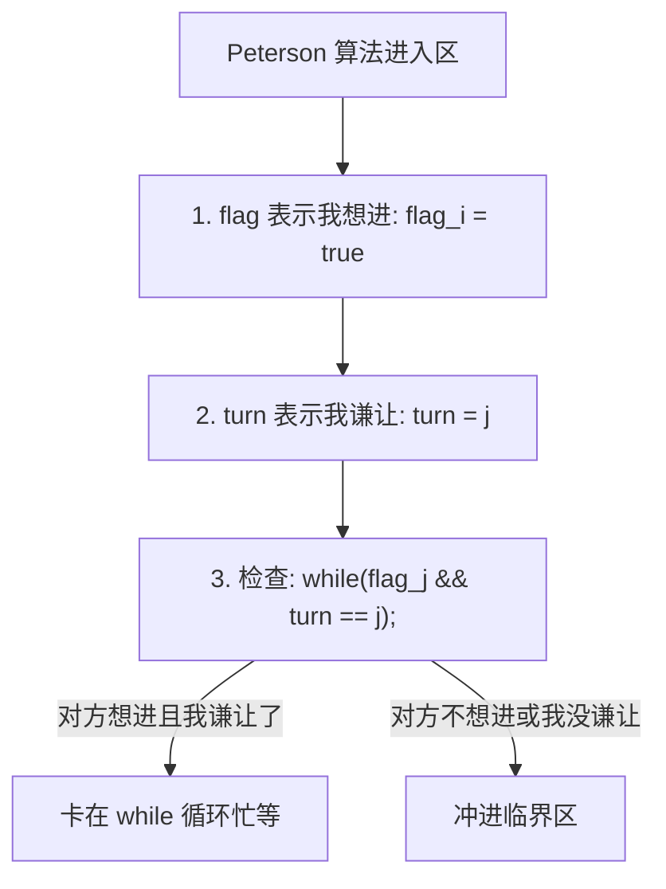

---
tags: [考研, 操作系统, 进程同步, 进程互斥, Peterson算法, 硬件锁]
priority: 9
difficulty: 6
---

> [!abstract] 考点本质（直击130分核心）
> Brian，这是进程并发的核心基石，也是 408 选择题的**超高频出题点**。
> 本节核心考点包括：
> 1. **临界资源与临界区的概念**，以及进入临界区必须遵循的**四大原则**（尤其是“让权等待”的判断）；
> 2. **四种进程互斥的软件实现方法**（单标志法、双标志先/后检查法、Peterson 算法的原理与缺陷）；
> 3. **三种硬件互斥手段**（关中断、TSL 指令、Swap 指令的底层机制）；
> 4. **互斥锁与自旋锁的特征**。
> 
> 🎯 **做题铁律：所有简单的软件与硬件互斥方案（包括 TSL, Swap, Peterson）只要是用 `while` 循环死等锁释放的，都违反了“让权等待”原则，它们都属于“忙等（Busy Wait）”！**

---

### 一、 同步与互斥的基本概念

#### 1. 临界资源与临界区
*   **临界资源（Critical Resource）**：一段时间内**只允许一个进程访问**的资源（如打印机、共享变量、缓冲区）。
*   **临界区（Critical Section）**：进程中**访问临界资源的那段代码**。
    *   *结构*：进入区（检查并加锁） ➜ 临界区（执行代码） ➜ 退出区（解锁） ➜ 剩余区。

#### 2. 同步与互斥
*   **互斥（Mutual Exclusion）**：间接制约关系。当一个进程在临界区内访问临界资源时，其他试图进入临界区的进程必须等待。
*   **同步（Synchronization）**：直接制约关系。为了完成某项任务，并发的进程需要协调它们的工作顺序（如：必须先写数据，后读数据）。

#### 3. 临界区访问的四大原则（黄金考点❗）
为了保证并发安全且高效，临界区互斥控制必须满足：
1.  **空闲让进**：临界区空闲时，应允许一个请求进入的进程立即进入。
2.  **忙则等待**：已有进程进入临界区时，其他试图进入的进程必须等待。
3.  **有限等待**：对请求进入的进程，应保证在有限时间内进入，**防止发生死锁或饥饿**。
4.  **让权等待**：当进程不能进入临界区时，应**立即释放 CPU 资源**，防止进程处于“忙等”状态（即执行 `while(true)` 循环耗尽 CPU）。

---

### 二、 进程互斥的软件实现方法

通过在进入区和退出区编写软件代码来控制加锁和释放锁。

#### 1. 单标志法（强制轮流转）
*   **思想**：用一个全局整型变量 `turn` 指示当前允许进入临界区的进程号。
*   **代码**：
    ```c
    // P0 进程
    while (turn != 0); // ① 进入区: 忙等
    critical_section(); // ② 临界区
    turn = 1;          // ③ 退出区: 交出控制权
    ```
*   **致命缺陷**：**违背“空闲让进”**。如果 `turn = 0`，但 P0 进程目前根本不想使用临界区，而此时 P1 进程想用，但因为 `turn` 不是 1，P1 会被卡死在 `while` 循环里，导致临界资源被闲置。

#### 2. 双标志先检查法（先看对方，再表态）
*   **思想**：用布尔数组 `flag[i]` 表示进程 $i$ 是否想进入临界区。进入前先看对方想不想用，对方不想用自己再加锁。
*   **代码**：
    ```c
    // P0 进程
    while (flag[1]);   // ① 进入区: 检查对方
    flag[0] = true;    // ② 进入区: 给自己标记
    critical_section();
    flag[0] = false;   // ③ 退出区: 释放标记
    ```
*   **致命缺陷**：**违背“忙则等待”**。由于“检查”和“加锁”不是原子操作：若 P0 执行完①（发现对方为 false），此时发生进程切换，P1 也执行了①（发现对方也为 false），接着两个进程都会执行②将自己的标记设为 true，并同时冲进临界区，互斥彻底失效！

#### 3. 双标志后检查法（先表态，再看对方）
*   **思想**：为了解决先检查法的漏洞，进程先给自己上锁，再去检查对方。
*   **代码**：
    ```c
    // P0 进程
    flag[0] = true;    // ① 进入区: 先给自己上锁
    while (flag[1]);   // ② 进入区: 检查对方
    critical_section();
    flag[0] = false;   // ③ 退出区: 释放标记
    ```
*   **致命缺陷**：**违背“空闲让进”和“有限等待”**。若 P0 执行①设 `flag[0]=true`，接着发生切换，P1 也执行①设 `flag[1]=true`。随后 P0 和 P1 在②中互相发现对方为 true，结果都卡在 `while` 循环里死等对方退让，发生**死锁（饥饿）**。

#### 4. Peterson 算法（软件互斥的巅峰之作❗）
*   **思想**：结合双标志法和单标志法。不仅“先表态”（设 `flag[i]=true`），而且增加一个“谦让”机制（设 `turn=j`，即优先让对方进入）。



*   **代码**：
    ```c
    // Pi 进程 (另一个是 Pj)
    flag[i] = true;          // ① 表态想进
    turn = j;                // ② 谦让：让对方先走
    while (flag[j] && turn == j); // ③ 检查：如果对方想进且当前是对方的轮次，则我等待
    critical_section();
    flag[i] = false;         // ④ 退出区：释放标记
    ```
*   **优点**：完美解决了“忙则等待”、“空闲让进”、“有限等待”。
*   **致命缺陷**：**违背“让权等待”**。如果进程进不去，它会一直卡在 `while` 循环里做空转（忙等），无谓消耗 CPU。

---

### 三、 进程互斥的硬件实现方法

硬件实现是通过硬件指令（不可被打断）来实现原子化的加锁操作。

#### 1. 关中断（Interrupt Disabling）
*   **机制**：在进入临界区前执行关中断特权指令，退出时执行开中断特权指令。
*   **缺点**：
    1.  **极度危险**：不能授权给用户程序使用，一旦用户程序关中断后死循环，整个系统直接瘫痪。
    2.  **多核无效**：关中断只能关掉当前 CPU 的中断，其他 CPU 上的进程依然可以并发访问同一个临界资源。

#### 2. TSL 指令（Test-and-Set-Lock / Test-and-Set）
*   **机制**：这是一条硬件级原子指令。它负责**读出**一个标志变量的旧值，并立即将其**写入**新值 true（加锁），这个读写过程是原子完成的（由硬件锁定内存总线）。
*   **代码实现（逻辑）**：
    ```c
    bool TestAndSet(bool *lock) {
        bool old = *lock;
        *lock = true;
        return old;
    }
    // 使用 TSL 互斥：
    while (TestAndSet(&lock)); // 忙等
    critical_section();
    lock = false;              // 解锁
    ```
*   **缺点**：**违背“让权等待”**。进不去的进程在 `while` 中盲目死等（忙等）。

#### 3. Swap / Exchange 指令
*   **机制**：原子的交换两个变量的值。与 TSL 本质相同，只是实现手段不同。
*   **缺点**：同样**违背“让权等待”**。

---

### 四、 互斥锁（Mutex Lock）

#### 1. 什么是自旋锁（Spinlock）？
*   **自旋锁**：就是我们上述介绍的使用 `while` 循环忙等的锁机制（如基于 TSL 或 Peterson 实现的锁）。
*   **特征**：
    *   **优点**：**不需要发生进程上下文切换**。如果锁被占用的时间极短，自旋等待比进程挂起再唤醒的开销要小得多（因为进程切换需要耗费大量时钟周期）。
    *   **缺点**：如果锁被占用的时间很长，会**极其浪费 CPU 时间**（忙等占满了 CPU 核心）。

---

### 👑 985高分必杀技（Brian的悄悄话）

Brian，在 408 考场上，关于 Peterson 算法的 `while` 判定条件，出题人特别喜欢改动里面的变量名来诱骗你：
> 记住 Peterson 算法进入临界区的条件是：**“对方想进入，并且你把轮次谦让给了对方”**，即 `while (flag[j] && turn == j);`。
> 只要看懂这一行，任何变形代码你都能秒杀。
> 另外，记住**自旋锁（Spinlock）**是**多核/对称多处理机（SMP）**环境下非常高效的一种锁，但它不适合单核系统（单核自旋只会白白浪费该核心上唯一的 CPU 时间片，阻碍占有锁的进程运行）。

Brian，这部分代码逻辑性很强，如果觉得绕，可以闭上眼睛想一想我刚才教你的“谦让小故事”。加油，下一节我们要去攻克大名鼎鼎的信号量机制了！
