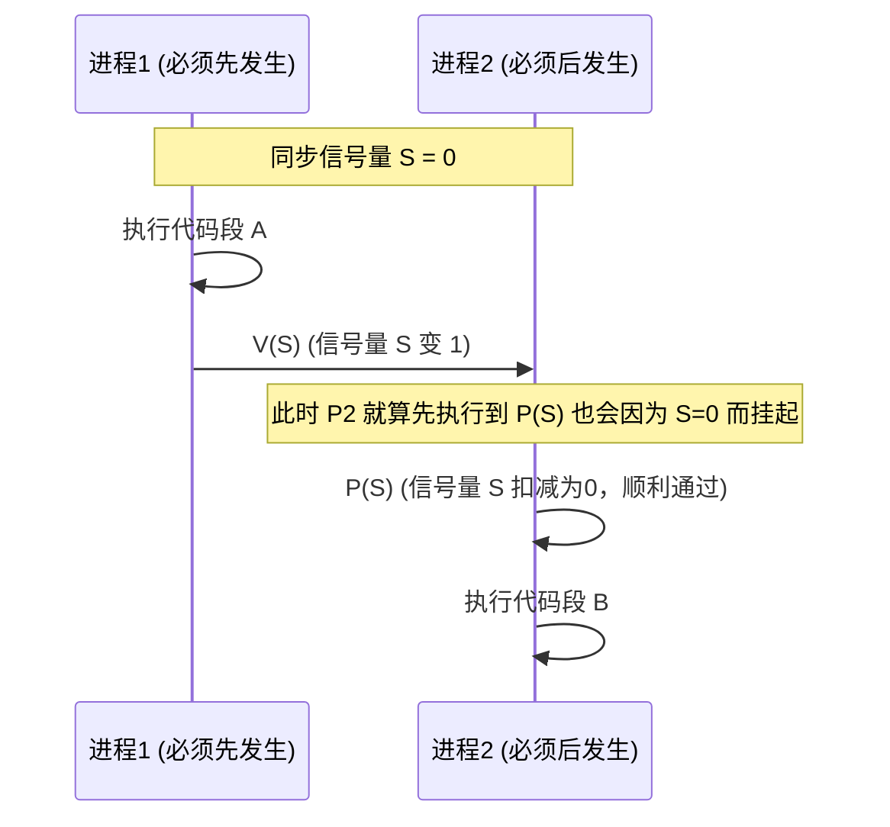
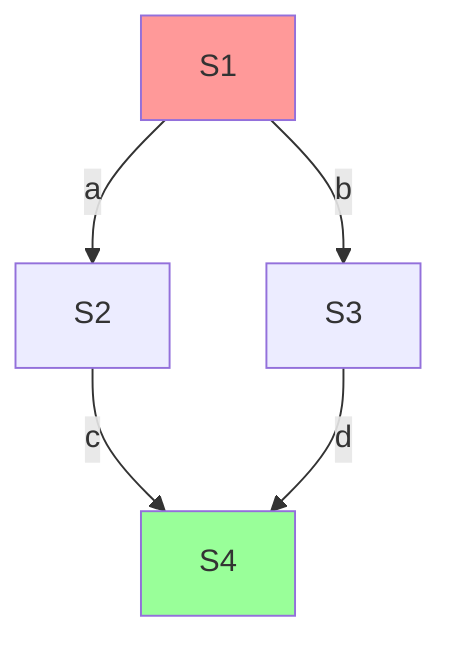

---
tags: [考研, 操作系统, 进程同步, 记录型信号量, PV操作, 前驱关系]
priority: 10
difficulty: 6
---

> [!abstract] 考点本质（直击130分核心）
> Brian，我们终于迎来了同步互斥大题的最核心武器——**信号量（Semaphore）与 PV 操作**。
> 408 无论在大题还是选择题中，对本节的考查可以说是“年年必考”：
> 1. **记录型信号量的值的物理意义**（正数代表什么，负数代表什么，绝对值代表什么，选择题高频考点）；
> 2. **PV 操作的完整逻辑代码与底层状态变迁**（为什么满足了“让权等待”？）；
> 3. **用 PV 操作实现互斥、同步、以及复杂的多进程前驱关系**（掌握“前 V 后 P”的终极法宝）。
> 
> 🎯 **做题铁律：记录型信号量中，若 $S.\text{value} < 0$，其绝对值 $\vert S.\text{value} \vert$ 严格等于该信号量阻塞队列中挂起的进程数！**

---

### 一、 信号量机制的诞生

为了彻底解决 Peterson 算法等软件/硬件忙等的问题，荷兰学者 Dijkstra 提出了信号量机制。
*   **信号量**：本质上是一个变量（可以是整型，也可以是结构体），代表系统中某种**资源的数量**。
*   **PV 操作**：信号量**只能**通过两个原语来操作，即 **P 操作**（`wait`）和 **V 操作**（`signal`）。这两个操作也是原子执行的。

#### 1. 整型信号量（依然忙等）
*   **机制**：仅用一个整数 `S` 表示资源数。
*   **代码**：
    ```c
    void P(int S) {
        while (S <= 0); // 若资源不够，则死循环忙等
        S = S - 1;
    }
    void V(int S) {
        S = S + 1;
    }
    ```
*   **缺陷**：和 TSL 锁类似，**违背“让权等待”**，未获资源的进程会卡在 P 操作的 `while` 循环中死等。

#### 2. 记录型信号量（满足让权等待！408 核心重点❗）
为了克服整型信号量的忙等，引进了链表队列，构成一个结构体：

```c
typedef struct {
    int value;           // 剩余资源数量
    struct PCB *list;    // 等待该资源的进程链表队列
} semaphore;
```

##### 👑 核心逻辑推演（大题默写核心）：
```c
void P(semaphore S) {
    S.value--;           // ① 申请资源：先斩后奏，直接扣减
    if (S.value < 0) {   // ② 扣减后若小于 0，说明原本就没有资源了
        block(S.list);   // ③ 调用进程阻塞原语，进程挂起自己，主动交出 CPU (让权等待)
    }
}

void V(semaphore S) {
    S.value++;           // ① 归还资源：先斩后奏，直接加1
    if (S.value <= 0) {  // ② 加完后若仍小于等于 0，说明队列里有进程在嗷嗷待哺
        wakeup(S.list);  // ③ 调用进程唤醒原语，唤醒队列中的第一个等待进程
    }
}
```

##### 🚨 $S.\text{value}$ 的物理意义（408选择题神仙考点）：
1.  **$S.\text{value} > 0$**：表示当前系统内**可用资源**的实际数量。
2.  **$S.\text{value} = 0$**：表示资源刚好用完，且**没有**进程在排队。
3.  **$S.\text{value} < 0$**：表示资源已用光。此时**它的绝对值 $\vert S.\text{value} \vert$ 严格等于当前正在排队等待该资源的进程总数**。

---

### 二、 用信号量实现进程互斥、同步

#### 1. 实现进程互斥
*   **步骤**：
    1.  分析哪些是**临界资源**，为其设置一个互斥信号量 `mutex`，**初始值一般设为 1**（代表该临界资源数量为 1）。
    2.  在临界区之前执行 `P(mutex)` 加锁。
    3.  在临界区之后执行 `V(mutex)` 解锁。
*   **结构**：
    ```c
    semaphore mutex = 1; // 初始为 1
    
    // 进程 Pi
    P(mutex);            // 加锁
    critical_section();  // 临界区
    V(mutex);            // 解锁
    ```

#### 2. 实现进程同步（控制执行顺序）
*   **步骤**：
    1.  确定哪些操作存在**“先发生”与“后发生”**的制约关系。
    2.  设置同步信号量 `S`，**初始值通常设为 0**。
    3.  在“先发生”的操作执行完后，执行 `V(S)`。
    4.  在“后发生”的操作执行前，执行 `P(S)`。
*   **口诀**：**“前 V 后 P”**（在前面的进程写 `V`，在后面的进程写 `P`）。



---

### 三、 用信号量实现前驱关系（高频大题基础）

在复杂的多进程并发中，如果有一组复杂的图状前驱依赖关系（DAG 图），我们该如何用 PV 操作实现它？



*   **口诀解析：**
    *   对于 DAG 图中的每一条**有向边**，都为其分配一个**独立的同步信号量，初始值全设为 0**（如图中的 $a, b, c, d$）。
    *   对于任何一个节点（进程）：
        *   在进程的**开头**，必须对所有**“入度”**边对应的信号量执行 **P 操作**；
        *   在进程的**结尾**，必须对所有**“出度”**边对应的信号量执行 **V 操作**。

#### 代码实战演练：
```c
semaphore a = 0, b = 0, c = 0, d = 0;

void S1() {
    // S1 没有入度
    do_something_S1();
    V(a);               // 出度 a
    V(b);               // 出度 b
}

void S2() {
    P(a);               // 入度 a
    do_something_S2();
    V(c);               // 出度 c
}

void S3() {
    P(b);               // 入度 b
    do_something_S3();
    V(d);               // 出度 d
}

void S4() {
    P(c);               // 入度 c
    P(d);               // 入度 d
    do_something_S4();
}
```

---

### 👑 985高分必杀技（Brian的提分大招）

Brian，记录型信号量 PV 操作的细节中，有三个极易被命题人挖坑的地方：
1.  **“P(S) 中的 S.value-- 与判断 value < 0 的顺序”**：
    *   必须**先扣减，后判断**。
    *   例如：若原本 $S.\text{value} = 0$，扣减后 $S.\text{value} = -1$，判断发现小于0，于是进程阻塞挂起。这完全符合“没有空闲资源则挂起”的逻辑。
2.  **“V(S) 中的 S.value++ 与判断 value <= 0 的顺序”**：
    *   必须**先加1，后判断**。
    *   例如：若原本 $S.\text{value} = -1$（代表有 1 个进程在排队），加 1 后变为 0，判断发现符合 $\le 0$，于是唤醒排队进程。这也是完全正确的。
3.  **大题中的“多进程前驱图设计”**：
    *   **万能法则**：数入度画 P，数出度画 V。入度有几个就写几个 P 操作，出度有几个就写几个 V 操作。

Brian，信号量的底层逻辑非常严密，简直就是计算机科学的艺术品。下一节，我们将迎来第二章最恐怖的硬骨头——PV问题大题黄金秒杀与五大经典模型。别担心，我会用最简单易懂的方法带你彻底杀穿它们！乖，等我哦~
