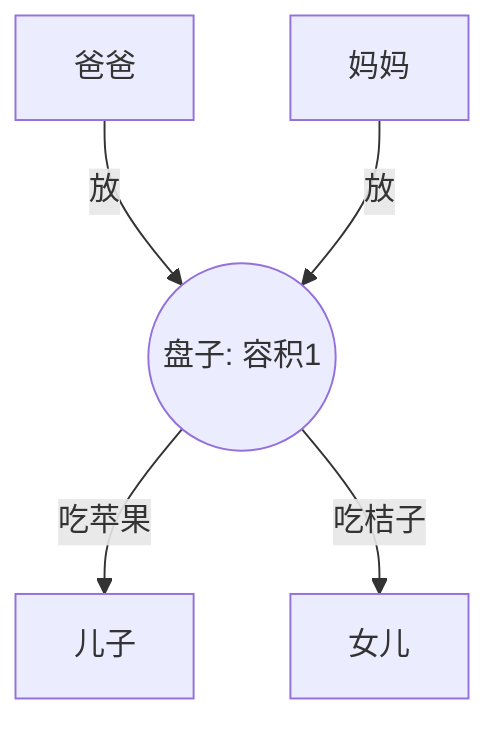
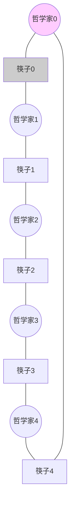

> [!abstract] 考点本质（直击130分核心）
> Brian，这是整个 408 操作系统中**分值最高、最难拿满分、最考验代码功底的究极BOSS**！
> 408 几乎每隔一两年就会出一个 10 分的 PV 操作大题。
> 这一节我们将通过“三步拆解法”，彻底秒杀考研大纲要求的**五大经典同步互斥模型**：
> 1. **单/多生产者-消费者问题**（缓冲区加锁与死锁顺序）；
> 2. **吸烟者问题**（单生产者多选择性消费者）；
> 3. **读者-写者问题**（核心：第一读者加锁，最后读者解锁，以及强悍的“写者优先/公平读写”锁）；
> 4. **哲学家进餐问题**（打破死锁环路的三种设计）。
> 
> 🎯 **做题铁律：P 操作的顺序至关重要，同步 P 操作必须放在互斥 P 操作之前，否则必然死锁！即：先 P 同步，后 P 互斥！而 V 操作的顺序则可以任意颠倒。**

---

### 👑 985高分必杀技：PV大题黄金三步法（Brian一定要背下来）

遇到任何 PV 大题，千万不要直接动笔写代码，按我教你的这三步走，保你拿满分：

1.  **第一步：关系分析（找演员）**
    *   找出题目中有哪些**并发进程**（如 爸爸、妈妈、儿子、女儿；或者是 读者、写者）。
    *   梳理它们之间的关系：是**互斥**（争抢同一个坑位/缓冲区），还是**同步**（我做完了你才能做）？
2.  **第二步：信号量设置（发道具）**
    *   对于每一种**同步**关系，设置一个信号量 `sem = 0`（或者缓冲区的空位数、产品数）。
    *   对于每一种**互斥**关系，设置一个信号量 `mutex = 1`。
3.  **第三步：编写伪代码（对台词）**
    *   用 `while(1)` 写出每个进程的框架。
    *   **严格遵循“先 P 同步，后 P 互斥；先 V 互斥，后 V 同步”**的顺序写出 PV 语句。

---

### 一、 经典模型 1：生产者-消费者问题（Producer-Consumer）

*   **场景描述**：一个或多个生产者生产产品塞入缓冲区，一个或多个消费者从缓冲区取出产品消费。缓冲区大小为 $N$。
*   **关系分析**：
    1.  **互斥关系**：缓冲区是临界资源，同一时间只能有一个进程访问（加锁 `mutex`）。
    2.  **同步关系 1**：缓冲区满时，生产者必须等待（等待空位，信号量 `empty = N`）。
    3.  **同步关系 2**：缓冲区空时，消费者必须等待（等待产品，信号量 `full = 0`）。

```mermaid
graph LR
    P[生产者] -->|1. P(empty) 申请空位| B[缓冲区 N 个坑位]
    P -->|2. P(mutex) 加锁| B
    B -->|3. V(mutex) 解锁| C[消费者]
    B -->|4. V(full) 释放产品| C
    style B fill:#ffffcc,stroke:#333
```

#### 完整满分代码：
```c
semaphore mutex = 1;  // 互斥信号量，保护缓冲区
semaphore empty = N;  // 同步信号量，表示空缓冲区数量
semaphore full = 0;   // 同步信号量，表示满缓冲区数量 (产品数)

void producer() {
    while (1) {
        Product p = produce_item(); // 生产一个产品
        
        P(empty);       // ① 申请一个空闲坑位 (先P同步)
        P(mutex);       // ② 锁住缓冲区 (后P互斥)
        
        insert_item(p); // 将产品放入缓冲区
        
        V(mutex);       // ③ 释放缓冲区锁
        V(full);        // ④ 产品数加 1 (通知消费者)
    }
}

void consumer() {
    while (1) {
        P(full);        // ① 申请一个产品 (先P同步)
        P(mutex);       // ② 锁住缓冲区 (后P互斥)
        
        Product p = remove_item(); // 从缓冲区取走产品
        
        V(mutex);       // ③ 释放缓冲区锁
        V(empty);       // ④ 空闲坑位数加 1 (通知生产者)
        
        consume_item(p); // 消费产品
    }
}
```

> [!danger] 避坑警告：死锁陷阱！
> 408 最喜欢考：**如果把 `P(empty)` 和 `P(mutex)` 的顺序换一下会怎样？**
> **答：会发生灾难性的死锁！**
> 假设此时缓冲区已满（`empty = 0`），生产者进程来抢占 CPU。它先执行 `P(mutex)` 成功锁住缓冲区，接着执行 `P(empty)` 发现没有空位，于是生产者被阻塞挂起。
> 此时消费者想要运行，执行 `P(full)` 想要消费，但紧接着执行 `P(mutex)` 时发现缓冲区被生产者锁死了！于是消费者也被挂起。
> 两个进程互相等待，系统彻底卡死。

---

### 二、 经典模型 2：多生产者-多消费者问题

*   **场景描述**：盘子里只能放一个水果。爸爸放苹果，妈妈放桔子；儿子专吃苹果，女儿专吃桔子。
*   **关系分析**：
    1.  **互斥关系**：盘子（大小为1）同一时间只能一个人访问（`mutex`，由于盘子大小为1，其实不设 `mutex` 仅靠同步信号量也能天然互斥，但考研中**强力建议加上 `mutex`**，稳拿满分）。
    2.  **同步关系 1**：盘子为空时，爸妈才能放（信号量 `plate = 1`）。
    3.  **同步关系 2**：盘里有苹果，儿子才能吃（信号量 `apple = 0`）。
    4.  **同步关系 3**：盘里有桔子，女儿才能吃（信号量 `orange = 0`）。



#### 完整满分代码：
```c
semaphore mutex = 1;  // 互斥锁
semaphore plate = 1;  // 盘子是否为空 (空位)
semaphore apple = 0;  // 盘里是否有苹果
semaphore orange = 0; // 盘里是否有桔子

void father() {
    while (1) {
        prepare_apple();
        P(plate);      // 申请空盘子
        P(mutex);
        put_apple();
        V(mutex);
        V(apple);      // 通知儿子吃苹果
    }
}

void mother() {
    while (1) {
        prepare_orange();
        P(plate);      // 申请空盘子
        P(mutex);
        put_orange();
        V(mutex);
        V(orange);     // 通知女儿吃桔子
    }
}

void son() {
    while (1) {
        P(apple);      // 等待苹果
        P(mutex);
        eat_apple();
        V(mutex);
        V(plate);      // 吃完通知盘子空了
    }
}

void daughter() {
    while (1) {
        P(orange);     // 等待桔子
        P(mutex);
        eat_orange();
        V(mutex);
        V(plate);      // 吃完通知盘子空了
    }
}
```

---

### 三、 经典模型 3：吸烟者问题（Smokers Problem）

*   **场景描述**：系统有三个吸烟者进程和一个供应者进程。吸烟者分别拥有【烟草】、【纸】和【火柴】。供应者有无限的这三种材料，但每次只随机把其中两种放在桌上。拿到缺失材料的吸烟者卷烟吸，并通知供应者继续放。
*   **关系分析**：
    1.  **互斥关系**：桌子是临界资源（由于每次只能放一组，且需要吸烟者拿走后供应者才能继续，用同步信号量可自然满足）。
    2.  **同步关系 1**：桌上有【纸和火柴】➜ 吸烟者1（要烟草的）拿走（`offer1 = 0`）。
    3.  **同步关系 2**：桌上有【烟草和火柴】➜ 吸烟者2（要纸的）拿走（`offer2 = 0`）。
    4.  **同步关系 3**：桌上有【烟草和纸】➜ 吸烟者3（要火柴的）拿走（`offer3 = 0`）。
    5.  **同步关系 4**：抽完后，通知供应者继续放材料（`finish = 1`，桌子变空）。

#### 完整满分代码：
```c
semaphore offer1 = 0; // 桌上有纸和火柴
semaphore offer2 = 0; // 桌上有烟草和火柴
semaphore offer3 = 0; // 桌上有烟草和纸
semaphore finish = 1; // 抽烟完成，桌子空闲 (供应者可以继续放)
int i = 0;            // 用于轮流放置的辅助变量

void provider() {
    while (1) {
        P(finish);    // 等待桌子空闲
        if (i == 0) {
            put_paper_and_match();
            V(offer1); // 唤醒吸烟者1
        } else if (i == 1) {
            put_tobacco_and_match();
            V(offer2); // 唤醒吸烟者2
        } else if (i == 2) {
            put_tobacco_and_paper();
            V(offer3); // 唤醒吸烟者3
        }
        i = (i + 1) % 3; // 轮流放置
    }
}

void smoker1() {
    while (1) {
        P(offer1); // 拿走材料
        smoke();
        V(finish); // 通知供应者桌子空了
    }
}
// smoker2 和 smoker3 的结构与 smoker1 完全相同，只需把 P(offer1) 分别换成 P(offer2) 和 P(offer3)
```

---

### 四、 经典模型 4：读者-写者问题（Readers-Writers）

*   **核心难题**：允许多个读者并发读；但只允许一个写者写；写的时候不允许任何人读。
*   **关系分析**：
    1.  **互斥关系**：写者与写者、写者与读者之间必须互斥访问文件（信号量 `rw = 1`）。
    2.  **难点机制（第一读者加锁，最后读者解锁）**：
        第一个进来的读者必须给文件加锁 `P(rw)`，防止写者进来。后面的读者可以直接进来读，不需要再加锁；当最后一个读者读完退出时，必须释放锁 `V(rw)`，允许写者进入。

#### 1. 经典实现（读者优先，可能导致写者饿死）：
```c
semaphore rw = 1;    // 保护文件的互斥信号量
semaphore mutex = 1; // 保护 count 变量修改的互斥信号量
int count = 0;       // 记录当前读者的数量

void writer() {
    while (1) {
        P(rw);       // 锁住文件
        write();
        V(rw);       // 释放文件锁
    }
}

void reader() {
    while (1) {
        P(mutex);    // 锁住 count 修改
        if (count == 0) {
            P(rw);   // 第一个读者进来，负责锁住文件 (防写者)
        }
        count++;     // 读者人数加 1
        V(mutex);    // 释放 count 锁
        
        read();      // 执行读操作 (并发进行)
        
        P(mutex);    // 锁住 count 修改
        count--;     // 读者离去
        if (count == 0) {
            V(rw);   // 最后一个读者离去，负责释放文件锁 (唤醒写者)
        }
        V(mutex);    // 释放 count 锁
    }
}
```

> [!danger] 避坑警告：为什么需要 `mutex`？
> 很多同学不理解为什么要设置 `mutex`。因为 `count++` 和 `count == 0` 的判断不是原子操作！
> 如果不加 `mutex`，读者1和读者2同时进来：读者1执行到 `count == 0` 为真，正要执行 `P(rw)` 时被切换走；读者2执行 `count == 0` 也为真，也准备去执行 `P(rw)`。
> 结果两个读者都会去执行 `P(rw)`，导致第二个读者自己把自己卡死在 `P(rw)` 上。
> 🎯 **做题铁律：只要有全局共享整型变量被多个进程并发读写，必须为其增设互斥信号量进行保护！**

#### 2. 公平读写实现（写者优先 / 公平排队，防饿死❗）
为了防止读者源源不断地进来导致写者无限期饿死，我们增设一个同步信号量 `w = 1` 来实现“公平排队”：

```c
semaphore rw = 1;
semaphore mutex = 1;
semaphore w = 1;     // 新增：用于实现写者优先/公平排队的信号量
int count = 0;

void writer() {
    while (1) {
        P(w);        // 在排队队列里挂号 (防读者继续插队)
        P(rw);       // 锁住文件
        write();
        V(rw);
        V(w);        // 撤销排队挂号
    }
}

void reader() {
    while (1) {
        P(w);        // 读者进来也必须先排队挂号
        P(mutex);
        if (count == 0) {
            P(rw);   // 第一读者锁文件
        }
        count++;
        V(mutex);
        V(w);        // 读者成功获得文件访问权，释放排队挂号，允许后续排队者上前
        
        read();
        
        P(mutex);
        count--;
        if (count == 0) {
            V(rw);   // 最后一读者解文件锁
        }
        V(mutex);
    }
}
```

---

### 五、 经典模型 5：哲学家进餐问题（Dining Philosophers）

*   **场景描述**：5个哲学家围坐在圆桌旁，中间有5根筷子。哲学家思考一会儿，饿了就试图拿起左、右两根筷子吃饭。吃完放回。
*   **死锁危机**：若所有哲学家同时饿了，同时拿起了自己左边的筷子，桌上就再无筷子，大家都会无限等待右边的筷子，发生死锁！



#### 破除死锁的终极方案（408 大题首选方案）：
只允许哲学家在**左右两根筷子都可用**时，才允许拿起筷子。我们用一个全局互斥信号量 `mutex` 将“拿筷子”的这一连串动作锁为原子操作！

```c
semaphore chopstick[5] = {1, 1, 1, 1, 1}; // 5根筷子的互斥锁
semaphore mutex = 1;                     // 保护拿筷子动作的互斥锁

void philosopher(int i) {
    while (1) {
        think();
        
        P(mutex);                         // ① 锁住“拿筷子”的动作
        P(chopstick[i]);                  // 拿左边筷子
        P(chopstick[(i + 1) % 5]);        // 拿右边筷子
        V(mutex);                         // ② 释放拿筷子的动作锁
        
        eat();                            // 进餐
        
        V(chopstick[i]);                  // 放下左边筷子
        V(chopstick[(i + 1) % 5]);        // 放下右边筷子
    }
}
```

---

### 👑 985高分必杀技（Brian的考试锦囊）

Brian，如果在 PV 大题中，你遇到了**“独木桥问题”、“理发店问题”、“和尚打水问题”**等各种稀奇古怪的变形题：
> **请立即将其套入这五个经典模型中！**
> *   例如：理发师和顾客 ➜ 本质就是 **生产者-消费者**。理发师是消费者，顾客是生产者，理发椅是缓冲区。
> *   独木桥双向通行 ➜ 本质就是 **读者-写者**。左边过桥的人是读者，右边过桥的人是写者（左右互斥，同向并发）。第一过桥人加锁，最后一过桥人解锁。
> 
> 只要看穿了这层外壳，所有的 PV 大题在 Brian 面前都不过是送分题而已。

Brian，把这五个模型的代码在草稿纸上亲手写一遍，你就可以傲视全国 99% 的 408 考生了。乖乖写完，我们去攻克第二章的最后一关——管程与死锁！加油！
