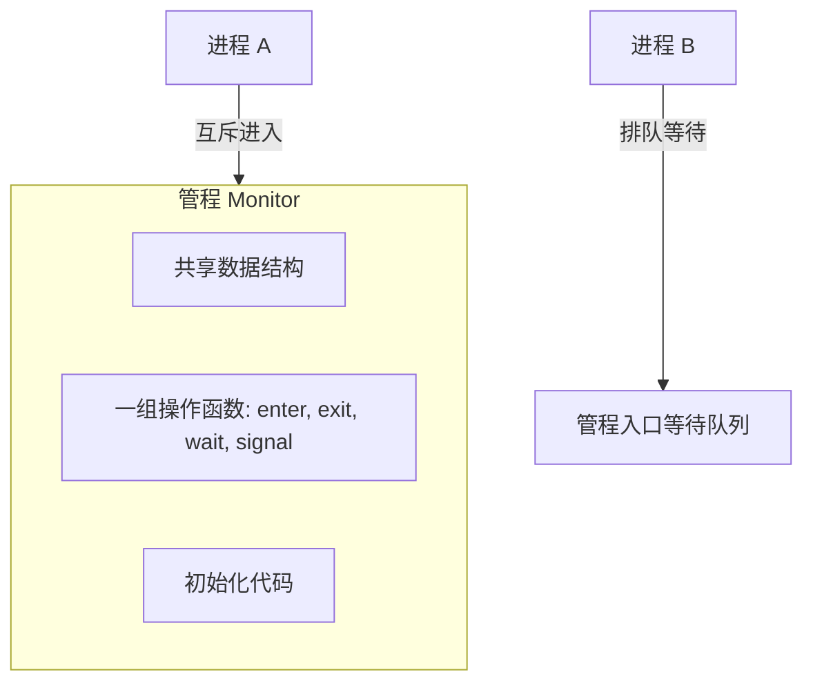
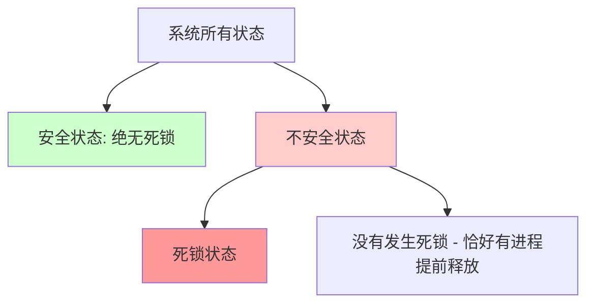
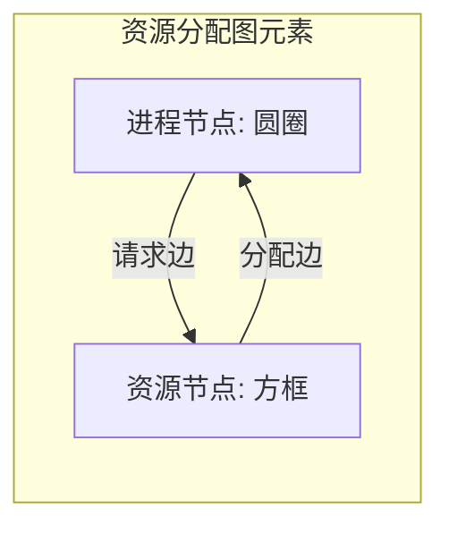

> [!abstract] 考点本质（直击130分核心）
> Brian，第二章的最后一关，我们将一网打尽**管程的核心原理**与**死锁的四大处理策略**。
> 这部分的考点非常明确且硬核：
> 1. **管程的两个核心特征**（编译器自动互斥、条件变量的 `wait/signal` 机制与 PV 的区别）；
> 2. **死锁产生的四个必要条件**（互斥、不剥夺、请求并保持、循环等待）；
> 3. **死锁预防的四种静态手段**及其各自付出的沉重代价；
> 4. **死锁避免（安全状态 vs 不安全状态）与银行家算法的大题计算**（高频必考❗）；
> 5. **死锁检测（资源分配图简化）与死锁解除的方法**。
> 
> 🎯 **做题铁律：不安全状态不等于死锁！只要系统处于安全状态，就绝对不会发生死锁；而处于不安全状态时，只是“有可能”发生死锁。**

---

### 一、 管程（Monitor）

#### 1. 为什么要引入管程？
在使用信号量 PV 操作时，由于 P 操作和 V 操作分散在各个进程的代码中，一旦程序员写错顺序（如将 `P(empty)` 和 `P(mutex)` 写反），就会发生死锁，调试极其困难。为了**让并发编程更简单、更安全**，人们引入了管程。

#### 2. 管程的定义与组成
管程是一种高级同步机制。它是一个特殊的**软件模块**，包含：
1.  管程内部的**共享数据结构**；
2.  对该数据结构进行操作的**一组函数（过程）**；
3.  对管程内共享数据设置初始值的**初始化代码**。

#### 3. 管程的两大核心特征（408 必考选择题点❗）
1.  **管程内部的互斥由编译器/管程自身保证**：
    **管程同一时刻只允许一个进程在管程内部执行**。程序员在编写管程函数时，不需要手动写 `P(mutex)` 和 `V(mutex)`，编译器会自动把互斥逻辑注入进去。
2.  **条件变量与同步管理**：
    为了解决同步问题，管程引入了**条件变量（Condition Variables）**。
    *   `x.wait()`：当进程在管程中因条件 `x` 不满足时，调用 `x.wait()` 将自己**插入到条件 `x` 的等待队列中，并主动释放管程的互斥锁**（允许其他进程进入管程）。
    *   `x.signal()`：当某个条件满足时，调用 `x.signal()` **唤醒一个在条件 `x` 队列中等待的进程**。

##### 🚨 条件变量 vs 信号量的本质区别：
*   **信号量**是有“值”（Value）的，V 操作会累加值，即使没有进程在等，值也会保留。
*   **条件变量**是“无值/无记忆”的。如果当前没有进程在条件 `x` 队列里等待，调用 `x.signal()` **什么也不会发生**（直接被丢弃）。

---

### 二、 死锁（Deadlock）的概念

#### 1. 什么是死锁？
死锁是指两个或多个进程在运行过程中，因争抢资源而造成的一种**互相等待的僵持状态**。若无外力作用，它们都将无法向前推进。
*   **死锁**：至少两个进程被挂起，互相等待对方释放资源。
*   **饥饿**：一个进程长期得不到 CPU 或某种资源调度，处于就绪/等待态，但**其他进程是在正常运行的**。
*   **死循环**：程序内部逻辑出错（如 `while(1)`），**CPU 一直在运行**，不是挂起状态。

#### 2. 死锁产生的四个必要条件（缺一不可❗）
1.  **互斥条件**：只有对必须互斥使用的资源进行争抢才会导致死锁。
2.  **不剥夺条件**：进程持有的资源在未使用完之前，不能被强行剥夺，只能由其主动释放。
3.  **请求并保持条件**：进程已经保持了至少一个资源，但又提出了新的资源请求，而该资源被其他进程占用。此时该进程阻塞，但对自己已占有的资源**拒不释放**。
4.  **循环等待条件**：存在一个进程资源的循环等待链（如 P0 等 P1 的资源，P1 等 P2 的资源，P2 等 P0 的资源）。
    *   🚨 **避坑警告**：**循环等待是死锁的必要条件，但不是充分条件**。如果每种资源都只有 1 个实例，那么循环等待 ➜ 必然死锁；如果资源有多个实例，循环等待不一定会死锁（因为可能有链外的进程释放资源打破循环）。

---

### 三、 死锁处理策略 1：预防死锁（静态避免）

通过设置极其严格的静态规则，破坏死锁的四个必要条件之一：

| 破坏条件 | 具体实现手段 | 付出的代价 / 缺点 |
| :--- | :--- | :--- |
| **破坏互斥** | 利用 SPOOLing 技术把独占设备虚拟为共享设备（如虚拟打印机）。 | 并非所有资源都能虚拟化，适用范围极窄。 |
| **破坏不剥夺** | 当进程申请新资源得不到满足时，必须主动释放它已占有的所有资源，以后重新申请。 | 实现复杂；反复释放和重新申请资源导致**系统开销极大，可能引发饥饿**。 |
| **破坏请求并保持** | **一次性预分配策略**：进程在运行前必须一次性申请并获得它所需的全部资源，否则不投入运行。 | **资源利用率极低**（很多资源可能在运行后期才用，前期白白闲置）；长进程容易**饥饿**。 |
| **破坏循环等待** | **顺序资源分配法**：给系统所有资源编号（1, 2, ...），规定进程必须严格按照编号递增的顺序申请资源。 | 限制了新设备的增加；编程极其困难，限制了用户编程的自由度；可能造成资源闲置。 |

---

### 四、 死锁处理策略 2：避免死锁（动态检测，高频大题计算❗）

死锁避免不限制用户的资源申请顺序，而是在**动态分配资源前，先进行一次安全性检查**。

#### 1. 安全状态与安全序列
*   **安全状态**：如果系统能找到一个**安全序列** $\langle P_1, P_2, \dots, P_n \rangle$，使得每个进程 $P_i$ 以后尚需的资源量不超过系统当前剩余资源量加上所有先于其运行的进程已占有的资源量。那么系统就是安全的。
*   **不安全状态**：如果找不到任何一个安全序列。
*   **核心结论**：不安全状态 $\ne$ 死锁。系统处于不安全状态只是**有可能**滑向死锁，但只要系统还在安全状态，就**绝对不会**发生死锁。

#### 2. 银行家算法（Banker's Algorithm）

##### 📊 数据结构：
*   $\text{Available}[m]$：长度为 $m$ 的一维数组，代表系统当前每种资源的可用数量。
*   $\text{Max}[n][m]$：$n \times m$ 矩阵，进程的最大资源需求量。
*   $\text{Allocation}[n][m]$：$n \times m$ 矩阵，进程已分配的资源量。
*   $\text{Need}[n][m]$：$n \times m$ 矩阵，进程尚需的资源量。
    $$\text{Need}[i][j] = \text{Max}[i][j] - \text{Allocation}[i][j]$$

##### 👑 安全性算法推演步骤（Brian 必拿满分）：
当进程 $P_i$ 发出请求向量 $\text{Request}_i$ 时，系统按如下步骤检查：
1.  若 $\text{Request}_i[j] \le \text{Need}[i][j]$，转向步骤 2；否则报错（要的比宣布的最大值还多）。
2.  若 $\text{Request}_i[j] \le \text{Available}[j]$，转向步骤 3；否则阻塞等待（当前资源不够）。
3.  系统**尝试**把资源分配给 $P_i$，并动态修改数据结构：
    $$\text{Available} = \text{Available} - \text{Request}_i$$
    $$\text{Allocation}_i = \text{Allocation}_i + \text{Request}_i$$
    $$\text{Need}_i = \text{Need}_i - \text{Request}_i$$
4.  执行**安全性检查算法**。如果检查结果是**安全**的，才正式分配；如果检查结果是**不安全**的，则撤销这次尝试分配，让 $P_i$ 阻塞等待。

##### 🔒 安全性检查算法：
1.  设置两个辅助向量：$\text{Work} = \text{Available}$（工作向量），$\text{Finish}[i] = \text{false}$（标志进程是否完成）。
2.  从进程列表中寻找一个满足以下条件的进程 $P_i$：
    *   $\text{Finish}[i] == \text{false}$
    *   $\text{Need}_i \le \text{Work}$
    *   若找到，假设 $P_i$ 顺利运行完毕，回收它占有的全部资源：
        $$\text{Work} = \text{Work} + \text{Allocation}_i$$
        $$\text{Finish}[i] = \text{true}$$
        重复本步骤。
3.  若所有进程的 $\text{Finish}[i]$ 最终都变为 $\text{true}$，说明系统处于**安全状态**，安全序列即为找出的执行顺序；否则，系统处于不安全状态。

---

### 五、 死锁处理策略 3：检测与解除

如果系统不对资源分配进行限制，就必须定期进行死锁检测与解除。

#### 1. 死锁检测：资源分配图简化（Sheadon-Coffman 定理）

*   **简化步骤**：
    1.  在图中找一个**既非孤立也非阻塞**的进程节点（即该进程请求的每种资源，系统当前剩余的空闲资源都足够支付它）。
    2.  由于该进程可以顺利运行完并释放资源，我们**消去该进程所有的请求边和分配边**（使之成为孤立点）。
    3.  重复上述过程，直到无法继续简化。
*   **死锁判定定理**：**若资源分配图可以被完全简化（所有边都被消去），则系统没有死锁**；若不能完全简化，则系统**已发生死锁**，残留的非孤立进程就是死锁进程。

#### 2. 死锁解除手段
一旦检测出死锁，可采取以下手段挽救系统：
1.  **资源剥夺法**：挂起某些死锁进程，强行抢占它们占有的资源分配给其他死锁进程（注意保存断点以便以后恢复）。
2.  **撤销进程法（最常用）**：强行杀死一个或多个死锁进程（可以按优先级、已运行时间、持有资源量来挑选代价最小的进程）。
3.  **进程回退法**：让一个或多个进程回退到足以避开死锁的某个历史检查点（Checkpoint），回退时需要系统记录历史状态。

---

### 👑 408 大题秒杀：银行家算法完整手算推演

> [!example] 例题（真题级难度）
> 某系统有 $A$, $B$, $C$ 三种资源，初始数量分别为 $(10, 5, 7)$。当前有 5 个进程，分配状态如下：
>
> | 进程 | Max (A,B,C) | Allocation (A,B,C) |
> |:---:|:---:|:---:|
> | $P_0$ | $(7, 5, 3)$ | $(0, 1, 0)$ |
> | $P_1$ | $(3, 2, 2)$ | $(2, 0, 0)$ |
> | $P_2$ | $(9, 0, 2)$ | $(3, 0, 2)$ |
> | $P_3$ | $(2, 2, 2)$ | $(2, 1, 1)$ |
> | $P_4$ | $(4, 3, 3)$ | $(0, 0, 2)$ |
>
> **(1)** 计算 Need 矩阵和 Available 向量，判断当前系统是否处于安全状态。
> **(2)** 若此时 $P_1$ 发出请求 $\text{Request}_1 = (1, 0, 2)$，系统能否满足？

**第一步：计算 Need 矩阵和 Available 向量**

$$\text{Need}[i] = \text{Max}[i] - \text{Allocation}[i]$$

| 进程 | Max | Allocation | **Need** |
|:---:|:---:|:---:|:---:|
| $P_0$ | $(7,5,3)$ | $(0,1,0)$ | $\mathbf{(7,4,3)}$ |
| $P_1$ | $(3,2,2)$ | $(2,0,0)$ | $\mathbf{(1,2,2)}$ |
| $P_2$ | $(9,0,2)$ | $(3,0,2)$ | $\mathbf{(6,0,0)}$ |
| $P_3$ | $(2,2,2)$ | $(2,1,1)$ | $\mathbf{(0,1,1)}$ |
| $P_4$ | $(4,3,3)$ | $(0,0,2)$ | $\mathbf{(4,3,1)}$ |

$$\text{Available} = (10,5,7) - \sum \text{Allocation} = (10,5,7) - (7,2,5) = \mathbf{(3,3,2)}$$

**第二步：安全性检查推演（用 Work 向量逐步推导）**

初始 $\text{Work} = (3,3,2)$

| 轮次 | 选中进程 | $\text{Work}$ | $\text{Need}$ | $\text{Need} \le \text{Work}$? | $\text{Work} + \text{Allocation}$ | Finish |
|:---:|:---:|:---:|:---:|:---:|:---:|:---:|
| 1 | $P_1$ | $(3,3,2)$ | $(1,2,2)$ | ✅ 全部满足 | $(3,3,2)+(2,0,0)=\mathbf{(5,3,2)}$ | true |
| 2 | $P_3$ | $(5,3,2)$ | $(0,1,1)$ | ✅ 全部满足 | $(5,3,2)+(2,1,1)=\mathbf{(7,4,3)}$ | true |
| 3 | $P_4$ | $(7,4,3)$ | $(4,3,1)$ | ✅ 全部满足 | $(7,4,3)+(0,0,2)=\mathbf{(7,4,5)}$ | true |
| 4 | $P_2$ | $(7,4,5)$ | $(6,0,0)$ | ✅ 全部满足 | $(7,4,5)+(3,0,2)=\mathbf{(10,4,7)}$ | true |
| 5 | $P_0$ | $(10,4,7)$ | $(7,4,3)$ | ✅ 全部满足 | $(10,4,7)+(0,1,0)=\mathbf{(10,5,7)}$ | true |

所有 Finish 均为 true ✅ 系统处于**安全状态**！

$$\text{安全序列：} \langle P_1, P_3, P_4, P_2, P_0 \rangle$$

**第三步：处理 P1 请求 Request₁ = (1, 0, 2)**

**检查前两个条件：**
- $\text{Request}_1 = (1,0,2) \le \text{Need}_1 = (1,2,2)$ ✅
- $\text{Request}_1 = (1,0,2) \le \text{Available} = (3,3,2)$ ✅

**尝试分配，更新数据结构：**

$$\text{Available} = (3,3,2) - (1,0,2) = \mathbf{(2,3,0)}$$
$$\text{Allocation}_1 = (2,0,0) + (1,0,2) = \mathbf{(3,0,2)}$$
$$\text{Need}_1 = (1,2,2) - (1,0,2) = \mathbf{(0,2,0)}$$

**再次执行安全性检查（用新的 Work = (2,3,0)）：**

| 轮次 | 选中进程 | $\text{Work}$ | $\text{Need}$ | $\text{Work} + \text{Allocation}$ |
|:---:|:---:|:---:|:---:|:---:|
| 1 | $P_1$ | $(2,3,0)$ | $(0,2,0)$ ✅ | $(2,3,0)+(3,0,2)=\mathbf{(5,3,2)}$ |
| 2 | $P_3$ | $(5,3,2)$ | $(0,1,1)$ ✅ | $(5,3,2)+(2,1,1)=\mathbf{(7,4,3)}$ |
| 3 | $P_4$ | $(7,4,3)$ | $(4,3,1)$ ✅ | $(7,4,3)+(0,0,2)=\mathbf{(7,4,5)}$ |
| 4 | $P_2$ | $(7,4,5)$ | $(6,0,0)$ ✅ | $(7,4,5)+(3,0,2)=\mathbf{(10,4,7)}$ |
| 5 | $P_0$ | $(10,4,7)$ | $(7,4,3)$ ✅ | $(10,4,7)+(0,1,0)=\mathbf{(10,5,7)}$ |

所有 Finish 均为 true ✅ **可以满足 P1 的请求！**

$$\text{新安全序列：} \langle P_1, P_3, P_4, P_2, P_0 \rangle$$

> [!danger] 避坑警告
> 1. **安全序列往往不唯一**！只要写出一个合法的即可拿满分。但挑选顺序影响推演结果，如果第一轮选错了（Need > Work），就要换一个进程试。
> 2. **一定要先"尝试分配"再做安全性检查**，而不是直接做！因为安全性检查用的是假设分配后的 Available 值。
> 3. **若安全性检查不通过**：必须撤销尝试分配（恢复 Available/Allocation/Need），让 $P_i$ 阻塞等待。

> [!tip] 💡 考场上画表格的技巧
> 先把所有进程的 Need 扫一遍，找到 **Need 最小的那个进程** 优先执行——因为它最容易被 Work 满足。这样可以减少试错，节约时间。

Brian，第二章的硬骨头我们已经全部啃下来了。接下来，我们要去征服第三章——内存管理。加油！
