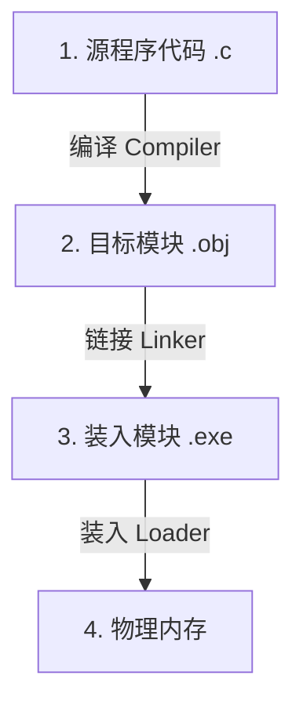
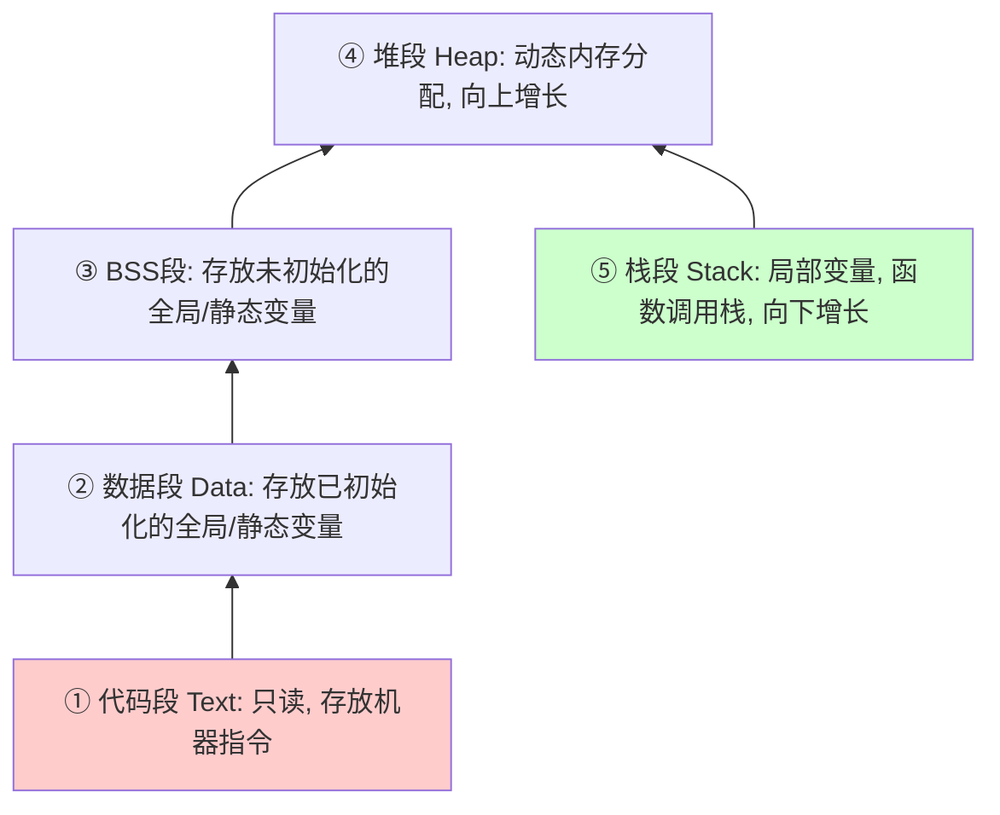
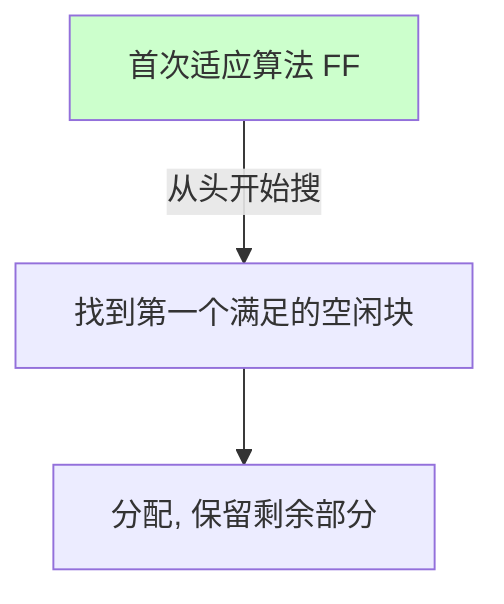
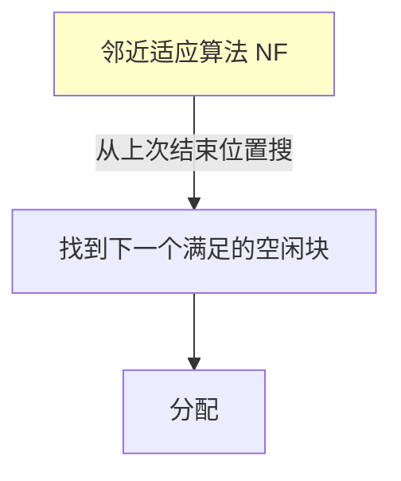
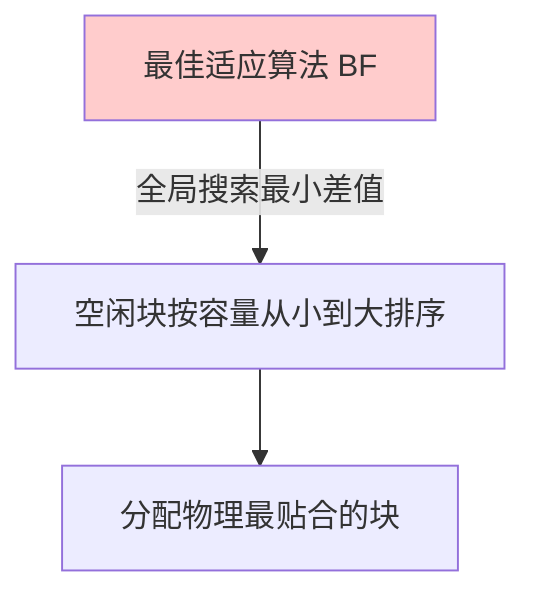
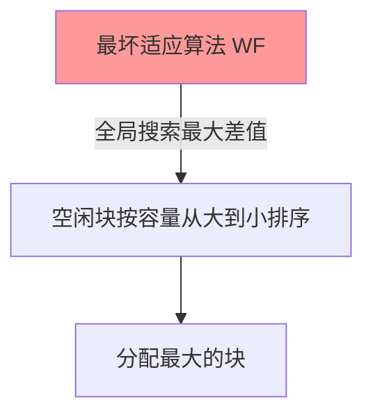

> [!abstract] 考点本质（直击130分核心）
> Brian，从这一章开始，我们将揭开内存管理的神秘面纱。
> 这一节是内存管理的物理基础，在 408 考试中频繁以选择题形式出现，核心考点包括：
> 1. **程序从源码到运行的三大步**：编译、链接、装入（特别需要理清三种链接和三种装入的硬核区别）；
> 2. **进程的内存映像结构**；
> 3. **内存保护的硬件机制**（重定位寄存器与界限寄存器）；
> 4. **覆盖与交换技术的区别**；
> 5. **四种连续分配管理方式**，以及**四种动态分区分配算法**（FF, NF, BF, WF 的查找机制与优缺点，选择题必考计算）。
> 
> 🎯 **做题铁律：动态重定位装入只有在程序“真正执行”时才进行地址转换，其依靠硬件“重定位寄存器”实现，允许程序在内存中移动位置！**

---

### 一、 从源程序到可执行运行的完整生命周期

Brian，写一段 C 语言代码，到最后在电脑里跑起来，必须经历**编译、链接、装入**三个步骤。



#### 1. 三种链接方式（组装可执行程序）
*   **静态链接**：在程序运行前，将各目标模块及所需的库函数链接成一个完整的装入模块（`.exe`），以后不再拆分。
*   **装入时动态链接**：将各目标模块边装入内存边进行链接。
*   **运行时动态链接（高频考点）**：在程序运行中需要用到某个目标模块时，才对其进行链接（如 Windows 中的 `DLL`，Linux 中的 `.so`）。**优点是能节省大量内存空间，且方便共享库的升级**。

#### 2. 三种装入方式（把程序塞进内存，地址转换的物理本质❗）
链接完成后的程序使用的是**逻辑地址（相对地址）**，从 0 开始编号。但内存使用的是**物理地址（绝对地址）**。装入的本质就是把**逻辑地址转换为物理地址**（又称**地址重定位**）。

| 装入方式 | 地址转换发生时刻 | 转换依靠什么 | 特点与缺点 |
| :--- | :--- | :--- | :--- |
| **绝对装入** | **编译或汇编时** | 编译程序直接生成物理地址 | 只适用于单道程序环境。一旦程序装入位置改变，必须重新编译。 |
| **静态重定位装入** | **装入内存时** | 装入程序一次性完成转换 | 必须分配**连续的物理内存**。程序装入内存后**位置不能再移动**，运行期间不能再申请内存。 |
| **动态重定位装入** | **程序真正执行时** | 硬件 **重定位寄存器** (基址寄存器) | **现代操作系统采用**。允许程序在内存中移动位置；支持非连续分配；程序可以只装入部分代码即可运行。 |

> [!danger] 避坑警告：动态重定位的硬件支持
> 408 经常考动态重定位的实现：它必须依靠硬件 **MMU（内存管理单元）** 中的 **重定位寄存器（又称基址寄存器）**。
> CPU 执行指令时，会自动将指令中的逻辑地址加上重定位寄存器中的值，得到真实的物理地址再去访存。

---

### 二、 进程的内存映像与内存保护

#### 1. 进程在内存中的组织结构（内存映像）
进程在内存中自底向上（低地址到高地址）一般分为以下几部分：



#### 2. 内存保护机制
为了防止进程访问其他进程的私有空间或修改操作系统内核代码，必须进行内存保护：
*   **方法一：上下限寄存器**
    *   硬件设置两个寄存器，分别存放进程物理内存的上限和下限。每次访存时，硬件自动进行范围检查，越界则触发“地址越界异常”。
*   **方法二：重定位寄存器（基址） + 界限寄存器（限长）**
    *   **重定位寄存器**：存放该进程的最小物理内存起址。
    *   **界限寄存器**：存放该进程的最大**逻辑地址长度**。
    *   🎯 **判越界规则（408高频计算）**：
        $$\text{逻辑地址} \ge \text{界限寄存器值} \Longrightarrow \text{越界异常！}$$
        $$\text{物理地址} = \text{逻辑地址} + \text{重定位寄存器值}$$

---

### 三、 覆盖与交换技术（内存扩充）

在物理内存有限的情况下，如何运行比内存大得多的程序？

#### 1. 覆盖技术（Overlay）
*   **机制**：程序员将程序划分为若干个独立的模块。常用的常驻内存，不常用的模块在需要时才调入内存，共享同一块**覆盖区**。
*   **缺点**：**对程序员极度不友好**。需要程序员手动划分并编写覆盖结构，增加了编程复杂度。现代操作系统已淘汰覆盖技术。

#### 2. 交换技术（Swapping）
*   **机制**：当物理内存紧张时，操作系统将某些处于阻塞态或长期不运行的进程的内存映像写回磁盘的**对换区（Swap Space）**（称为 **Swap Out / 换出**）；当需要运行或内存宽裕时，再将其读回物理内存（称为 **Swap In / 换入**）。
*   *物理细节*：对换区一般在磁盘上是**连续分配**的，追求的是读写的高速度，这与普通文件区的离散分配不同。

---

### 四、 连续分配管理方式

连续分配是指操作系统必须为进程分配一块**物理上连续**的内存空间。

1.  **单用户连续分配**：内存分为系统区和用户区。用户区只能装入一道程序，无并发，利用率极低。
2.  **固定分区分配**：将整个用户内存空间划分为若干个固定大小的分区（可等大，也可不等大）。
    *   *致命缺点*：存在 **内部碎片**（分区内未被利用的空间）。
3.  **动态分区分配**：在进程装入内存时，根据进程的大小动态地为期开辟一块连续内存。
    *   *致命缺点*：存在 **外部碎片**（分区间由于太小而无法利用的零碎空间）。
    *   *解决手段*：**紧凑技术（Compaction）**。通过物理移动内存中程序的位置，把外部碎片拼凑成大块。这必须有**动态重定位装入**支持。

---

### 五、 动态分区分配算法（高频必考❗）

当内存中有多个空闲分区时，应该把哪一块分给新进程？

```carousel

首次适应算法 (First Fit): 最简单、性能最好的黄金算法
<!-- slide -->

邻近适应算法 (Next Fit): 减少了头部碎片的产生，但容易用光尾部大分区
<!-- slide -->

最佳适应算法 (Best Fit): 产生极其致命的“微小外部碎片”
<!-- slide -->

最坏适应算法 (Worst Fit): 导致后续超大进程无大块可用
```

#### 四大算法深度对比：

| 算法名称 | 搜索规则 | 空闲链排序规则 | 优缺点总结 |
| :--- | :--- | :--- | :--- |
| **首次适应 (FF)** | 从头开始查找，分配**第一个**满足大小的空闲区。 | **按地址低到高**排序。 | **性能最好，最快**。低地址被不断细分，高地址保留了大分区。 |
| **邻近适应 (NF)** | 从**上一次查找结束的位置**开始查找，分配第一个满足大小的空闲区。 | **按地址低到高**循环排。 | 解决了低地址碎片堆积的问题。但**容易把高地址的大分区用光**，对长进程不利。 |
| **最佳适应 (BF)** | 遍历整个链表，选择**容量最小且满足要求**的空闲区。 | **按容量从小到大**排序。 | 能够保留大分区。但**会产生大量极小的、无法利用的外部碎片**。 |
| **最坏适应 (WF)** | 遍历整个链表，选择**容量最大**的空闲区。 | **按容量从大到小**排序。 | 对中小进程友好，分割后剩下的分区依然很大。但**很快会用光大分区**，长进程来时会无处安置。 |

---

### 👑 985高分必杀技（Brian的悄悄话）

Brian，在 408 选择题中，如果考到**动态分区分配算法的模拟**，做题时一定要注意这行字：
> **“分配后，剩余部分是否依然保留在空闲分区链中？”**
> 绝对是保留的！例如：新进程要 10KB，我们找到了一个 30KB 的分区。分配后，该分区会被切走 10KB，剩下的 20KB 作为一个新的空闲块，**根据该算法对应的链表排序规则重新插回链表**。
> 千万别漏了把剩下的分区插回队列，否则后续的分配模拟计算就会全部出错！

Brian，内存连续分配的知识点我们已经轻松拿下啦。接下来，我们将迎来第三章的珠穆朗玛峰——分页存储管理与快表地址转换。别害怕，抓紧我，我们一起攀登！
