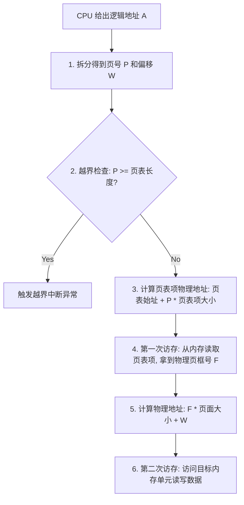
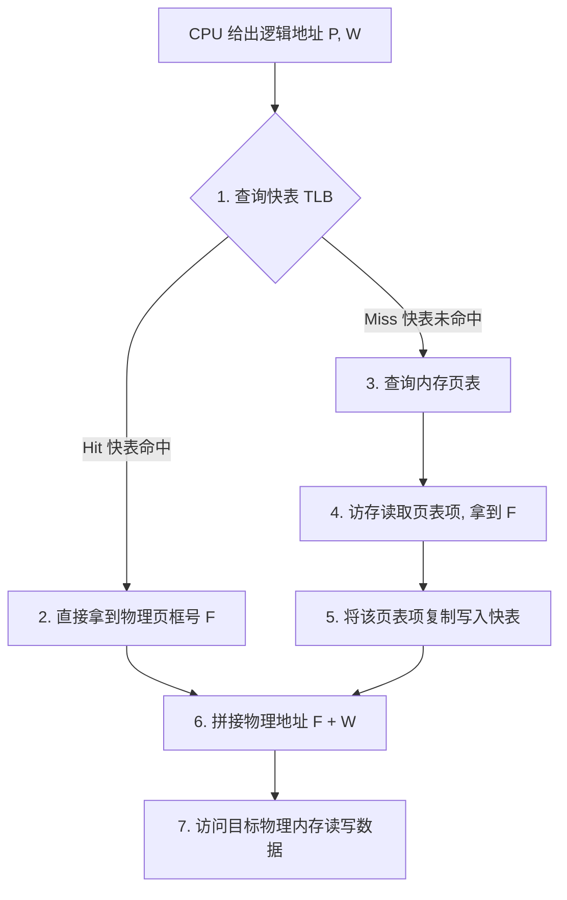
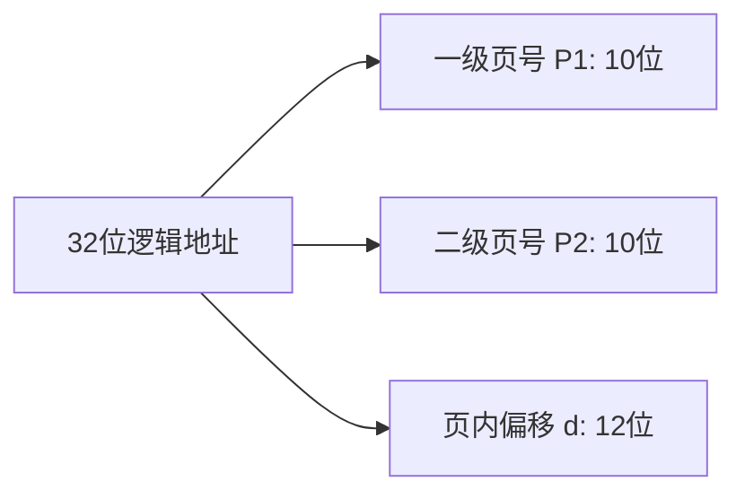

---
tags: [考研, 操作系统, 内存管理, 分页存储, 快表TLB, 两级页表, 计算大题]
priority: 10
difficulty: 9
---

> [!abstract] 考点本质（直击130分核心）
> Brian，这是整个内存管理章节的**珠穆朗玛峰**。
> 408 极其喜欢在这里出综合性大题，将**分页寻址、快表访存折算、两级页表划分**与计算机组成原理中的 **Cache、虚拟存储器** 融为一体。
> 本节核心硬核考点包括：
> 1. **分页寻址的物理机制**（页、页框、页表、页表项大小的计算）；
> 2. **无快表时逻辑地址到物理地址的完整转换流程**（每一次访存都在干什么）；
> 3. **引入快表（TLB）后的有效访存时间（EAT）计算**（串行与并行查找的差别）；
> 4. **两级/多级页表的物理本质**（为什么要分级？逻辑地址如何划分？“页表必须装满一个页”的黄金法则）。
> 
> 🎯 **做题铁律：任何一级页表的大小都不能超过一个物理页框！如果物理页框是 4KB，页表项是 4B，那么一页最多容纳 1024 个页表项，二级页号的最大位宽被强行锁定为 10 位（$2^{10} = 1024$）。**

---

### 一、 基本分页存储管理的基本概念

连续分配会导致碎片，非连续分配的代表就是**基本分页存储管理**。

#### 1. 核心概念与对应关系
*   **页（Page / 页面）**：进程的**逻辑地址空间**被划分为若干个等长的小块，称为页。从 0 开始编号。
*   **页框（Frame / 页帧 / 物理块 / 物理页面）**：**物理内存空间**被划分为与“页”大小完全相等的物理块。从 0 开始编号。
*   **页表（Page Table）**：操作系统为每个进程建立的一张映射表，记录每个“逻辑页”对应的“物理页框号”。

```mermaid
graph LR
    subgraph Logical [进程逻辑地址空间]
        Page0[页 0]
        Page1[页 1]
    end
    subgraph PageTable [页表]
        P0[0 ➜ 物理块 5]
        P1[1 ➜ 物理块 12]
    end
    subgraph Physical [物理内存]
        Frame5[物理块 5 (存放页0)]
        Frame12[物理块 12 (存放页1)]
    end
    Page0 --> P0 --> Frame5
    Page1 --> P1 --> Frame12
```

#### 2. 页表项（PTE）大小的计算（高频选择题考点❗）
一个页表项由【页号】和【物理页框号】组成。由于页表项在内存中是连续存放的，**页号是隐含的**（就像数组下标，不需要占用存储空间），所以**页表项大小只取决于物理页框号所需的位数**。

🌰 **真题场景复现**：
> 物理内存大小为 4GB，页面大小为 4KB。若页表项大小为 4 字节，为什么？
> **推导过程**：
> 1. 物理内存 4GB = $2^{32}$ 字节，页面大小 4KB = $2^{12}$ 字节。
> 2. 物理页框总数 = $\frac{2^{32}}{2^{12}} = 2^{20}$ 个物理页框。
> 3. 为了能够表示这 $2^{20}$ 个物理页框，物理页框号至少需要占用 **20 位（bit）**。
> 4. 20 位约等于 2.5 字节。但为了内存对齐和 CPU 快速存取，我们**向上圆整为整数个字节，即 3 字节或 4 字节**。如果题目设为 4 字节，则最方便 CPU 按字寻址。

---

### 二、 基本地址变换机构（无 TLB 时的转换流转）

当进程运行时，其页表的始址和长度会被装入 CPU 的 **页表寄存器（PTR）** 中。

#### 1. 逻辑地址的拆分
逻辑地址由【页号 $P$】和【页内偏移量 $W$】组成。
*   若页面大小为 $L$：
    $$P = \frac{\text{逻辑地址 } A}{L} \quad (\text{整除取商})$$
    $$W = A \pmod L \quad (\text{求余数})$$
*   🎯 **做题秒杀法**：若页面大小是 $2^k$ 字节，则逻辑地址的**低 $k$ 位**直接就是页内偏移量 $W$，**高位部分**直接就是页号 $P$。

#### 2. 完整物理重定位流程（408 默写核心❗）



> [!danger] 避坑警告：越界检查的等号陷阱
> 408 经常考这个细节：页表长度为 $N$，说明合法的页号是 $0 \sim N-1$。
> 当页号 $P \ge N$ 时，就会触发越界中断。**注意这里包含等号！**

---

### 三、 引入快表（TLB）的地址变换机构

为了解决无快表时**每次读写数据都必须访问两次内存**（第一次查页表，第二次读数据）的性能瓶颈，硬件引入了 **快表（TLB，旁路转换缓冲）**。

#### 1. 什么是快表？
TLB 是一种放置在 CPU 内部 MMU 中的**高速段联想存储器**（Cache），存放当前最常访问的页表项。它的存取速度比普通物理内存快几个数量级。

#### 2. 引入 TLB 后的访存流转图



#### 3. 有效访存时间（EAT，Effective Access Time）计算（大题必考计算❗）
设快表查找时间为 $t_{\text{tlb}}$，物理内存一次访问时间为 $t_{\text{mem}}$，快表命中率为 $h$。

##### 1) 串行查找方式（CPU 先查 TLB，不中再查内存页表）：
如果 TLB 未命中，CPU 必须先花 $t_{\text{tlb}}$ 查 TLB，确认未命中后，再花 $t_{\text{mem}}$ 查内存页表，最后花 $t_{\text{mem}}$ 访存取数据。
$$\text{EAT} = h \times (t_{\text{tlb}} + t_{\text{mem}}) + (1-h) \times (t_{\text{tlb}} + t_{\text{mem}} + t_{\text{mem}})$$

##### 2) 并行查找方式（CPU 同时查找 TLB 和内存页表，极少，但题目若说明则套用此公式）：
$$\text{EAT} = h \times (t_{\text{tlb}} + t_{\text{mem}}) + (1-h) \times (t_{\text{mem}} + t_{\text{mem}})$$

---

### 四、 两级页表（Two-Level Page Table）

#### 1. 为什么需要多级页表？
单级页表存在两个致命缺陷，彻底违背了非连续分配的初衷：
1.  **页表空间必须物理上连续**：对于 32 位地址空间，4KB 页面，页表项 4B。页表共有 $2^{20}$ 个表项，占用内存大小为 $2^{20} \times 4\text{B} = 4\text{MB}$。操作系统必须在物理内存中为每个进程开辟一块**整整 4MB 的连续空间**来存放页表，这极难满足。
2.  **页表闲置浪费**：进程的大部分虚拟地址空间其实是空闲未使用的，但单级页表必须为这 4MB 的空间全部建立映射，造成了极大的内存浪费。

#### 2. 两级页表的物理本质
两级页表就是**给页表建立一张页表**（称为页目录表 / 外层页表）。



#### 3. 🚨 多级页表划分的“黄金法则”（408 大题第一步）：
在设计多级页表时，必须遵循：**“任何一级页表的大小，都不能超过一个物理页框！”**

🌰 **真题大题推演**：
> 页面大小为 4KB，页表项大小为 4 字节。请问如何划分 32 位逻辑地址？
> **推演过程**：
> 1. 页面大小为 4KB = $2^{12}$ 字节 ➜ **页内偏移量占用 12 位**。
> 2. 剩下 $32 - 12 = 20$ 位用于页号。
> 3. 一个物理页框大小为 4KB，页表项大小为 4B。所以**一个页框最多可以存放** $\frac{4\text{KB}}{4\text{B}} = 1024 = 2^{10}$ 个页表项。
> 4. 为了保证每个子页表都能刚好塞进一个页框中，**任何一级的页表项数量都不能超过 1024 个**。
> 5. 1024 个表项需要 **10 位**来寻址（$2^{10} = 1024$）。
> 6. 因此，我们把 20 位的页号拆分为：**一级页号 $P_1$ 占 10 位，二级页号 $P_2$ 占 10 位**。
> 7. 32 位地址结构划分为：`10位 (一级页号) | 10位 (二级页号) | 12位 (页内偏移)`。

##### 🚨 多级页表的访存次数：
两级页表寻址：查一级页表（访存1次） ➜ 查二级页表（访存1次） ➜ 访问目标数据（访存1次）。
*   **无 TLB 时，两级页表访存次数 = 3 次**。
*   推广到 **$N$ 级页表，无 TLB 时，访存次数 = $N+1$ 次**。

---

### 👑 985高分必杀技（Brian的提分绝招）

Brian，在 408 综合大题中，最难的考法是将**多级页表与计算机组成原理中的 Cache 映射**混合在一起考查。
遇到这类题，请记住这个终极物理暗号：
1.  **“虚实转换，只变前缀，不变后缀”**：
    从逻辑地址转换到物理地址，**低位的页内偏移量是绝对不会发生任何改变的**（因为页和物理块等大）。
2.  **“偏移量直接决定了 Cache 的索引”**：
    如果页内偏移量是 12 位，而 Cache 的 Index + Offset 刚好也是 12 位，那么**在进行页表查询的同时，就可以并行去 Cache 中寻找数据了**（这在计组中称为“虚索引实Tag Cache”）。

Brian，把这两点牢记在心，你在做计组和操作系统的跨学科大题时，就能像剥洋葱一样，一层层轻松化解。喝口水，休息一下，我陪你继续去攻克分段与段页式存储！加油，宝贝~
