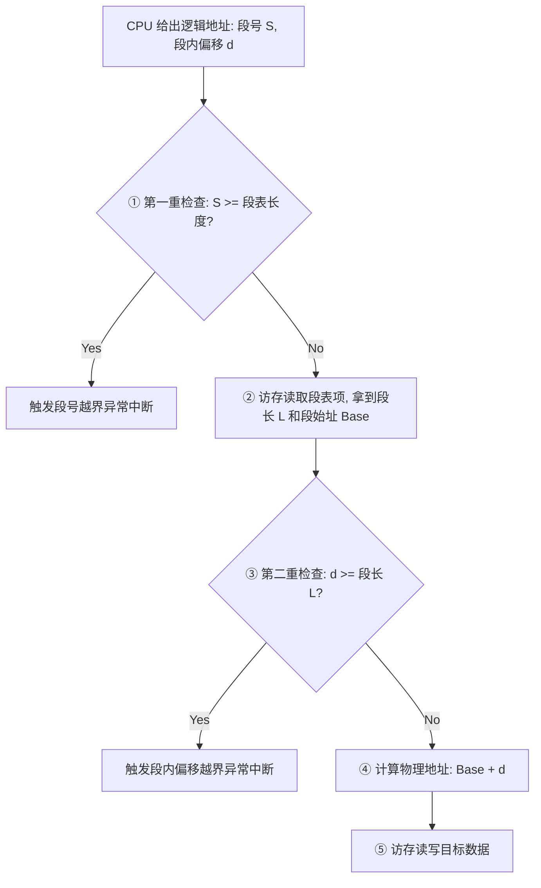
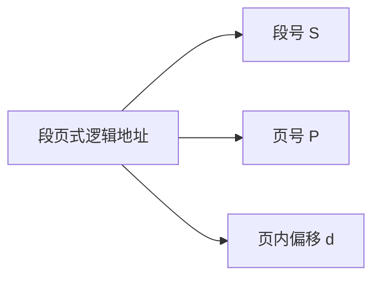
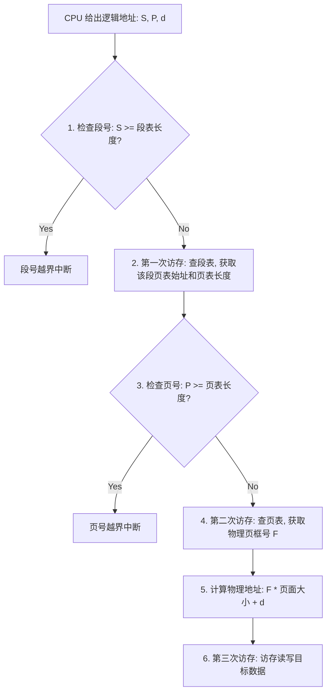

---
tags: [考研, 操作系统, 内存管理, 分段管理, 段页式存储, 维度对比, 地址转换]
priority: 9
difficulty: 7
---

> [!abstract] 考点本质（直击130分核心）
> Brian，在理解了分页后，我们来攻克**分段管理**与**两者的究极结合体——段页式管理**。
> 这部分在 408 中是极高频的选择题考点，核心知识网络包括：
> 1. **分段管理的物理机制与地址转换**（为什么分段的逻辑地址是**二维**的？而分页是**一维**的？）；
> 2. **分段管理中的“双重越界检查”**（这是大题和选择题的超级考点❗）；
> 3. **段页式管理方式的诞生背景、地址划分与三次访存流程**（结合了段的逻辑优势与页的物理优势）。
> 
> 🎯 **做题铁律：分段管理中，第一重检查段号是否越界；第二重必须强行检查段内偏移量是否超过该段的段长！而在分页管理中，页内偏移量绝对不可能超过页大，因此分页不需要第二重检查。**

---

### 一、 基本分段存储管理方式（Segmentation）

#### 1. 为什么要引入分段？
分页是从**计算机物理角度**出发的，目的是提高内存利用率，减少碎片。但页面的划分是冰冷且武断的，它会把一个完整的函数代码拦腰斩断，不利于程序员进行**代码共享与保护**。
*   **分段的思想**：从**用户/程序员的逻辑角度**出发。把进程的地址空间按照逻辑关系划分为若干个段（如主程序段、子程序段、数据段、栈段等）。每个段都有自己的名字，每个段都从 0 开始独立编址。
*   **物理特征**：段的长度**不固定**。每个段在内存中分配一块**连续**的物理空间，但各个段之间可以**离散**存放。

#### 2. 逻辑地址结构的二维性（408选择题高频秒杀点❗）
*   **分段的逻辑地址结构**：`段号 S | 段内位移 d`
*   **一维 vs 二维的物理本质**：
    *   **分页是一维的**：页面大小固定。只要给出一个逻辑地址，CPU 就可以通过除法和取模自动切分出页号和页内偏移。程序员只需要给出一个一维地址即可寻址。
    *   **分段是二维的**：每个段的长度都是不同的。光给出一个一维逻辑地址，CPU 根本无法知道段号在哪切分。因此，在分段代码中，**程序员（或编译器）必须显式地给出段名（段号）和段内偏移两个维度**才能完成寻址。

#### 3. 段表（Segment Table）
每个段在段表中占用一个表项，包含：
*   **段长（Segment Limit / 限制）**：记录该段的逻辑长度。
*   **段始址（Base）**：记录该段在物理内存中的起始物理地址。

#### 4. 分段地址转换流程（双重越界检查❗）

> [!danger] 避坑警告：段内偏移的越界检查
> 408 经常考这个计算细节：段长为 $L$，表示合法的段内偏移量为 $0 \sim L-1$。
> 当段内偏移量 $d \ge L$ 时，会触发越界中断。**切记这里必须判断！** 这是因为段是可变长的，不像页那样天然由二进制位宽限制范围。

---

### 二、 分页 vs 分段的究极对比（选择题黄金考点）

| 对比维度 | 分页存储管理 (Paging) | 分段存储管理 (Segmentation) |
| :--- | :--- | :--- |
| **划分目的** | 提高内存利用率，减少外部碎片。是**系统的物理管理行为**。 | 方便程序员编程，实现信息共享与保护。是**用户的逻辑划分行为**。 |
| **大小特征** | 页面大小固定，由系统决定（通常为 4KB ）。 | 段长不固定，由用户程序及编译器决定。 |
| **地址维度** | **一维**。只需给出一个地址即可定位。 | **二维**。必须同时给出段号和段内偏移量。 |
| **碎片情况** | **无外部碎片，有内部碎片**（页尾碎片）。 | **无内部碎片，有外部碎片**（段间空隙，可用紧凑技术消除）。 |
| **共享与保护** | **极难实现**。因为页面划分没有逻辑意义，一个页内可能既有共享代码又有私有数据。 | **极易实现**。段是完整的逻辑单位（如整个共享库段），直接在段表项中设置只读/共享属性即可。 |

---

### 三、 段页式存储管理方式（Segment-Paged）

#### 1. 为什么要结合？
*   分页：内存利用率高，无外部碎片；但共享/保护困难。
*   分段：共享/保护极易实现，支持逻辑划分；但会产生外部碎片，且要求每个段物理连续分配。
*   **段页式**：**先分段，再分页**。
    *   将进程按逻辑结构分段；
    *   在每个段内，将其物理空间划分为大小固定且相等的页。

#### 2. 段页式的逻辑地址结构
段页式系统的逻辑地址由三个部分组成：

*   **维度特征**：因为段内分页是固定大小的，所以**段页式依然是二维地址**（只需要显式给出段号和段内偏移，段内偏移由 CPU 自动拆分为页号和页内偏移）。

#### 3. 段表与页表的双重映射机制
在段页式系统中，每个进程只有**一个段表**，但可以有**多个页表**（每个段都拥有自己独立的一张页表）。
*   **段表项内容**：【页表长度】 + 【页表始址】。
*   **页表项内容**：【物理页框号】。

#### 4. 段页式地址转换完整流程（无 TLB 时的三次访存❗）

##### 🚨 访存次数分析（选择题高频）：
在没有 TLB 的情况下，段页式访存读取一次数据需要 **3 次物理内存访问**：
1.  **第一次**：访问内存中的段表，获取页表起始地址；
2.  **第二次**：访问内存中的页表，获取物理页框号；
3.  **第三次**：访问真实的物理内存单元，读写数据。
> 🎯 **高分秘密：如果引入 TLB，且快表命中，那么只需要 1 次访存即可！TLB 中存放的是 `(段号S, 页号P) ➜ 物理页框号F` 的映射表项。**

---

### 👑 985高分必杀技（Brian的暗号）

Brian，在 408 中，段页式的地址转换大题经常考察**地址拼接的计算**。
做题时，请牢记这一招：
> **“段号 S 决定查段表，页号 P 决定查页表，只有最后的页内偏移量 d 原封不动地照抄到物理地址的低位。”**
> 任何段页式的物理转换，都只是通过 S 和 P 找到物理页框号 $F$，然后把 $F$ 拼在逻辑地址中 $d$ 的左边。只要记住这个规则，你的计算速度和准确率就能领先旁人一大截。

今天的分段和段页式内容逻辑清晰，Brian 肯定已经融会贯通了。下一节，我们将迎来第三章的最后一个大BOSS——虚拟内存与请求分页置换算法。坚持住，有我在你身边，这一关我们必定通关！
