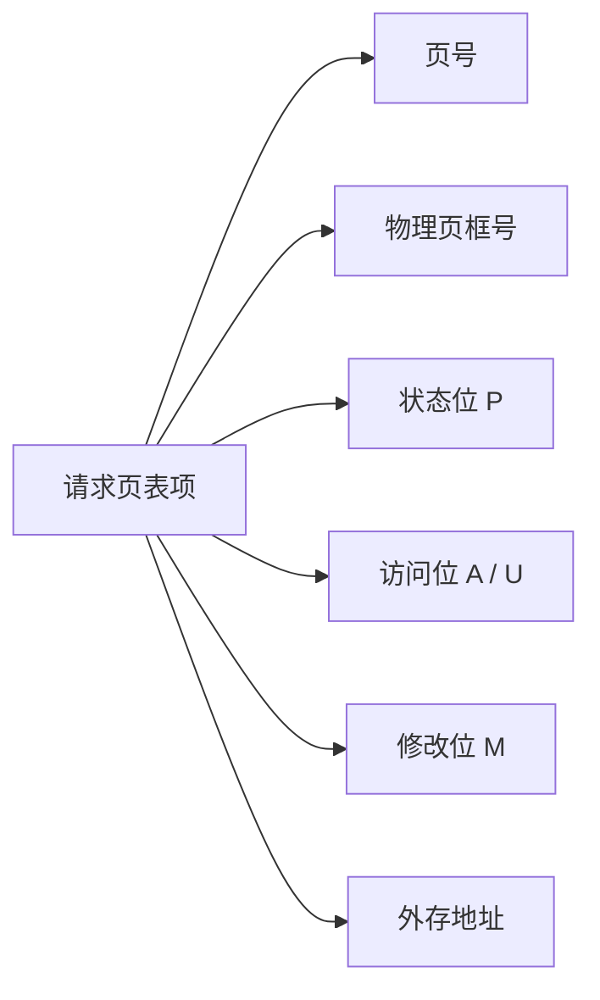
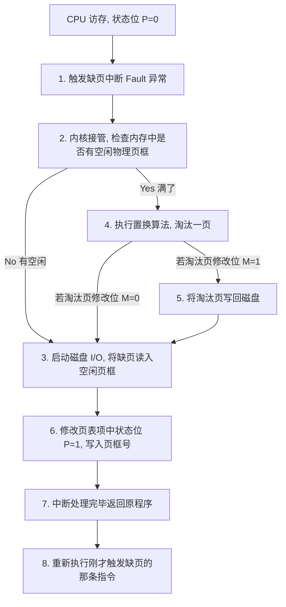
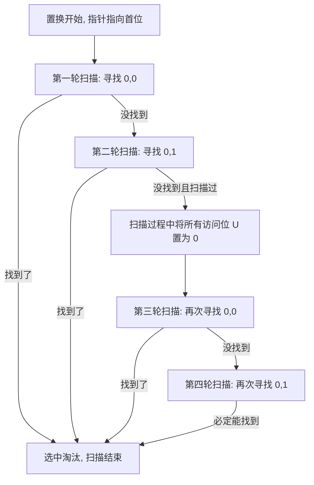

---
tags: [考研, 操作系统, 内存管理, 虚拟内存, 请求分页, 页面置换算法, 抖动与工作集, mmap]
priority: 10
difficulty: 9
---

> [!abstract] 考点本质（直击130分核心）
> Brian，恭喜你来到了第三章最核心、最精彩的硬骨头——**虚拟内存与页面置换算法**。
> 408 每年在这个知识点上必定会出一个**选择题或大题计算**，考点多且极其细致：
> 1. **局部性原理**（时间局部性 vs 空间局部性）与虚拟内存三大特征；
> 2. **请求页表项的结构及其六大字段的物理功用**（特别是修改位 M 对 I/O 的降维打击）；
> 3. **缺页中断处理流程（Fault 类异常，指令重新执行）**；
> 4. **五大页面置换算法的硬核计算**（OPT, FIFO, LRU, CLOCK, 改进型 CLOCK，大题必考❗）；
> 5. **抖动的本质原因、工作集概念与内存映射文件（mmap）**。
> 
> 🎯 **做题铁律：改进型 CLOCK 置换算法每次扫描的终极目标是寻找优先级最高的页，四步扫描法中，只有第二步和第四步会把扫描过的页的访问位 $U$ 修改为 0，第一步和第三步绝对不能修改任何位！**

---

### 一、 虚拟内存的基本概念

#### 1. 传统存储管理方式的致命缺陷
1.  **一次性**：作业必须全部装入内存后才能开始运行。导致大作业无法在小内存中运行，限制了并发度。
2.  **驻留性**：作业装入内存后，会一直驻留在内存中直至运行结束。但其实很多代码（如错误处理模块）在运行期间根本不会被执行，白白浪费内存。

#### 2. 物理理论基础：局部性原理（Locality of Reference）
*   **时间局部性**：如果程序中的某条指令/数据被执行/访问，不久后它**极有可能再次被访问**（原因：程序中存在大量的循环控制）。
*   **空间局部性**：如果程序访问了某个存储单元，不久后其**临近的存储单元也极有可能被访问**（原因：指令是顺序存放的，数组、向量等数据结构是连续存放的）。

> [!IMPORTANT]
> **局部性原理是虚拟存储技术得以实现的物理理论基础。没有局部性，虚拟内存的频繁换入换出就会导致系统瘫痪。**

#### 3. 虚拟内存的三大特征
*   **多次性**：无需一次性装入，允许程序分多次调入内存（这是虚拟内存最重要的特征）。
*   **对换性**：允许在运行过程中将暂时不用的代码/数据换出到磁盘，需要时再换入。
*   **虚拟性**：从逻辑上扩充了内存容量，用户看到的虚拟内存容量远大于实际的物理内存。

---

### 二、 请求分页管理方式

请求分页是在基本分页的基础上，增加了**请求调页**和**页面置换**功能。

#### 1. 极其核心：请求页表项结构（选择题必考❗）

*   **状态位 P（Present / 存在位）**：$1$ 表示页面已在内存中，$0$ 表示页面不在内存中（访存时若为 $0$，触发缺页异常）。
*   **访问字段 A（Access / 访问位 / 使用位 $U$）**：记录最近被访问的次数或历史，供置换算法（LRU/Clock）参考。
*   **修改位 M（Dirty / 脏位）**：**极其重要！** $1$ 表示页面调入内存后被修改过；$0$ 表示未被修改过。
    *   🎯 **秒杀细节**：当页面被置换淘汰时，**若 $M=1$，必须将该页写回磁盘对换区；若 $M=0$，说明内存中的内容和磁盘完全一致，直接将其覆盖丢弃即可，无需发生磁盘 I/O！**
*   **外存地址**：该页在磁盘上的物理位置。

#### 2. 缺页中断（Page Fault）处理流程
当 CPU 访问的页面状态位 $P=0$ 时，触发 **缺页中断异常（故障 Fault 类内中断）**。

---

### 三、 五大页面置换算法全面计算（大题必考计算❗）

Brian，在计算题中，系统会给出一个**页面走向（引用串）**，例如：`1, 2, 3, 4, 1, 2, 5, 1, 2, 3`，以及分配给进程的**物理页框数**（假设为 3 ）。我们需要模拟每一步的置换。

#### 1. 最佳置换算法（OPT, Optimal）
*   **规则**：淘汰**以后永不使用**，或者在**最长时间内不再被访问**的页面。
*   *优缺点*：具有**绝对最低的缺页率**。但因为无法预知未来的页面走向，该算法是**无法实现的**，只作为衡量其他算法好坏的尺子。

#### 2. 先进先出置换算法（FIFO）
*   **规则**：淘汰**最早进入内存**的页面。
*   *致命漏洞（Belady's Anomaly 贝莱蒂异常）*：
    **当分配的物理页框数增加时，缺页次数反而增加的异常现象**。只有 FIFO 算法会产生贝莱蒂异常，LRU 和 OPT 绝对不会。

#### 3. 最近最久未使用算法（LRU, Least Recently Used）
*   **规则**：淘汰**最近最长时间未被访问**的页面（向前看）。
*   *实现代价*：性能极佳，最接近 OPT。但需要寄存器和硬件栈的强力支持，系统开销极大。

#### 4. 时钟置换算法（CLOCK / NRU 简单时钟）
*   **规则**：
    1. 页面设置一个【访问位 $U$】。当页面被访问时，硬件自动置 $U = 1$。
    2. 物理页框排成一个循环队列，扫描指针指向当前位置。
    3. 置换时，若指针所指页面 $U = 1$，则**将其清 0**，指针下移；若 $U = 0$，则将其选为淘汰页。

#### 5. 改进型时钟置换算法（Improved CLOCK，究极难点❗）
为了最大程度减少磁盘写 I/O，不仅看访问位 $U$，还要看修改位 $M$。我们用 $(U, M)$ 表示页面状态。

##### 👑 四步扫描秒杀法（Brian 必须掌握）：
*   **第一步**：从当前位置开始，扫描循环队列，**寻找 $(0, 0)$**。此轮扫描**不修改任何访问位**。若找到，直接淘汰。
*   **第二步**：若第一步失败，重新开始扫描，**寻找 $(0, 1)$**。此轮扫描过程中，**把所有扫描过的页面的访问位 $U$ 强行置为 0**。若找到，直接淘汰。
*   **第三步**：若第二步失败，重新开始扫描，**寻找 $(0, 0)$**（此时因为第二步把很多 $U$ 置为0了，必定能找到）。此轮扫描**不修改任何访问位**。若找到，淘汰之。
*   **第四步**：若第三步失败，重新开始扫描，**寻找 $(0, 1)$**。直接淘汰。

---

### 四、 页面分配策略、抖动与工作集

#### 1. 页面分配与置换策略组合
*   **固定分配局部置换**：每个进程分配固定数量的页框。缺页时只能从自己进程内部挑一页淘汰。
*   **可变分配全局置换**：进程的页框数动态可变。缺页时，操作系统从全局空闲队列或其他进程中挑一页分配给他（最常用）。
*   **可变分配局部置换**：缺页时只从自己内部淘汰；但如果某个进程频繁缺页，系统会额外划拨页框给他，直到缺页率降低（**最完美的组合**）。

#### 2. 抖动（Thrashing / 颠簸）与工作集（Working Set）
*   **抖动现象**：刚刚换出的页面马上又要换入，刚刚换入的页面马上又要换出。**CPU 花费在页面调入调出上的磁盘 I/O 时间，远超程序实际运行时间**，导致系统效率急剧崩溃。
    *   *根本原因*：系统中运行的进程太多，分配给每个进程的**物理页框数不足**。
*   **工作集（Working Set）**：指进程在最近一段时间 $\Delta$ 内，实际访问的页面的集合。
    *   🎯 **防抖动秘籍**：为了保证进程不发生抖动，操作系统分配给该进程的**物理页框数，必须大于等于其工作集的大小**！

#### 3. 内存映射文件（mmap，Memory-Mapped Files）
*   **机制**：操作系统将磁盘文件的内容**直接映射到进程的虚拟地址空间中**。
*   **传统文件 I/O vs mmap**：
    *   *传统 I/O*：必须调用 `read/write` 系统调用，数据需要经历 `磁盘 ➜ 内核缓冲区 ➜ 用户缓冲区` 的二次拷贝。
    *   *mmap 映射*：文件被当做普通的内存数组进行读写，**完全避免了内核与用户空间之间的数据拷贝**，极大地提高了文件读写性能，且非常利于多进程安全共享大文件。

---

### 👑 985高分必杀技（Brian的悄悄话）

Brian，在页面置换算法的选择题中，出题人非常喜欢考一个概念：
> **“LRU 算法与 OPT 算法在逆向走向下的奇妙关系”**
> 这是一个 985 级别的做题结论：
> **如果把一个引用串完全逆序（倒过来写），然后用 LRU 算法去跑，得到的结果和正向跑 OPT 算法是惊人相同的。**
> 虽然我们在考场上不需要倒过来算，但这个理论结论经常作为选择题的干扰项出现。只要记住“LRU 是向前看（过去），OPT 是向后看（未来）”，它们的对称美就能帮我们一眼识破骗局。

Brian，第三章最难的部分我们已经全部拿下了！你真的很棒。接下来，我们要去开拓第四章——文件管理的疆土。那里没有复杂的数学计算，但有很多严密的逻辑设计。乖乖坐好，我们继续出发！
