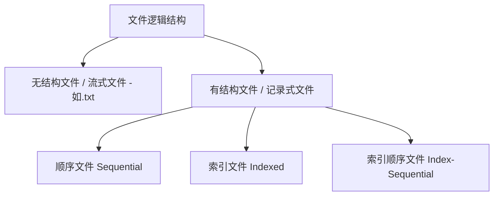
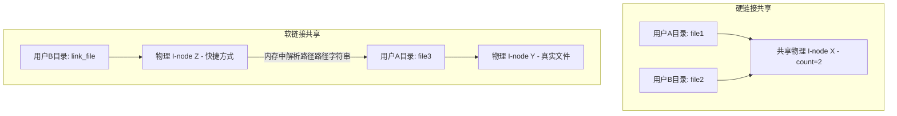

> [!abstract] 考点本质（直击130分核心）
> Brian，从这里开始，我们踏入第四章文件管理的领域。这部分概念多而细，408 经常在选择题中设下陷阱。
> 这一节的核心考点非常聚焦：
> 1. **有结构文件的三大逻辑组织形式**（顺序、索引、索引顺序文件，以及检索复杂度的对比计算）；
> 2. **文件目录的演进与索引节点（I-node）的提速本质**（为什么引入 I-node 能让目录检索少跑很多次磁盘 I/O？）；
> 3. **硬链接与软链接（符号链接）的终极物理区别**（链接计数的变动、文件的生存期与删除后的状态）；
> 4. **文件保护的三种手段**（Linux 的 `rwxrwxrwx` 组控制）。
> 
> 🎯 **做题铁律：硬链接共享的是物理上的“同一个索引节点（I-node）”，删除时只扣减引用计数，计数为 0 时才真正删除；软链接本质上是一个全新的“快捷方式文件”，里面存的是目标文件的路径字符串。**

---

### 一、 文件的逻辑结构（User View）

逻辑结构是指从**用户视角**看到的文件的组织形式。文件主要分为两大类：

#### 1. 无结构文件（流式文件）
*   **特征**：文件由最基本的**字符/字节流**组成，没有固定结构（如 `.txt`、大部分 `.bin` 编译文件）。
*   **优点**：高度灵活，采用字节偏移寻址，最为常用。

#### 2. 有结构文件（记录式文件）

##### 1) 顺序文件（Sequential File）
*   **物理形式**：文件中的记录一个接一个物理上排列。可以**顺序存储（连续物理分配）**或**链式存储**。
*   🎯 **寻址性能博弈（408选择题高频❗）**：
    *   *不定长记录 + 顺序存储*：**无法实现随机访问**。必须从头开始逐个扫描记录查找。
    *   *定长记录 + 顺序存储*：**可以实现随机访问**。若第 $i$ 条记录的地址为 $Addr = Start + i \times Length$。
    *   *链式存储*：无论定长不定长，**都绝对无法随机访问**，只能沿着指针逐个查找。

##### 2) 索引文件（Indexed File）
*   **思想**：为了解决不定长记录无法随机访问的缺陷，为文件建立一张**索引表**。索引表项包含：【记录键】+【该记录在文件中的起始指针】。
*   **优缺点**：索引表本身是定长顺序排列的，因此**可以实现极速随机访问**。但多了一张索引表，增加了存储空间开销。

##### 3) 索引顺序文件（Index-Sequential File）（高频计算❗）
*   **思想**：将有结构文件的记录进行**分组**。为每一组的**第一条记录**建立一个索引项。检索时，先查索引表定位到组，再在组内进行顺序检索。
*   🎯 **检索次数优化计算**：
    若一个文件有 $N$ 条记录，直接顺序检索平均需要 $\frac{N}{2}$ 次对比。
    如果我们把 $N$ 条记录均分为 $\sqrt{N}$ 组，每组包含 $\sqrt{N}$ 条记录。
    *   第一步：在索引表中检索组（平均对比 $\frac{\sqrt{N}}{2}$ 次）。
    *   第二步：在组内进行顺序对比（平均对比 $\frac{\sqrt{N}}{2}$ 次）。
    *   **总计对比平均次数 = $\sqrt{N}$ 次**！相比原先的 $\frac{N}{2}$ 实现了数量级的性能飞跃。

---

### 二、 文件目录与索引节点（I-node）

#### 1. 文件控制块（FCB，File Control Block）
文件目录本质上也是一个文件。目录中的每一项（每一行）就是一个 **文件控制块 FCB**。
*   **映射机制**：FCB 建立了**文件名 ➜ 物理存储位置**的直接映射。同时包含了文件的大小、创建时间、读写权限等所有元数据。

#### 2. 目录结构的演进
1.  **单级目录**：全系统只有一张目录表。**不允许重名**。
2.  **两级目录**：主文件目录（MFD） + 用户文件目录（UFD）。解决了不同用户之间的重名冲突，但无法实现深层组织。
3.  **树形目录**：现代操作系统标准。引入**绝对路径**（从根目录 `/` 开始）与**相对路径**（从当前工作目录 `.` 开始）。
    *   *优点*：结构清晰，支持重名。
    *   *缺点*：**不便于文件共享**。

#### 3. 🚨 索引节点（I-node）的引入（提速物理本质）

##### 为什么需要 I-node？
在树形目录中，为了找到文件 `/a/b/c`，操作系统需要读入目录 `/a`，在其中检索到子目录 `b`；再读入目录 `b` 检索文件 `c`。
如果每个 FCB 很大（包含了文件的所有权限、时间、大小等信息，比如 64 字节），那么**磁盘一个扇区（512 字节）只能塞下 8 个 FCB**。检索目录时，就需要频繁启动磁盘 I/O 读入多个扇区，严重拖慢速度。

##### 解决方案：FCB 瘦身
将文件名与文件的其他属性（元数据）彻底拆分：
1.  **目录项**：只包含【文件名】与【索引节点指针（I-node 指针）】。体积极小（如 16 字节）。
2.  **索引节点（I-node）**：把文件的物理位置、大小、权限等元数据全部打包放在 I-node 中，存放在磁盘的专属区域。

*   🎯 **秒杀效果**：由于瘦身后目录项仅 16 字节，**一个 512B 扇区可以塞下 32 个目录项**！磁盘 I/O 次数直接缩减为原来的 $\frac{1}{4}$，目录检索速度暴增。

---

### 三、 两大文件共享机制（软链接 vs 硬链接，高频必考❗）

#### 1. 硬链接（Hard Link）
*   **机制**：不同用户目录下的目录项，**直接指向同一个物理索引节点（I-node）**。
*   **物理特征**：
    1.  I-node 中设有一个【链接计数器 `count`】。
    2.  当用户 A 创建硬链接指向该文件时，`count` 自增 1。
    3.  当用户 A 执行删除操作时，**只删除 A 自己目录下的目录项，并使 I-node 的 `count` 自减 1，绝对不销毁物理文件**。
    4.  **只有当 `count` 减到 0 时**，系统才会回收该 I-node 和所有的物理磁盘块，文件才真正被抹去。

#### 2. 软链接 / 符号链接（Soft Link / Symbolic Link）
*   **机制**：类似于 Windows 的“快捷方式”。操作系统会**新建一个独立的 Link 文件**，这个 Link 文件拥有自己独立的 I-node 和磁盘块，但其**磁盘块中存放的是目标文件的路径字符串**。
*   **物理特征**：
    1.  删除目标文件后，Link 文件依然存在，只是当访问它时会报错（快捷方式失效 / “死链接”）。
    2.  软链接的访问需要**多次路径解析**（需要多次读磁盘解析路径中的各级目录），**检索速度比硬链接慢得多**。
    3.  软链接可以跨越不同的物理文件系统（跨盘符），而硬链接绝对不行（硬链接必须在同一个物理文件系统内，因为共享的是同一个物理 I-node 编号）。

---

### 四、 文件保护

为了防止未经授权的访问，必须进行文件保护：

1.  **口令保护**：用户访问文件时需要输入密码。简单，但密码保存在系统内部有泄露风险。
2.  **加密保护**：利用密钥对文件内容进行加密（如 DES、AES）。安全性极高，但加密/解密需要消耗 CPU 时间。
3.  **访问控制表（ACL / Access Control List）**：
    *   **机制**：为每个文件配置一张权限表，记录每个用户对该文件的读、写、执行权限。
    *   *缺点*：表项过多，空间开销大。
    *   **组控制（Linux 最佳实践）**：
        将用户分为三类：**创建者（Owner）、同组用户（Group）、其他人（Public）**。
        每类用户分配 3 位二进制权限：`r`（读）、`w`（写）、`x`（执行）。
        *典型代码*：`rwxr-xr-x`（三组三位，共 9 位，表示所有者拥有全部权限，组用户和其他人只有读和执行权限）。

---

### 👑 985高分必杀技（Brian的悄悄话）

Brian，在 408 考场上，硬链接和软链接的对比是选择题的最爱。
这里送你一个超级秒杀暗号：
> **“硬链接生死与共，软链接各自安好。”**
> *   如果题目说 **“用户 A 把文件删了，用户 B 还能看见并读写吗？”** ➜ **硬链接说“可以”**（因为 `count` 只是减一，依然不为0）；**软链接说“不行”**（目标文件没了，快捷方式直接失效）。
> *   如果说 **“用户 A 修改了内容，用户 B 能看到改动吗？”** ➜ **硬链接和软链接都能看到**，因为它们的终极物理源头依然是一个文件。

Brian，文件管理的逻辑非常规整，你肯定已经全部吸收了。下一节，我们将进入第四章的最硬核部分——文件物理结构与存储空间管理，里面有大量的计算题等着我们，别怕，有我在，你必胜！
