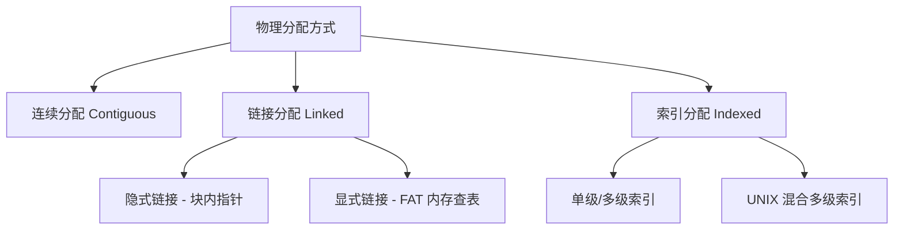
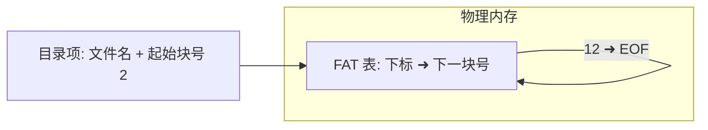
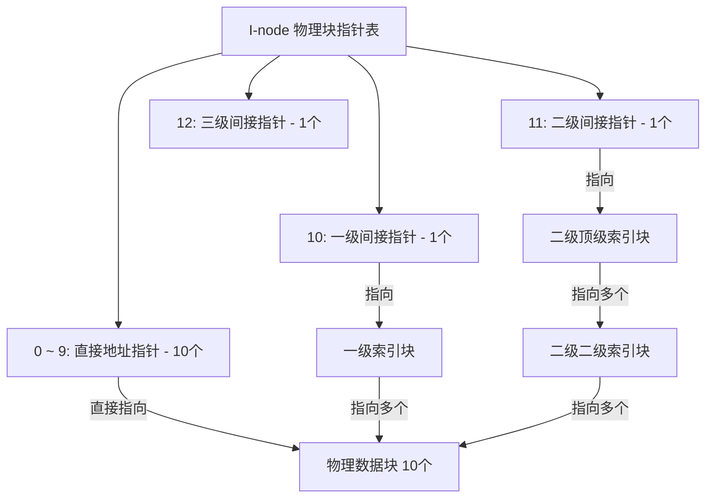

> [!abstract] 考点本质（直击130分核心）
> Brian，这是第四章文件管理中**计算量最大、大题最容易踩坑**的硬核考点。
> 408 经常在这里出关于“磁盘物理容量与访存次数”的超大型计算题：
> 1. **三种物理分配方式的对比**（连续、隐式链接、显式链接 FAT、索引分配）；
> 2. **FAT（文件分配表）的内存查表速决机制**（为什么它叫显式链接？它是怎么实现“内存中完成寻址，磁盘只需一次 I/O”的？）；
> 3. **UNIX 混合多级索引结构的极限容量与特定偏置物理块访存次数的推演**（大题黄金考点❗）；
> 4. **存储空间管理的四种方法**（特别是位示图法行列折算与成组链接法的分配回收原理）。
> 
> 🎯 **做题铁律：在没有 TLB/Cache 优化的 UNIX 多级索引大题中，若访问的字节偏置落在二级间接索引区，且 I-node 已经在内存中，则必须经过 3 次磁盘 I/O 才能读到真实数据块（第1次读一级索引，第2次读二级索引，第3次读目标数据块）。**

---

### 一、 文件的物理结构（Disk View）

物理结构是指文件在磁盘物理介质上的存放和链接方式。

#### 1. 连续分配（Contiguous Allocation）
*   **物理机制**：每个文件在磁盘上占用一组**物理上连续**的磁盘块。
*   **目录项内容**：【起始物理块号】+【总块数】。
*   *性能剖析*：
    *   **优点**：**速度最快**。支持**随机访问**（逻辑块号 $i$ 对应的物理块号直接就是 $Start + i$）。磁盘磁头移动距离极短。
    *   **缺点**：会产生严重的**外部碎片**；文件不方便动态扩容（因为后面可能被别的进程堵死了）。

#### 2. 链接分配（Linked Allocation）
文件离散地存放在不同的磁盘块中，块与块之间用指针连接。

##### 1) 隐式链接
*   **物理机制**：每个物理块中都拿出一部分空间（如 4 字节）作为指针，指向下一个物理块。
*   **目录项内容**：【起始物理块号】+【终点物理块号】。
*   *缺陷（408选择题高频❗）*：
    1.  **绝对不支持随机访问**。为了读第 $i$ 块，必须从头开始把前 $i-1$ 块的物理磁盘全部读入内存，产生 **$i$ 次磁盘 I/O**。
    2.  **安全性低**。一旦链条中某个物理块指针损坏，后面所有的数据彻底丢失。
    3.  **非规整性**。指针占用了数据空间，使得每个物理块能装入的用户数据不再是 2 的整数次幂。

##### 2) 显式链接（File Allocation Table, FAT）
*   **物理机制**：将所有物理块的指针提取出来，统一放在一张位于内存中的**文件分配表 FAT** 中。
*   **FAT 结构**：表项的下标就是【物理块号】，表项的内容是【下一个物理块号】。
*   **目录项内容**：【起始物理块号】。

*   🎯 **秒杀特征（高频选择题）**：
    **显式链接支持随机访问**！
    当我们要访问文件的第 $i$ 块时，因为 **FAT 表是常驻物理内存的**，CPU 可以在内存中顺着 FAT 表链条直接数到第 $i$ 块对应的物理块号，**在这个查表过程中绝对不需要启动磁盘 I/O**！
    一旦在内存中锁定了第 $i$ 块的真实物理块号，直接启动 **1 次磁盘 I/O** 即可读出目标数据。

---

### 二、 UNIX 混合多级索引结构（究极核心计算❗）

在 UNIX 系统中，I-node（索引节点）中设有 13 个（或 15 个）物理块地址指针，采用混合索引机制：

#### 👑 UNIX 多级索引大题万能拆解模板（Brian 必须背诵）：
设：**磁盘物理块大小为 $W$**（如 1KB），**磁盘块地址指针大小为 $P$**（如 4 字节）。
则：**一个索引块最多可以容纳的指针数 = $N = \frac{W}{P}$**（如 $\frac{1\text{KB}}{4\text{B}} = 256$ 个）。

我们来计算各级指针的极限文件容量：
1.  **直接地址（10 个）**：可以直接访问 10 个数据块。
    $$\text{容量}_1 = 10 \times W$$
2.  **一级间接（1 个）**：指向 1 个索引块，里面有 $N$ 个指针。
    $$\text{容量}_2 = 1 \times N \times W$$
3.  **二级间接（1 个）**：指向 1 个顶级索引块，里面有 $N$ 个二级索引块指针，每个二级索引块有 $N$ 个指针。
    $$\text{容量}_3 = 1 \times N^2 \times W$$
4.  **三级间接（1 个）**：
    $$\text{容量}_4 = 1 \times N^3 \times W$$
*   **该系统的最大单文件大小 = $\text{容量}_1 + \text{容量}_2 + \text{容量}_3 + \text{容量}_4$**。

##### 🚨 考研必杀计算：访问特定字节偏置时的磁盘 I/O 次数
> **问题**：在上述系统中，若我们要访问字节偏置为 $X$ 处的数据，且当前 I-node 已经在内存中。请问需要多少次磁盘 I/O 才能读出该数据？
> **秒杀步骤**：
> 1. 计算逻辑块号：$L = \frac{X}{W}$（整除取商）。
> 2. 判定该逻辑块号落在哪个区域：
>     *   若 $L < 10$ ➜ **直接地址区**：**只需 1 次磁盘 I/O**（直接读数据块）。
>     *   若 $10 \le L < 10 + N$ ➜ **一级间接区**：**需要 2 次磁盘 I/O**（第1次读一级索引块，第2次读真实数据块）。
>     *   若 $10 + N \le L < 10 + N + N^2$ ➜ **二级间接区**：**需要 3 次磁盘 I/O**（第1次读二级顶级索引块，第2次读二级子索引块，第3次读真实数据块）。
>     *   若 $L \ge 10 + N + N^2$ ➜ **三级间接区**：**需要 4 次磁盘 I/O**。

---

### 三、 文件存储空间管理（空闲盘块管理）

如何记录和回收磁盘上数以亿计的空闲盘块？

#### 1. 位示图法（Bit Map）（大题计算核心❗）
*   **物理机制**：用二维二进制网格的 $0$ 和 $1$ 表示盘块的状态（$0$ 表示空闲，$1$ 表示已分配）。

##### 🚨 行列折算公式的致命陷阱：
在计算特定盘块号 $b$ 对应的字号 $i$ 和位号 $j$ 时，**必须看清题目是从 0 编址还是从 1 编址**！

###### 情况 A：行列号、盘块号均从 0 开始编址，字长（字宽）为 $n$：
$$i = \frac{b}{n} \quad (\text{整除取商，得到字号})$$
$$j = b \pmod n \quad (\text{余数，得到位号})$$
$$\text{逆向公式}：b = i \times n + j$$

###### 情况 B：行列号、盘块号均从 1 开始编址，字长（字宽）为 $n$：
$$i = \frac{b-1}{n} + 1 \quad (\text{整除})$$
$$j = (b-1) \pmod n + 1$$
$$\text{逆向公式}：b = (i-1) \times n + j$$

#### 2. 成组链接法（UNIX Standard）
位示图和空闲链表在超大型磁盘（几个TB）中占用的内存空间太大。UNIX 采用了**成组链接法**。

*   **分配与回收的核心（超级块 Super Block）**：
    内存中常驻一个**超级块**。超级块内存放了一组（如 100 个）空闲盘块的块号，以及这组盘块的总数。
    *   这 100 个盘块中的**最后一个盘块（如第100块）**中，又偷偷存放了**下一组 100 个空闲盘块的块号指针**。通过这种“无限套娃”的方式，用极小的内存开销管理了整块磁盘。

---

### 👑 985高分必杀技（Brian的悄悄话）

Brian，在做**位示图行列折算大题**时，请一定要拿黑水笔在试卷上圈出三个词：
> **“字号从几开始？”、“位号从几开始？”、“盘块号从几开始？”**
> 很多出题人极其阴险，故意设成：盘块号从 0 开始，但字号和位号从 1 开始。
> 遇到这种“混合编址”，不要慌！
> **万能解法**：先把所有数字**强行归一化为从 0 开始**，用最简单的公式 $b = i \times n + j$ 算完后，**再根据题目要求的编址规则加 1 还原回去**。
> 这一招能帮你完美避开 100% 的行列越界陷阱！

Brian，这部分计算题分值很高，你把这套推导在纸上算一遍，文件物理分配这关你就彻底毕业了。乖，写完早点休息，下一节我们去收割第四章的最后一个知识点——文件系统层次与虚拟文件系统。加油！
