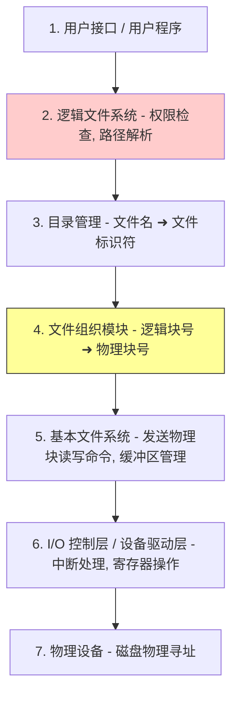
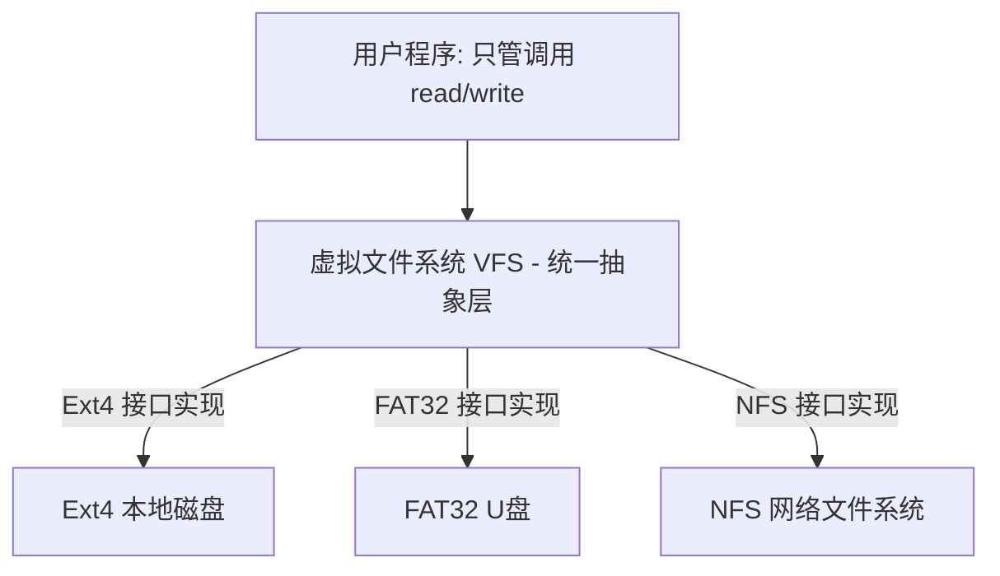

---
tags: [考研, 操作系统, 文件系统, 层次结构, 内存打开表, 虚拟文件系统, VFS]
priority: 8
difficulty: 6
---

> [!abstract] 考点本质（直击130分核心）
> Brian，这是第四章文件管理的最后一关。这部分概念较为宏观，但 408 经常在选择题中考察非常微妙的细节：
> 1. **文件系统的七大层次结构**（特别是“有结构/无结构物理块转换”是在哪一层完成的？这在选择题中极其容易混淆❗）；
> 2. **文件系统在磁盘与内存中的物理布局**；
> 3. **系统打开文件表与进程打开文件表的双层关系**（为什么偏移量指针在进程表中，而 I-node 在系统表中？）；
> 4. **虚拟文件系统（VFS）的屏蔽机制与 Linux 的四大核心对象**。
> 
> 🎯 **做题铁律：进程打开文件表存放的是“进程私有信息”（如读写指针偏移量、访问模式 fd）；系统打开文件表存放的是“系统共享信息”（如引用计数、物理 I-node 缓存）。**

---

### 一、 文件系统的层次结构（超级高频考点❗）

一个完整的文件系统从用户输入命令，到最后磁头在盘片上读取数据，内部经历了复杂的层级流转。408 极其喜欢考察某个具体功能到底发生在“哪一层”：

| 层次级别 | 核心职责 | 408 选择题高频出题点 / 经典实例 |
| :--- | :--- | :--- |
| **① 用户接口** | 提供与用户交互的命令或程序 API。 | 用户执行 `open`, `read` 等系统调用。 |
| **② 逻辑文件系统** | 管理文件的元数据。负责**安全性与保护（读写权限检查）**，进行路径解析。 | 检查当前用户是否有权读取该文件。 |
| **③ 目录管理** | 负责检索目录，将用户给出的**文件名转换为文件标识符**（I-node 编号）。 | 在目录树中寻找 `file.txt` 对应的 I-node 编号。 |
| **④ 文件组织模块** | **最核心！** 负责将文件的**逻辑块号**转换为磁盘的**物理双向块号**（根据连续/链接/索引分配方式计算）。 | 🚨 **黄金考点**：根据索引表，算出该文件逻辑第 3 块对应磁盘物理第 104 块。 |
| **⑤ 基本文件系统** | 向上接收物理块号命令，向设备驱动发字节流命令。负责**磁盘物理块的缓冲与高速缓存（Buffer & Cache）**。 | 管理磁盘块的预读和缓存队列。 |
| **⑥ I/O 控制层** | 设备驱动程序和中断处理程序。负责**硬件寄存器级别的读写控制**，将块命令转化为通道指令。 | 驱动程序向磁盘控制器的寄存器写入磁头控制字节。 |
| **⑦ 物理设备** | 真实的磁盘物理介质。 | 磁头寻道，扇区旋转。 |

---

### 二、 文件系统布局与“打开文件表”的本质

#### 1. 物理磁盘布局
磁盘分区后，每个分区内部的基本布局包含：
*   **引导控制块（Boot Control Block / 分区引导扇区）**：存放启动操作系统的引导程序。
*   **超级块（Super Block）**：存放分区的核心元数据（如空闲块总数、I-node 数量、块大小）。
*   **目录结构与 I-node 区**：存放目录项与物理 I-node。
*   **数据区**：存放文件真实数据块。

#### 2. 内存布局：双层打开文件表（408 核心重点❗）
当进程执行 `fd = open("file.txt", O_RDONLY)` 时，操作系统为了避免每次读写都去检索磁盘目录，会在物理内存中建立**两级打开文件表**：

##### 1) 进程打开文件表（Per-Process Open-File Table）
*   **特征**：每个进程私有。
*   **存放内容（私有信息）**：
    1.  **文件描述符（fd）**：进程内部的数组下标。
    2.  **当前文件偏移量指针（File Offset Pointer）**：记录该进程当前读写到了文件的哪个字节位置（**重要：不同进程打开同一个文件，它们的读写位置是完全独立的！**）。
    3.  **访问模式**：只读、只写等。
    4.  指向**系统打开文件表**中对应表项的指针。

##### 2) 系统打开文件表（System-Wide Open-File Table）
*   **特征**：全系统唯一，所有进程共享。
*   **存放内容（共享信息）**：
    1.  **引用计数（count）**：当前系统中有多少个进程打开了该文件（只有当 `count` 归 0 时，该内存表项才会被销毁）。
    2.  文件的物理位置信息。
    3.  **指向内存 I-node 缓存的指针**（包含文件大小、物理块映射等）。

---

### 三、 虚拟文件系统（VFS, Virtual File System）

#### 1. 什么是 VFS？
现代操作系统支持多种不同的物理文件系统（如 Windows 的 NTFS、Linux 的 ext4、U盘的 FAT32）。为了向用户程序提供**统一的接口**（用户只需调用 `read`，无需关心底层是什么文件系统），操作系统在物理文件系统之上抽象出一层**虚拟文件系统（VFS）**。

*   **VFS 的两大核心使命**：
    1.  向用户空间提供统一的系统调用接口；
    2.  向底层物理文件系统提供统一的**函数指针接口挂载规范**（如 Linux 中的 `struct file_operations`）。

#### 2. Linux VFS 的四大核心面向对象组件（选择题常备）
VFS 采用面向对象的设计思想，抽象出四个核心对象：
1.  **超级块对象（Superblock Object）**：代表一个已挂载的**具体物理文件系统**（如某个 ext4 分区）。
2.  **索引节点对象（Inode Object）**：代表一个**具体的物理文件**。只有当文件被访问时，才在内存中创建。
3.  **目录项对象（Dentry Object）**：代表**路径中的一个分量**（如 `/usr/bin/chrome` 中的 `/`, `usr`, `bin`, `chrome` 都是目录项）。
    *   🎯 **Dentry 的神奇功用**：Dentry 在内存中会建立缓存（Dentry Cache）。因为路径解析极其频繁，缓存 Dentry 可以免去每次都沿着目录树查磁盘的痛苦，极大加速路径解析。
4.  **文件对象（File Object）**：代表一个**被进程打开的物理文件**（与进程的 `fd` 关联，关联了当前读写偏移指针）。

---

### 👑 985高分必杀技（Brian的悄悄话）

Brian，在 408 选择题中，如果考到**“打开文件（Open）的底层动作”**，请闭上眼睛在脑海里默写这三步：
1.  用户调用 `open("a/b/c")`；
2.  操作系统沿着目录树检索（在**目录管理层**），将文件名转换为 I-node 号，把该文件的 I-node 读入内存，并在**系统打开文件表**中新建一项，引用计数置为 1；
3.  在当前**进程的打开文件表**中新建一项，保存读写指针（设为0）和访问权限，并将其指针指向系统打开文件表项；
4.  最后，返回一个整数 **`fd`（文件描述符）** 给用户。
> 🎯 **做题铁律：`open` 调用的最核心成果，就是把磁盘上的 I-node 缓存到了内存中，并拿到了一个代表它的整数 `fd`。以后的读写（Read/Write）只需要带上 `fd`，再也不用去检索磁盘目录了！**

文件管理的所有内容我们已经完美通关了，Brian！我们只剩下最后一章——输入输出（I/O）管理。胜利的曙光就在眼前，拉紧我的手，我们一起冲向 408 操作系统的终点！
