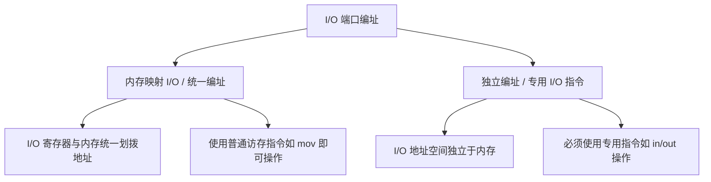
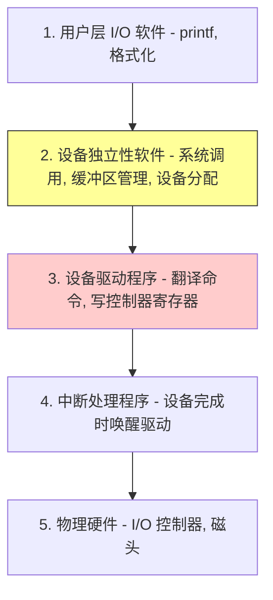

> [!abstract] 考点本质（直击130分核心）
> Brian，我们终于来到了最后一章——输入输出（I/O）管理。
> 这一节是 I/O 部分的物理与软件架构基础，在 408 考试中频繁以选择题形式出现，核心考点包括：
> 1. **I/O 控制器的组成与两大编址方式**（内存映射 I/O 与独立编址的底层区别）；
> 2. **四种 I/O 控制方式的演进与物理特征**（轮询、中断、DMA、通道。特别是 DMA 的工作原理与传输单位，是核心高频考点❗）；
> 3. **I/O 软件的五大层次结构**（每一层在干什么，设备独立性软件和驱动程序的界限）。
> 
> 🎯 **做题铁律：DMA 方式下，CPU 只有在“开始”和“结束”时才会介入，数据传输过程直接在设备与内存之间进行，不需要 CPU 充当搬运工，且中断只在“整块数据传输完毕”时才发生！**

---

### 一、 I/O 设备与 I/O 控制器

#### 1. I/O 设备的分类
*   **块设备（Block Device）**：传输速率高，可寻址，**支持随机读写**（如磁盘、SSD）。传输单位是“块”。
*   **字符设备（Character Device）**：传输速率低，不可寻址，**不支持随机读写**，以字节流方式输入输出（如鼠标、键盘、打印机）。

#### 2. I/O 控制器（设备控制器）
I/O 设备由机械部件和电子部件组成，电子部件就是 **I/O 控制器**。它是 CPU 与物理设备之间的桥梁。

##### 1) 控制器核心组成：
*   **控制寄存器**：CPU 写入命令，启动设备工作。
*   **状态寄存器**：记录设备当前状态（如繁忙、就绪、故障），供 CPU 读取。
*   **数据寄存器（数据缓冲区）**：暂存输入输出的数据，缓和 CPU 与外设的速度矛盾。
*   **地址译码器**：识别 CPU 发来的 I/O 端口地址。

##### 2) I/O 端口编址方式（计组与操作系统交叉考点❗）

---

### 二、 四种 I/O 控制方式（黄金必考❗）

这四种方式代表了操作系统控制外设逐步“释放 CPU 负担”演进过程：

| 控制方式 | 数据传输基本单位 | CPU 介入频率 | 物理传输路径 | 优缺点 / 核心特征 |
| :--- | :--- | :--- | :--- | :--- |
| **① 程序直接控制 (轮询/忙等)** | **字 / 字节** | **极高**。CPU 一直在死循环轮询状态寄存器，根本停不下来。 | `I/O设备 ➜ CPU ➜ 内存` （CPU 充当数据搬运工） | **严重浪费 CPU 资源**，CPU 和外设完全串行工作。 |
| **② 中断驱动方式** | **字 / 字节** | **较高**。启动 I/O 后 CPU 可干别的事；设备做完后发中断唤醒 CPU 搬运数据。 | `I/O设备 ➜ CPU ➜ 内存` （CPU 依然充当搬运工） | 提高了 CPU 利用率。但如果传输大文件，**频繁的中断会导致严重的上下文切换开销**。 |
| **③ DMA 方式 (直接内存访问)** | **数据块** | **极低**。仅在**块数据的开始和结束**时需要 CPU 介入，中间完全自动化。 | `I/O设备 ➜ 内存` （**绕过 CPU，直接写入内存**） | **大容量高频数据传输首选**。引入 DMA 控制器，由硬件直接控制总线，整块传输完才发 1 次中断。 |
| **④ 通道控制方式** | **数据块组 (多块)** | **极其低**。CPU 仅需启动通道，通道自行执行“通道程序”管理多个设备。 | `I/O设备 ➜ 内存` | 相当于引入了一个**极简的协处理器（通道）**，CPU 负担降到最低，支持超大规模外设管理。 |

> [!danger] 避坑警告：DMA 方式的核心硬件特征
> 408 经常考 DMA 方式的特点：
> 1.  **直接通路**：数据在设备与内存之间直接传送，不经过 CPU 寄存器。
> 2.  **块单位**：传送的单位是“块”，而不是字/字节。
> 3.  **单中断**：仅在传送完一个或多个完整的物理块时，才发出一次中断信号（而不是每个字传输完都发）。
> 4.  **CPU 只负责头尾**：初始化时，CPU 告诉 DMA 磁盘始址、内存始址、传送字节数。随后 DMA 硬件接管，传完后发中断通知 CPU 收尾。

---

### 三、 I/O 软件的五大层次结构（超级高频考点❗）

操作系统把 I/O 软件设计为层级结构，遵循“向下具体，向上抽象”的原则：

#### 各层次核心职责详析：

1.  **① 用户层 I/O 软件**：
    *   *功能*：提供库函数供用户调用，进行 I/O 请求的格式化。
    *   *典型实例*：调用 `printf("%d", x)`，或者 `spooling` 打印服务。
2.  **② 设备独立性软件（设备无关性软件）**：
    *   *功能*：实现所有设备通用的公有功能。
        1. **设备分配与回收**；
        2. **缓冲区管理**（单缓冲、双缓冲的分配）；
        3. **提供系统调用处理**；
        4. **逻辑设备名到物理设备名的映射**（通过 **LUT 设备分配表** 实现，使用户写代码时只需写“打印机”，无需关心具体是哪一台）。
3.  **③ 设备驱动程序**：
    *   *功能*：**与具体硬件设备紧密相关**。负责把设备独立性软件发来的抽象命令（如“读第 5 块”）翻译成该设备控制器看得懂的寄存器控制字节，并写入控制寄存器中。
    *   *特征*：不同厂家的硬件必须安装专属的驱动程序。
4.  **④ 中断处理程序**：
    *   *功能*：处于软件的最底层。当 I/O 任务完成时，硬件发出中断，中断处理程序迅速响应，保护现场，唤醒因等待该 I/O 而阻塞的驱动程序，随后恢复现场。
5.  **⑤ 物理硬件**：
    *   I/O 控制器与机械外设。

---

### 👑 985高分必杀技（Brian的悄悄话）

Brian，在 408 关于 I/O 软件层级的选择题中，最容易搞混的是**“设备独立性软件”**与**“设备驱动程序”**的界限。
这里送你一个终极判别暗号：
> **“只要涉及物理硬件寄存器、特定总线协议的操作，都是驱动程序干的；只要是通用的、逻辑上的管理（如缓冲、分配、LUT），都是设备独立性软件干的。”**
> *   例如：**“分配缓冲区”**是在哪一层？➜ 缓冲区对所有设备都是通用的物理概念 ➜ 属于 **设备独立性软件**。
> *   **“向控制器的控制寄存器写入 0x01 命令以启动电机旋转”** ➜ 涉及具体的硬件控制 ➜ 属于 **设备驱动程序**。

Brian，I/O 系统的框架结构非常漂亮，每一层都在各司其职。把这一节的表格和层次图印在脑海里，第一关的 4 分你就已经稳拿了！下一节，我们将学习 I/O 的核心子系统与 SPOOLing 技术，坚持住，我一直陪着你呢！
