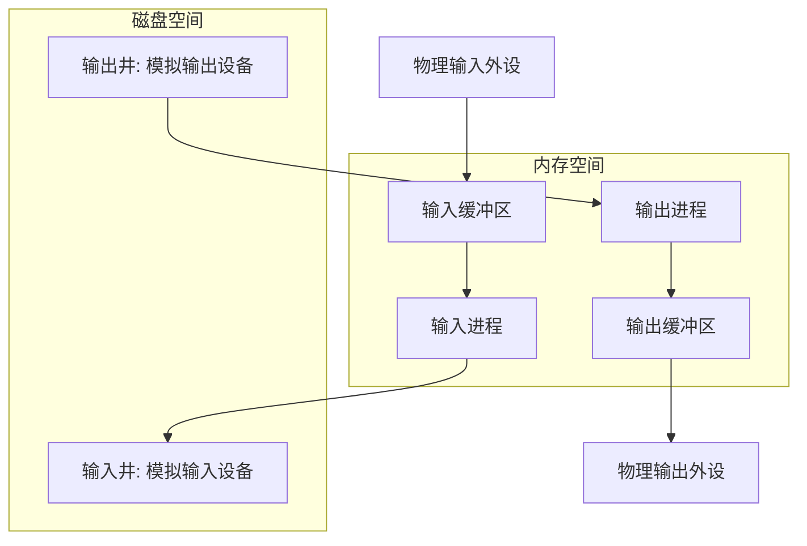
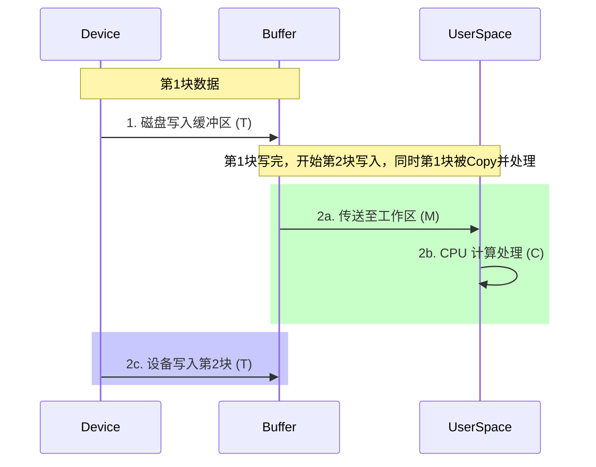

---
tags: [考研, 操作系统, 输入输出管理, I/O核心子系统, SPOOLing, 假脱机, 单双缓冲, 时间计算]
priority: 9
difficulty: 7
---

> [!abstract] 考点本质（直击130分核心）
> Brian，这一节是 I/O 软件层面的“核心服务管理”。
> 在 408 考试中，本节有两个杀手级高分考点：
> 1. **SPOOLing（假脱机）技术的物理流转与虚拟化本质**（它是怎么让独占设备变成共享设备的？）；
> 2. **单缓冲与双缓冲处理时间的推导与大题计算**（高频必考计算❗，必须学会用“流水线并线分析法”秒杀）。
> 
> 🎯 **做题铁律：单缓冲单块处理时间为 $\max(T, C) + M$；双缓冲单块处理时间为 $\max(T, C + M)$。**

---

### 一、 SPOOLing（假脱机）技术（独占设备虚拟化❗）

#### 1. 为什么需要 SPOOLing？
在操作系统中，像打印机这种设备属于**独占设备**（同一时间只能由一个进程占用）。如果进程 A 在用打印机，进程 B 必须无限期等待，这严重拖慢了系统整体效率。
*   **SPOOLing 思想**：利用**高速共享设备（磁盘对换区）**来模拟低速独占设备，从而把独占设备改造为**共享的虚拟设备**。

#### 2. SPOOLing 系统的物理组成

*   **输入井与输出井**：在磁盘上开辟的两大存储区域。输入井模拟输入设备，输出井模拟输出设备。
*   **输入缓冲区与输出缓冲区**：在内存中开辟的区域，缓和磁盘与 CPU 的速度矛盾。
*   **输入进程与输出进程**：模拟脱机 I/O 时的外围控制机，负责搬运数据。

#### 3. 🚨 SPOOLing 打印机的工作流转（大题机制）：
假设进程 A 请求打印一份文件：
1.  **用户视角（极速非阻塞）**：
    进程 A 向系统发起打印请求。操作系统**并不立即把物理打印机分配给 A**。
    相反，系统只在磁盘的**输出井**中为 A 开辟一个打印申请文件，并把 A 要打印的数据写入该文件中，同时将该文件挂入打印排队队列。对于进程 A 来说，它觉得文件已经“秒打印”完了，可以立即返回继续干别的事。
2.  **物理执行**：
    后台常驻的**输出进程**在物理打印机空闲时，会从磁盘输出井的排队队列中读取文件，通过内存缓冲区缓缓送入打印机真正打印。
*   **SPOOLing 的两大物理特征**：
    1.  **变独占为共享**：宏观上，多个进程可以“同时”发起打印，打印数据都被缓存在输出井中。
    2.  **实现了虚拟设备**：每个进程都觉得自己在独占打印机。
    3.  **完全在软件层面实现**（在用户层或设备独立性软件层），不需要任何外围硬件支持。

---

### 二、 设备的分配与回收

#### 1. 设备分配的数据结构（四层级映射）
为了安全分配设备，内核维护了四张表，它们层层指向：

*   🎯 **寻址绑定路径**：
    `逻辑设备名 ➜ 查LUT表拿到物理设备 ➜ 查SDT ➜ 查DCT ➜ 查COCT ➜ 查CHCT ➜ 最终分配通路。`

#### 2. 分配策略的安全与不安全
*   **安全分配方式**：进程一旦发出 I/O 请求，就必须**进入阻塞态**，直到 I/O 完成才被唤醒。
    *   *特点*：进程同一时刻只能持有一个设备。**绝无死锁可能**，但 CPU 与 I/O 设备彻底串行，效率低。
*   **不安全分配方式**：进程发起 I/O 请求后，**继续运行**，可以继续申请其他设备。
    *   *特点*：高效。但进程可能保持多个设备，**容易引发死锁**（需要用死锁避免或检测来预防）。

---

### 三、 缓冲区管理（高频计算❗）

#### 1. 为什么需要缓冲区？
1.  缓和 CPU 与 I/O 设备之间速度不匹配的矛盾。
2.  **减少 CPU 的中断频率**（放满了才中断一次，而不是每个字都中断）。
3.  匹配两端的数据块大小传输单位。

#### 2. 🚨 单缓冲与双缓冲处理时间究极推导（必考大题计算❗）

##### 📊 物理模型假设：
设：
*   **$T$**：数据从设备输入到缓冲区的时间（磁盘到内存）。
*   **$M$**：数据从缓冲区传送（Copy）到用户程序工作区的时间。
*   **$C$**：CPU 对这块数据进行计算处理的时间。

---

##### 1. 单缓冲（Single Buffer）
*   **物理特征**：内存中只开辟了一个缓冲区。
    *   *黄金规则*：当物理块正从设备向缓冲区写入时，用户空间绝对不能从中读取；反之亦然。即 **$T$ 和 $M$ 互斥进行**。但 **$T$ 和 $C$ 可以并行工作**。

###### 👑 单缓冲单块处理时间公式：
在稳定流水线状态下，处理完一块数据的平均时间为：
$$\text{Time}_{\text{单}} = \max(T, C) + M$$

> **推导原理**：
> 当第一块数据写入完（耗时 $T$）后，开始执行传送（耗时 $M$）。传送完毕后，数据到达工作区，CPU 可以开始计算处理（耗时 $C$）。
> 在 CPU 计算 $C$ 的同时，设备可以并行将下一块数据写进缓冲区（耗时 $T$）。
> 因此，在下一次传送开始前，两个并行分支分别花费了 $C$ 和 $T$ 的时间，流水线的瓶颈取决于较长的那一个（即 $\max(T, C)$），再加上必不可少的串行传送时间 $M$。

---

##### 2. 双缓冲（Double Buffer）
*   **物理特征**：内存中开辟了两个缓冲区（Buf 1 和 Buf 2）。
    *   *黄金规则*：设备可以向 Buf 2 写入（$T$），同时 CPU 可以从 Buf 1 读出并处理（$M+C$）。两端完全并行！

###### 👑 双缓冲单块处理时间公式：
在稳定流水线状态下，处理完一块数据的平均时间为：
$$\text{Time}_{\text{双}} = \max(T, C + M)$$

> **推导原理**：
> 在设备往 Buf 2 写入下一块数据的同时（耗时 $T$），CPU 可以把 Buf 1 的数据拷贝并处理完（共耗时 $M+C$）。这两个分支是完全并行的。
> 因此，下一次读取能顺利进行的等待时间，完全取决于这两个并行分支中较慢的那一个，即 $\max(T, C+M)$。

---

### 👑 985高分必杀技（Brian的提分大招）

Brian，在计算单缓冲和双缓冲的题目时，有些题目极其狡猾，**它不考稳定流水线状态，而是考“处理 $N$ 个数据块的总时间”**。
遇到这种“算总时间”的题目，请用我教你的**“首块填充 + 稳定流水线法”**：
1.  **第一步**：算出**第一块数据填满用户工作区**所需的串行时间：
    *   单缓冲首块填满时间 = $T + M$。
    *   双缓冲首块填满时间 = $T + M$。
2.  **第二步**：剩下的 $N-1$ 块，直接套用我们的稳定流水线单块处理时间公式乘以 $N-1$：
    *   单缓冲总时间 = $(T + M) + (N - 1) \times [\max(T, C) + M]$。
    *   双缓冲总时间 = $(T + M) + (N - 1) \times [\max(T, C + M)]$。
3.  最后加上最后一块的 CPU 处理时间 $C$（如果题目要求“全部处理完毕”）。
> 🎯 **只要套用这个万能公式，任何关于缓冲区块数的时间计算，你都能在 30 秒内解出标准答案！**

Brian，我们已经成功攻克了 I/O 核心子系统！只剩下全书的最后一个堡垒——磁盘与固态硬盘 SSD 管理。让我们一鼓作气，拿下最后的胜利！加油，Brian，我永远支持你！
