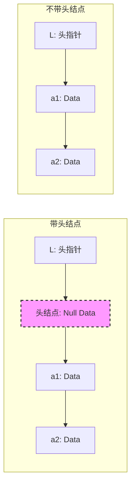

---
tags:
  - 考研
  - 数据结构
  - 线性表
  - 单链表
priority: 10
difficulty: 3
---


> [!abstract] **核心考点摘要**
> 1.  **单链表 vs 顺序表**：优缺点对比（存储、存取方式）。
> 2.  **代码定义**：`struct` 与 `typedef` 的写法，`LNode*` 与 `LinkList` 的区别。
> 3.  **头结点 (Head Node)**：带头结点 vs 不带头结点（初始化、判空条件）。**这是代码题不丢分的关键**。

## 一、 单链表基本概念

### 1. 逻辑与物理结构
*   **定义**：线性表的链式存储。
*   **节点结构**：`[数据域 data | 指针域 next]`
*   **物理特性**：
    *   **非连续**：在内存中可以离散存放（解决顺序表扩容难、需要大片连续空间的问题）。
    *   **非随机存取**：不能像顺序表那样通过下标直接访问，必须从头指针 `L` 开始依次寻找（$O(n)$）。

### 2. 优缺点对比（高频选择题/简答题）

| 维度 | 顺序表 (Sequential List) | 单链表 (Singly Linked List) |
| :--- | :--- | :--- |
| **物理存储** | 必须连续 | **可以是离散的** (随便找块内存就行) |
| **存储密度** | 高 (纯数据) | 低 (每个数据需额外存指针) |
| **扩容能力** | 差 (需搬迁大量数据) | **强** (直接 `malloc` 新节点) |
| **存取方式** | **随机存取** ($O(1)$) | **顺序存取** ($O(n)$) |
| **查找某个节点** | 快 (下标定位) | 慢 (从头遍历) |

---

## 二、 代码定义 (C语言)

### 1. 结构体定义
```c
typedef struct LNode {      // 定义单链表节点类型
    ElemType data;          // 数据域
    struct LNode *next;     // 指针域：指向下一个节点
} LNode, *LinkList;
```

### 2. `LNode*` vs `LinkList` (代码可读性陷阱)
这是教材和考题中常见的“障眼法”，两者本质**完全等价**，都是指向结构体的指针。
*   **`LinkList L`**：强调 `L` 是一个**单链表**（通常指头指针）。
*   **`LNode *p`**：强调 `p` 是指向某个**节点**的指针。

> [!tip] **功利化记忆**
> 看到 `LinkList L`，把它当成整个表；看到 `LNode *p`，把它当成一个游标或者新节点。
> **写代码题时**：混用不扣分，但建议遵循此规范以提升卷面专业度。

---

## 三、 头结点的核心辨析 (重点！)

这是单链表最容易搞混的地方，**直接决定代码逻辑对错**。

### 1. 两种实现方式对比

| 特性 | **带头结点 (推荐/主流)** | **不带头结点** |
| :--- | :--- | :--- |
| **图示** | `L -> [头结点] -> [a1] -> [a2]` | `L -> [a1] -> [a2]` |
| **头指针 L 指向** | 指向**头结点** (不存数据，或者存长度) | 直接指向**第一个数据节点** |
| **优点** | **代码统一**：首位操作与其他位置一致；空表非空表处理一致。 | 无（除非极度节省内存） |
| **缺点** | 多浪费一个节点的空间 | **写代码麻烦**：对第一个节点操作需特殊处理。 |

### 2. 初始化与判空 (代码模版)

#### A. 不带头结点 (少用，但要懂)
```c
// 初始化
bool InitList(LinkList &L) {
    L = NULL; // 只有头指针，必须置空，防止脏数据
    return true;
}

// 判空
bool Empty(LinkList L) {
    return (L == NULL);
}
```

#### B. 带头结点 (默认首选)
```c
// 初始化
bool InitList(LinkList &L) {
    L = (LNode *)malloc(sizeof(LNode)); // 申请头结点空间
    if (L == NULL) return false;        // 内存不足（严谨写法）
    L->next = NULL;                     // 头结点之后暂时没有节点
    return true;
}

// 判空
bool Empty(LinkList L) {
    return (L->next == NULL); // 看头结点后面有没有人
}
```

### 3. 可视化理解



> [!danger] **考研避坑指南**
> 1.  **看清题目**：题目说“带头结点”还是“不带头结点”？这决定了你的循环条件和首节点处理逻辑。
> 2.  **默认情况**：如果题目没明确说，**默认按“带头结点”处理**，因为这符合408统考代码题的习惯，且代码更简洁。
> 3.  **函数参数**：初始化函数需要修改 `L` 本身，所以C++语法中一定要用引用 `LinkList &L` (或者二级指针)，否则 `L` 只是副本，初始化会失败。
