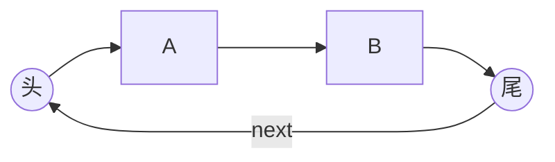
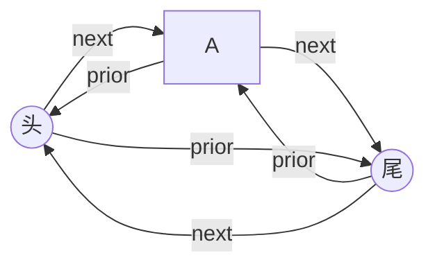

> [!NOTE] 核心考点速览
> **循环链表**的核心在于**首尾相接**。
> 1. **循环单链表**：尾结点的 `next` 指向头结点。
> 2. **循环双链表**：尾结点的 `next` 指向头，头结点的 `prior` 指向尾。
> 3. **考研命题陷阱**：判空条件、判尾条件、以及如何利用循环特性简化代码（避免空指针异常）。
> 4. **高频选择题点**：设置**尾指针**带来的复杂度优化。

## 一、循环单链表 (Circular Singly Linked List)

### 1. 结构定义与图解
与普通单链表的区别仅在于：**表中最后一个结点的指针不是 `NULL`，而是指向头结点 `L`**。
- **逻辑闭环**：从表中任一结点出发，均可找到表中其他结点（包括前驱，但需绕一圈，复杂度 $O(n)$）。

### 2. 关键操作（背诵代码逻辑）

| 操作 | 判别条件/代码逻辑 | 备注 |
| :--- | :--- | :--- |
| **初始化** | `L->next = L;` | **必考**：指向自己 |
| **判空** | `L->next == L;` | 单手抱住自己 |
| **判表尾(p)** | `p->next == L;` | 这一点与普通单链表(`p->next==NULL`)截然不同 |

### 3. ==提分Trick：尾指针优化==
如果在应用中经常需要**在表头或表尾**进行操作：
- **普通做法**：设头指针 `L`。
  - 找头：$O(1)$
  - 找尾：$O(n)$
- **高手做法**：**设尾指针 `R` (Rear)** 指向最后结点。
  - 找尾：$O(1)$ (`R`)
  - 找头：$O(1)$ (`R->next`)
  - **结论**：若设尾指针，循环单链表**头插、头删、尾插**均可达到 **$O(1)$**。

---

## 二、循环双链表 (Circular Doubly Linked List)

### 1. 结构定义
在双链表基础上，首尾相接形成两个闭环。
- `Tail->next == Head`
- `Head->prior == Tail`

### 2. 关键操作（代码健壮性）

| 操作 | 判别条件/代码逻辑 | 记忆口诀 |
| :--- | :--- | :--- |
| **初始化** | `L->next = L;` `L->prior = L;` | 双手抱住自己 |
| **判空** | `L->next == L;` (或 `prior`) | 任意一个指针指回自己即为空 |
| **判表尾(p)** | `p->next == L;` | |

### 3. ==核心优势：算法题不丢分关键==
普通双链表在删除/插入**尾结点**时，往往需要特判 `NULL`，否则会报错。**循环双链表无需特判，代码统一。**

* **场景：在 p 结点后插入 s**
    * **普通双链表**：若 p 是尾结点，`p->next` 为 NULL，执行 `s->next->prior = s` 会空指针异常。
    * **循环双链表**：`p->next` 必指向头结点（非空），上述代码**永远安全**。

* **场景：删除 p 的后继结点 q**
    * **普通双链表**：若 q 是尾结点，需特判。
    * **循环双链表**：
        1. `p->next = q->next;` (指向头)
        2. `q->next->prior = p;` (头的前驱指回 p)
        3. `free(q);`
        *逻辑完美闭环，无需边界检查。*

---

## 三、考研代码编写Checklist（防坑指南）

在手写代码题（算法设计）中，使用链表时必须在脑海中过一遍以下 3 点，否则极易扣分：

1.  **判空/初始化**：
    *   你是怎么初始化这个表的？（指向 NULL 还是指向 Head？）
    *   表为空时，你的代码逻辑是否成立？
2.  **判尾边界**：
    *   你的遍历循环 `while(p != ...)` 终止条件是什么？
    *   是 `NULL` 还是 `Head`？写错直接 0 分。
3.  **操作位置**：
    *   插入/删除的位置在**表头**、**表尾**时，你的代码需要特殊处理吗？
    *   **循环链表的优势**就在于通常不需要对表尾特殊处理。

> [!TIP] 极简总结
> *   **单链表**：线性，尾指空。
> *   **循环单链表**：环状，尾指头，**知尾即知头**。
> *   **双链表**：双向，前后指空。
> *   **循环双链表**：双向环状，**代码最统一**（最不容易写出 Bug）。
