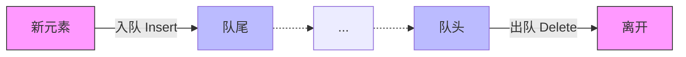

> [!abstract] **核心定义：操作受限的线性表**
> **队列 (Queue)**：只允许在**一端进行插入**，在**另一端进行删除**的线性表。

### 1. 逻辑结构与特点

*   **操作限制**：
    *   **入队 (Enqueue)**：只能在**队尾 (Rear)** 进行。
    *   **出队 (Dequeue)**：只能在**队头 (Front)** 进行。
*   **核心特性**：**先进先出 (FIFO)**
    *   全称：First In First Out
    *   *对比记忆*：栈 (Stack) 是后进先出 (LIFO)。
*   **术语辨析**：
    *   **队头 (Front)**：允许删除的一端（排队打饭的第一个人）。
    *   **队尾 (Rear)**：允许插入的一端（新来的人排队尾）。
    *   **空队列**：不含任何元素的空表。

**可视化记忆模型**：

---

### 2. 基本操作 (ADT)

> [!WARNING] **考研防坑点**
> 1.  **出队 vs 读队头**：
>     *   **出队 (DeQueue)**：**删除**队头元素，并返回其值。
>     *   **读队头 (GetHead)**：**仅返回**队头元素的值，**不删除**。
> 2.  **判空 (QueueEmpty)**：选择题高频考点，不仅要会调用，后续章节需重点掌握不同存储结构（顺序/链式）下的判空条件差异。

| 操作名称 | 英文函数名 | 功能描述 | 关键点 |
| :--- | :--- | :--- | :--- |
| **初始化** | `InitQueue(&Q)` | 分配内存，构造空队列 | 初始状态设置 |
| **销毁** | `DestroyQueue(&Q)` | 销毁并释放内存 | 防止内存泄漏 |
| **入队** | `EnQueue(&Q, x)` | 若Q未满，将x加入**队尾** | 只能从Rear进 |
| **出队** | `DeQueue(&Q, &x)` | 若Q非空，删除**队头**，用x返回 | **删除**操作 |
| **读队头** | `GetHead(Q, &x)` | 若Q非空，用x返回队头元素 | **不删除** |
| **判空** | `QueueEmpty(Q)` | 判断队列是否为空 | `true` 为空 |

---

### 3. 必背总结 (985通关要点)

1.  **定义背诵**：队列是**操作受限**的线性表，限制为**队尾插入，队头删除**。
2.  **英文缩写**：**FIFO** (First In First Out) 必须刻在脑子里，看到 FIFO 立刻反应是队列。
3.  **逻辑对比**：
    *   栈：只准动一端（栈顶）。
    *   队列：两头都要动（一头进，一头出）。
