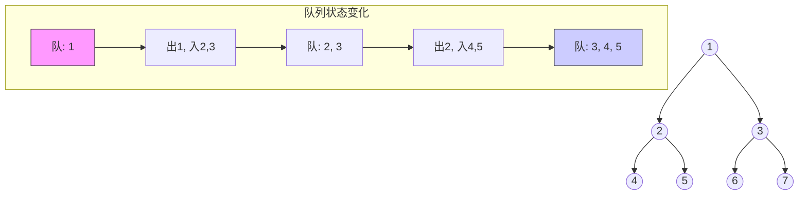
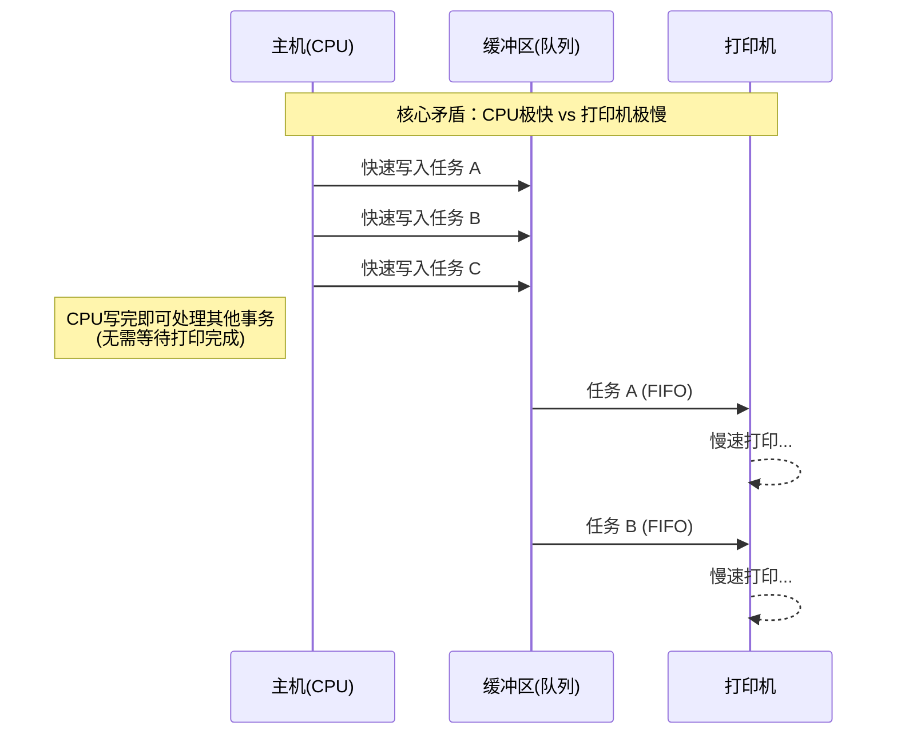

### 一、 核心考点速览
本节内容在考研中主要以 **选择题** 形式出现，考查核心是**“哪些场景底层使用了队列”**。

> [!important] **考研直击（必背结论）**
> 凡是涉及 **“分层”、“广度”、“先来后到”、“速度缓冲”** 的场景，首选数据结构均为 **队列 (Queue)**。

---

### 二、 具体的应用场景

#### 1. 树的层次遍历 (Level-Order Traversal)
*   **对应章节**：树 (Tree)
*   **原理**：利用队列 **先进先出 (FIFO)** 的特性，按层级依次处理节点。
*   **算法流程**：
    1. 根节点入队。
    2. 若队空则结束；否则队头节点出队，访问该节点。
    3. 将该节点的**左孩子**、**右孩子**（若存在）依次入队。
    4. 重复步骤2。

#### 2. 图的广度优先遍历 (BFS)
*   **对应章节**：图 (Graph)
*   **原理**：类似于树的层次遍历，从起始点开始，一层层向外扩展。
*   **区别**：图可能存在回路，需要标记“已访问”节点，避免重复入队。

> [!tip] 记忆口诀
> **深**度优先用**栈** (Stack -> DFS)
> **广**度优先用**队** (Queue -> BFS)

#### 3. 操作系统中的应用
这是跨学科（数据结构+操作系统）的结合点，**极易在选择题中考察概念**。

| 应用场景 | 具体实例 | 核心作用/解决了什么问题 |
| :--- | :--- | :--- |
| **资源分配** | **FCFS (先来先服务)** | 解决多进程争抢有限系统资源的问题。 |
| **进程调度** | **就绪队列** | CPU时间片轮转。所有就绪进程排队，依次上CPU执行一小段时间。 |
| **I/O缓冲** | **打印机缓冲区** | **缓解速度不匹配问题**（主机CPU太快，打印机太慢）。 |

##### 打印机缓冲区的可视化理解

---

### 三、 避坑指南 (Zero Point Loss)

1.  **区分栈与队列**：
    *   题目若描述“回溯”、“递归”、“深度”，选 **栈**。
    *   题目若描述“缓冲”、“排队”、“广度”、“层次”，选 **队列**。
2.  **关于缓冲区**：
    *   缓冲区的逻辑结构通常是**队列**（保持数据原有的先后顺序）。
    *   其物理实现可能是环形队列等。
3.  **树与图的细节**：
    *   本节无需掌握树和图的具体代码，只需记住 **“层次遍历/BFS依赖队列”** 这一结论即可，具体实现会在后续章节（树、图）详细展开。
