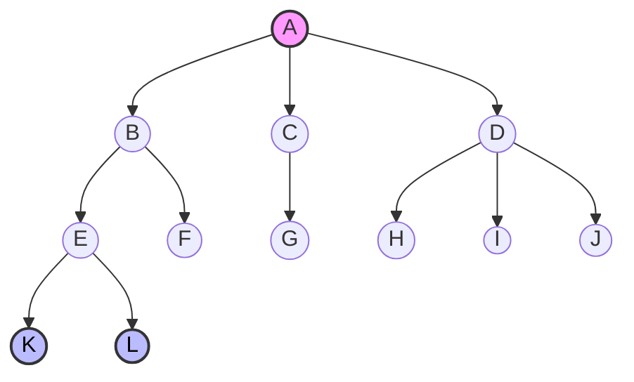

# 树的基本概念与逻辑结构

> [!abstract] **本节核心考点**
> 1.  **树的定义**（递归、互不相交）。
> 2.  **度（Degree）的概念**：区分节点度与树的度。
> 3.  **路径与层数**：路径的方向性、深度的起始（0或1）。
> 4.  **有序 vs 无序**：逻辑结构的区别。

---

## 一、 树的定义 (Logic Structure)

树（Tree）是 $n$ ($n \geq 0$) 个结点的有限集合。

1.  **空树**：$n=0$ 时，称为空树（**注意：树可以为空**）。
2.  **非空树**：
    *   **有且仅有**一个特定的称为**根（Root）**的结点。
    *   其余结点可分为 $m$ ($m>0$) 个**互不相交**的有限集 $T_1, T_2, \dots, T_m$，其中每个集合本身又是一棵树，称为根的**子树（Subtree）**。

> [!DANGER] **防坑指南：图 vs 树**
> *   **树**：除根节点外，任何一个结点**有且仅有**一个前驱（父节点）。子树之间**互不相交**。
> *   **图/网**：如果一个结点有多个前驱（如 A 的前驱是 B 和 C），则不是树，是图。

---

## 二、 节点分类与关系术语

### 1. 节点分类
| 术语 | 别名 | 定义 | 关键特征 |
| :--- | :--- | :--- | :--- |
| **根节点** | Root | 树的最顶层节点 | **无前驱** |
| **分支节点** | 非终端节点 | 度 $>0$ 的节点 | 有后继 |
| **叶子节点** | 终端节点 | 度 $=0$ 的节点 | **无后继** |

### 2. 节点间关系
*   **祖先 (Ancestor)**：从根到该节点**路径上**的所有节点（包含父节点、爷爷节点...）。
*   **子孙 (Descendant)**：某节点**子树中**的所有节点。
*   **双亲/父节点 (Parent)**：直接前驱。
*   **孩子 (Child)**：直接后继。
*   **兄弟 (Sibling)**：同一个父节点的孩子。
*   **堂兄弟 (Cousin)**：双亲在同一层的节点（**注意**：不需要双亲是亲兄弟，只要双亲在同一层即可，虽然常识上堂兄弟指叔伯子女，但在树中强调**层级对齐**）。

---

## 三、 数值属性 (计算题核心)

### 1. 度 (Degree)
> [!IMPORTANT] **高频考点**
> *   **节点的度**：该节点拥有的**子树（分支）数目**。（注意与图论中“度=入度+出度”区分）。
> *   **树的度**：树中**所有节点的度**的**最大值**。

### 2. 层次、深度与高度
*   **层次 (Level)**：从根开始，根为第 1 层（**注**：部分教材/题目可能定义根为第 0 层，考试时需审题，默认从 1 开始）。
*   **深度 (Depth)**：**从上往下**数（层数）。
*   **高度 (Height)**：**从下往上**数（叶子节点高度为 1）。
*   **树的高度/深度**：树中节点的最大层数。

### 3. 路径 (Path)
*   **定义**：两个节点之间经过的**边**的序列。
*   **方向性**：树中的路径是**单向**的（只能从上往下）。
    *   *例如：爷爷 -> 孙子 有路径；孙子 -> 爷爷 无路径。*
*   **路径长度**：路径上**边 (Edge)** 的个数（不是节点数）。

*   *图示说明*：
    *   **树的度**：3（因为 D 的度是 3，最大）。
    *   **叶子节点**：F, G, H, I, J, K, L。
    *   **高度**：4。

---

## 四、 树的逻辑性质分类

### 1. 有序树 vs 无序树
*   **有序树**：子树从左到右**有次序**，不能互换。（例如：家谱、二叉树）。
    *   *影响*：互换后代表不同的逻辑含义。
*   **无序树**：子树**无次序**，可以互换。（例如：行政区划）。
    *   *影响*：互换后仍表示同一棵树。

### 2. 森林 (Forest)
*   **定义**：$m$ ($m \geq 0$) 棵**互不相交**的树的集合。
*   **特例**：
    *   $m=0$：空森林。
    *   $m=1$：一棵树。
*   **转换**：去掉一棵非空树的根节点，其子树集合就变成了森林。

---

## 五、 考研避坑速记 (Utilitarian Checklist)

1.  **递归性**：树的定义是递归的（树由子树构成，子树又是树）。
2.  **存在性**：
    *   树可以是空的（0个节点）。
    *   森林可以是空的（0棵树）。
    *   非空树**必须**有根。
3.  **唯一性**：
    *   根节点无前驱。
    *   非根节点有且仅有 1 个前驱。
    *   **路径唯一**：树中任意两个节点之间若存在路径，则路径唯一。
4.  **度的陷阱**：
    *   题目问“树的度”时，找最大的那个节点的度，不是所有度之和。
    *   题目问“节点数”与“度”的关系时，记公式：**节点数 = 总度数 + 1** （总度数=总边数，+1是因为根节点没有入边）。
