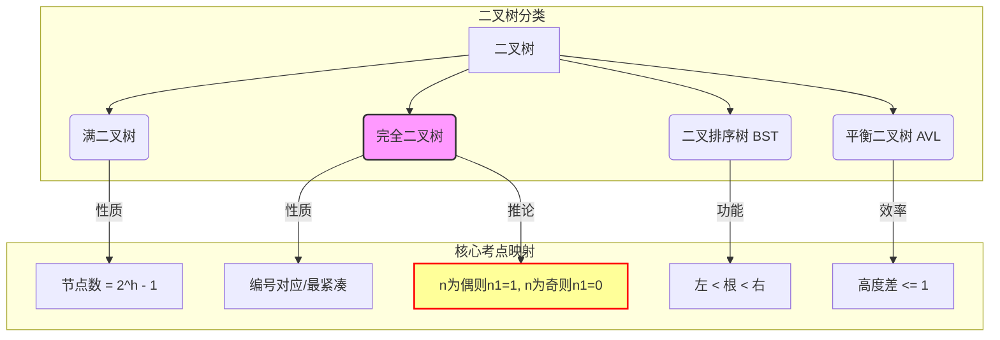

> [!abstract] **功利化导读**
> 本节是数据结构树章节的**基石**，也是**选择题重灾区**。
> **985上岸核心策略**：
> 1.  **定义坑点**：二叉树不是度为2的树（有序性）。
> 2.  **特殊形态**：满二叉树与完全二叉树的**编号对应关系**是解大题的关键。
> 3.  **核心公式**：$n_0 = n_2 + 1$ 必须刻进DNA，秒杀计算题。
> 4.  **推导逻辑**：完全二叉树的奇偶性质，决定了 $n_1$ 的值。

## 一、 二叉树定义与核心坑点

### 1. 递归定义
二叉树是递归数据结构，要么为空，要么由根节点 + 左子树 + 右子树组成。
**5种基本形态**：空、仅根、仅左、仅右、左右皆有。

### 2. 考研高频辨析（易错！）

> [!fail] **致命误区**
> **误区**：二叉树 = 度为2的有序树。
> **正解**：
> 1.  **度为2的有序树**：至少有一个节点度为2（即不能是空树，也不能所有节点度都小于2）。
> 2.  **二叉树**：可以为空，可以所有节点度都小于2。
> 3.  **分支区分**：二叉树严格区分**左孩子**和**右孩子**。即使只有一棵子树，也要区分是左还是右（度为2的有序树若只有一棵子树，通常不区分左右）。

---

## 二、 四种特殊二叉树（必考）

### 1. 满二叉树 (Full Binary Tree)
*   **外观**：三角形，所有分支节点都度为2，叶子全在最底层。
*   **数量特性**：高 $h$，节点数 $2^h - 1$。
*   **编号特性**（从上到下，从左到右，从1开始）：
    *   节点 $i$ 的左孩子：$2i$
    *   节点 $i$ 的右孩子：$2i + 1$
    *   节点 $i$ 的父节点：$\lfloor i/2 \rfloor$

### 2. 完全二叉树 (Complete Binary Tree)
*   **定义**：节点编号与同高度满二叉树**一一对应**。即：**只允许在最后一层缺节点，且必须缺在右边**。
*   **重要性质（做题判据）**：
    *   **叶子位置**：只可能出现在**最后两层**。
    *   **度为1的节点**：最多 **1个**，且该节点**只有左孩子**（因为要连续）。
    *   **分界线**：若总节点为 $n$，则 $i \le \lfloor n/2 \rfloor$ 为分支节点，$i > \lfloor n/2 \rfloor$ 为叶子节点。

### 3. 二叉排序树 (BST)
*   **特性**：**左 < 根 < 右**（递归满足）。
*   **功能**：高效搜索、插入。
*   **中序遍历**：得到递增序列。

### 4. 平衡二叉树 (AVL)
*   **特性**：树上任一节点的 $|左子树高度 - 右子树高度| \le 1$。
*   **目的**：让BST长得“胖”一点，防止退化成链表，保证查找效率 $O(\log n)$。

---

## 三、 核心性质与秒杀公式（背诵）

### 1. 通用二叉树性质（万能公式）

> [!important] **DNA级公式**
> 对任何非空二叉树：
> $$n_0 = n_2 + 1$$
> **含义**：叶子节点数 = 度为2的节点数 + 1

*   **推导逻辑（防遗忘）**：
    *   节点总数 $n = n_0 + n_1 + n_2$
    *   分支总数 = $n - 1$ (除了根都有线连着)
    *   分支总数 = $1 \times n_1 + 2 \times n_2$
    *   联立解得 $n_0 = n_2 + 1$

### 2. 层数与高度性质
*   第 $i$ 层最多节点数：$2^{i-1}$
*   高度 $h$ 最多节点数：$2^h - 1$ （即满二叉树）
*   $n$ 个节点的完全二叉树高度 $h$：
    *   $h = \lfloor \log_2 n \rfloor + 1$
    *   或者 $h = \lceil \log_2(n+1) \rceil$

---

## 四、 完全二叉树的“奇偶推断”绝技

此逻辑专门用于解决：**已知完全二叉树总节点数 $n$，求 $n_0, n_1, n_2$。**

**前置逻辑**：
1.  完全二叉树中，$n_1$ 只能是 **0** 或 **1**。
2.  $n_0 + n_2$ 必定是奇数（因为 $n_0 = n_2 + 1$，互为奇偶，和必为奇）。

**秒杀结论**：

| 总节点数 $n$ | $n_1$ (度为1节点) | 计算逻辑 |
| :--- | :---: | :--- |
| **偶数** | **1** | $n$是偶数 $\rightarrow$ $n_0+n_2$必须是奇数 $\rightarrow$ $n_1$必须是1 |
| **奇数** | **0** | $n$是奇数 $\rightarrow$ $n_0+n_2$必须是奇数 $\rightarrow$ $n_1$必须是0 |

> [!example] **实战演练**
> **题目**：一棵完全二叉树有 **768** 个节点，求叶子节点数。
> **解法**：
> 1. $n=768$ 是偶数 $\rightarrow n_1 = 1$。
> 2. 剩余节点 $n_0 + n_2 = 768 - 1 = 767$。
> 3. 代入万能公式 $n_0 = n_2 + 1$。
> 4. $n_0 + (n_0 - 1) = 767 \rightarrow 2n_0 = 768 \rightarrow n_0 = 384$。
> **答案**：384。

## 五、 总结图谱

