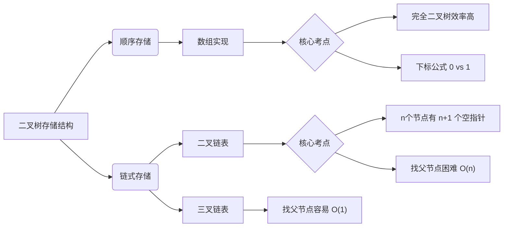

> [!abstract] **考研名师点拨**
> 本节核心在于**公式记忆**与**空指针计算**。
> 1.  **顺序存储**：死磕下标公式（注意题目是从0还是1开始），常考选择题。
> 2.  **链式存储**：掌握代码定义，死记 $n+1$ 个空链域结论。
> 
> **目标985策略**：不要只看视频里的下标1，**必须同时掌握下标0的公式**，否则考场上一紧张就会代错公式丢分。

### 一、 顺序存储 (Sequential Storage)

本质是用**数组**存储二叉树。关键在于如何用**下标**反应逻辑关系（父子关系）。

#### 1. 适用性与局限性
*   **最佳适用**：**完全二叉树** (Complete Binary Tree)。利用率100%。
*   **一般二叉树**：**极不推荐**。需补全为完全二叉树存储，导致大量空间浪费（"空节点"也要占位，`isEmpty=true`）。
    *   *极端情况*：高度为 $h$ 的单支树，需 $2^h-1$ 个存储单元，利用率极低。

#### 2. 下标公式体系 (高频考点)
> ⚠️ **高能预警**：考试时必须看清题目是从 `t[0]` 还是 `t[1]` 开始存储！视频中主要讲了从1开始，但**从0开始也非常爱考**。

假设总节点数为 $n$，当前节点下标为 $i$：

| 关系 | **下标从 1 开始** (经典教材) | **下标从 0 开始** (C语言数组习惯) |
| :--- | :--- | :--- |
| **根节点** | $i=1$ | $i=0$ |
| **左孩子** | $2i$ (若 $>n$ 则无左孩子) | $2i + 1$ (若 $\ge n$ 则无左孩子) |
| **右孩子** | $2i + 1$ (若 $>n$ 则无右孩子) | $2i + 2$ (若 $\ge n$ 则无右孩子) |
| **父节点** | $\lfloor i/2 \rfloor$ (向下取整) | $\lfloor (i-1)/2 \rfloor$ (向下取整) |
| **节点层次** | $\lfloor \log_2 i \rfloor + 1$ | $\lfloor \log_2(i+1) \rfloor + 1$ |
| **叶子判断** | $i > \lfloor n/2 \rfloor$ | $i \ge \lfloor n/2 \rfloor$ |

### 二、 链式存储 (Linked Storage)

二叉树最常用的存储方式，即**二叉链表**。

#### 1. 结构定义 (代码题背诵)
考研408标准C语言定义：

```c
typedef struct BiTNode {
    ElemType data;           // 数据域
    struct BiTNode *lchild;  // 左孩子指针
    struct BiTNode *rchild;  // 右孩子指针
    // struct BiTNode *parent; // 若需频繁找父节点，可加此指针变为"三叉链表"
} BiTNode, *BiTree;
```

#### 2. 核心结论：空指针域数量 (必考)
对于有 $n$ 个节点的二叉链表：
*   **总指针域数量**：$2n$ （每个节点2个指针）
*   **非空指针域**：$n-1$ （除了根节点，每个节点头顶都有1个连线）
*   **空指针域 (Null Pointers)**：
    $$2n - (n - 1) = n + 1$$
    > **考点应用**：这些空指针域是后续章节**线索二叉树**利用的空间基础。

#### 3. 特性对比

| 特性 | 二叉链表 | 三叉链表 (带parent指针) |
| :--- | :--- | :--- |
| **找孩子** | $O(1)$ | $O(1)$ |
| **找父亲** | **$O(n)$** (需从根遍历) | $O(1)$ |
| **空间开销** | 较小 | 较大 (多维护一个指针) |

### 三、 知识点逻辑图解 (Mermaid)



### 四、 避坑指南 (985防丢分)

1.  **题目陷阱**：遇到顺序存储题目，先圈出“下标从0/1开始”。如果题目没说，默认按照教科书（从1开始），但最好带入 $i=1$ 验证一下左孩子 $2*1=2$ 是否符合逻辑。
2.  **判断空节点**：
    *   **顺序存储**：看 `isEmpty` 标记或下标是否越界。
    *   **链式存储**：看 `lchild == NULL` 或 `rchild == NULL`。
3.  **代码手写**：如果不要求写 `parent` 指针，千万别自己画蛇添足写三叉链表，除非题目明确要求“频繁访问父节点”。
