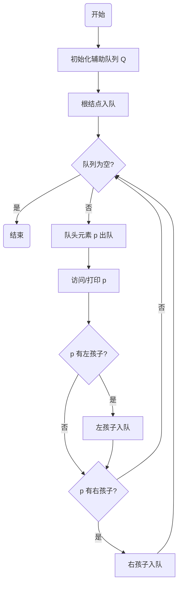

### 1. 核心考点提炼
**二叉树层序遍历 (Level Order Traversal)**
*   **本质**：广度优先搜索 (BFS)。
*   **核心辅助数据结构**：**队列 (Queue)**。
    *   *为何用队列？* 利用 FIFO (先进先出) 特性，保证上一层的节点先处理，其孩子节点排在队尾等待下一轮处理。
*   **空间复杂度**：$O(W)$，W为树的最大宽度（即最大规模取决于最宽那一层的节点数）。

### 2. 算法流程可视化 (Mermaid)



### 3. 标准代码模板 (C语言 / 408通用)
> **注意**：考试中通常可以直接调用队列的基本操作（如 `InitQueue`, `EnQueue`, `DeQueue`, `IsEmpty`），无需手写队列内部实现，除非题目强制要求。

```c
void LevelOrder(BiTree T) {
    if (T == NULL) return; // 空树特判，不丢分细节

    LinkQueue Q;           // 1. 定义辅助队列
    InitQueue(Q);          //    初始化
    
    BiTree p;              // p用于存储出队元素的指针
    EnQueue(Q, T);         // 2. 根结点入队

    while (!IsEmpty(Q)) {  // 3. 循环直到队列为空
        DeQueue(Q, p);     //    队头元素出队（注意：存的是指针！）
        visit(p);          //    访问节点

        // 4. 左右孩子依次入队
        if (p->lchild != NULL) {
            EnQueue(Q, p->lchild);
        }
        if (p->rchild != NULL) {
            EnQueue(Q, p->rchild);
        }
    }
}
```

### 4. 高分细节 & 避坑指南 (针对985上岸)

*   **存储的是指针 (关键点)**：
    *   队列中存储的数据类型应该是 `BiTree` (即 `BiTNode*`)，而不是 `BiTNode`。
    *   *理由*：复制整个节点数据量大且无必要，存指针只需 4/8 字节，极度节省空间。
*   **队列选择**：
    *   **链队列 vs 顺序队列**：网课推荐**链队列**，因为树的节点数未知，链队列扩容方便，避免溢出。但在手写代码题中，若未指定，默认只要逻辑对即可。
*   **代码健壮性**：
    *   开头必须判断 `if (T == NULL) return;`。虽然简单，但这是严谨性的体现，阅卷老师看重。

### 5. 功利化扩展：该算法能解决什么大题？
学会层序遍历不仅仅是为了遍历，它通常是解决以下复杂问题的**母题**：
1.  **求二叉树的高度**（非递归法）：每层处理完后高度+1。
2.  **求二叉树的宽度**：统计每一层入队元素的数量最大值。
3.  **判断完全二叉树**（高频考点）：
    *   遇到第一个空节点后，若后续队列中还有非空节点，则不是完全二叉树。
