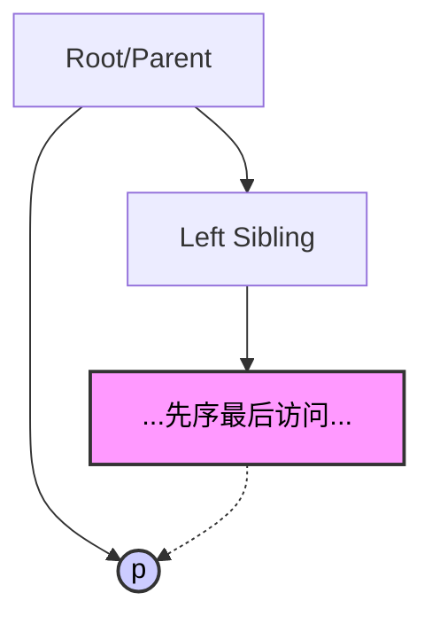
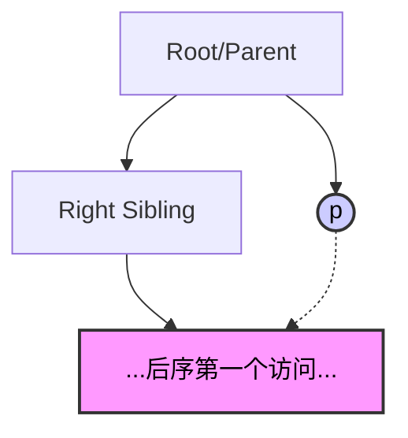

# 线索二叉树：找前驱与后继 (核心通关版)

## 0. 极速记忆表 (功利化背诵)
> **985上岸心法：** 考试重点在于**中序**的全套，以及先序/后序的“不可能”情况。遇到“不可能”的情况，必须借助**三叉链表**（父节点指针）或**从头遍历**。

| 线索类型                | 找前驱 (Pre)        | 找后继 (Post)       | 能否双向遍历？  | 备注            |
| :------------------ | :--------------- | :--------------- | :------- | :------------ |
| **中序 (In-order)**   | ✅ **可行**         | ✅ **可行**         | **完美双向** | 只有中序能完美支持双向操作 |
| **先序 (Pre-order)**  | ❌ **不可行** (需父指针) | ✅ 可行             | 单向 (后)   | 找不到父亲，无法回溯    |
| **后序 (Post-order)** | ✅ 可行             | ❌ **不可行** (需父指针) | 单向 (前)   | 根节点最后访问，无法找后继 |
|                     |                  |                  |          |               |

---

## 1. 中序线索二叉树 (In-Order)
**逻辑最完整，考频最高。**

### 1.1 找后继 (Successor)
*   **若 `rtag == 1`**：直接返回 `rchild` (线索指向后继)。
*   **若 `rtag == 0`** (有右子树)：**右子树中最左下**的节点。
    *   *逻辑*：中序遍历（左根**右**），访问完根，接下来访问右子树的第一个节点（即右子树的最左节点）。
    *   *代码逻辑*：`p = p->rchild; while(p->ltag==0) p=p->lchild;`

### 1.2 找前驱 (Predecessor)
*   **若 `ltag == 1`**：直接返回 `lchild` (线索指向前驱)。
*   **若 `ltag == 0`** (有左子树)：**左子树中最右下**的节点。
    *   *逻辑*：中序遍历（**左**根右），访问根之前，访问的是左子树的最后一个节点（即左子树的最右节点）。
    *   *代码逻辑*：`p = p->lchild; while(p->rtag==0) p=p->rchild;`

### 1.3 遍历应用
*   **空间复杂度**：$O(1)$ (无需递归栈)。
*   **流程**：找到全树最左下节点（起点） -> 循环调用“找后继”直至结束。

---

## 2. 先序线索二叉树 (Pre-Order)
**规则：根 -> 左 -> 右**

### 2.1 找后继 (Successor) —— ✅ 简单
*   **若 `rtag == 1`**：直接返回 `rchild`。
*   **若 `rtag == 0`** (必有右孩子)：
    1.  **有左孩子**：后继 = **左孩子** (根 -> **左** -> 右)。
    2.  **无左孩子**：后继 = **右孩子** (根 -> (空) -> **右**)。

### 2.2 找前驱 (Predecessor) —— ❌ 难点 (陷阱)
*   **现状**：二叉链表（只有左右孩子指针）**无法找到**先序前驱。
    *   *原因*：先序遍历中，左右子树的节点都在根之后被访问，无法通过子节点反推回根（除非从头遍历）。
*   **救命稻草**：若题目改为**三叉链表** (带 `parent` 指针)，则**可解**。
    *   **情况1**：p是根节点 -> 无前驱。
    *   **情况2**：p是父的**左**孩子 -> 前驱 = **父节点** (由**根**->左 推导)。
    *   **情况3**：p是父的**右**孩子，且**无左兄弟** -> 前驱 = **父节点** (根->(空)->**右**)。
    *   **情况4**：p是父的**右**孩子，且**有左兄弟** -> 前驱 = **左兄弟子树中先序遍历的最后一个节点**。
        *   *寻找路径*：进入左兄弟 -> 一直找右 -> 若无右则找左 -> 直到叶子。

---

## 3. 后序线索二叉树 (Post-Order)
**规则：左 -> 右 -> 根**

### 3.1 找前驱 (Predecessor) —— ✅ 简单
*   **若 `ltag == 1`**：直接返回 `lchild`。
*   **若 `ltag == 0`** (必有左孩子)：
    1.  **有右孩子**：前驱 = **右孩子** (左 -> **右** -> 根)。
    2.  **无右孩子**：前驱 = **左孩子** (左 -> (空) -> 根)。

### 3.2 找后继 (Successor) —— ❌ 难点 (陷阱)
*   **现状**：二叉链表**无法找到**后序后继。
    *   *原因*：根节点是最后被访问的，子节点处理完后需要找“父节点”，但没有指针回溯。
*   **救命稻草**：若题目改为**三叉链表** (带 `parent` 指针)，则**可解**。
    *   **情况1**：p是根节点 -> 无后继。
    *   **情况2**：p是父的**右**孩子 -> 后继 = **父节点** (左->右->**根**)。
    *   **情况3**：p是父的**左**孩子，且**无右兄弟** -> 后继 = **父节点** (左->(空)->**根**)。
    *   **情况4**：p是父的**左**孩子，且**有右兄弟** -> 后继 = **右兄弟子树中后序遍历的第一个节点**。
        *   *寻找路径*：进入右兄弟 -> 一直找左 -> 若无左则找右 -> 直到叶子 (即右子树的最左下/第一访问节点)。

---

## 4. 考场防坑总结 (Scoring Tips)

1.  **题目暗示**：如果题目问“在先序线索树中找前驱”或“后序中找后继”，只有两个可能：
    *   答案是“无法找到/需要从头遍历”。
    *   题目预设了使用“三叉链表”（Parent指针）。**务必看清题干结构定义！**
2.  **代码手写**：中序找后继的代码是必考点（`rtag==0`时找右子树最左下）。
3.  **复杂度**：
    *   线索化后找前驱/后继：通常 $O(h)$，h为树高。
    *   遍历整棵树：$O(n)$，空间 $O(1)$。
4.  **手算技巧**：
    *   不要死记硬背父节点的情况。
    *   画一个小三角：父、左、右。
    *   **先序**：根->左->右。想找左的前驱？是根。想找右的前驱？是左的“尾巴”。
    *   **后序**：左->右->根。想找右的后继？是根。想找左的后继？是右的“头”。
