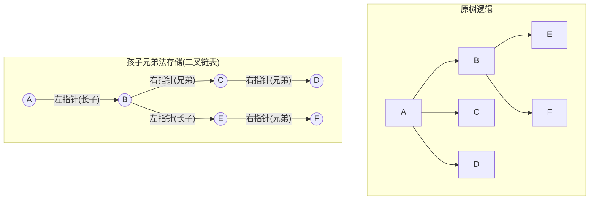

## 核心速览

本节核心在于**树的三种存储结构**及其**优缺点**（特别是时间复杂度）。
**考点**：
1.  结构体定义（代码题需默写）。
2.  找父节点/找子节点的操作复杂度（选择题）。
3.  **孩子兄弟表示法**（最为重要，是树/森林转二叉树的物理基础，**左孩右兄**口诀）。

---

## 1. 双亲表示法 (Parent Representation)

**核心思想**：连续空间（数组）存储，每个节点记录其**父节点**的下标。

### 1.1 数据结构定义
```c
#define MAX_TREE_SIZE 100

typedef struct {
    ElemType data; // 数据域
    int parent;    // 双亲位置域（存储父节点下标）
} PTNode;

typedef struct {
    PTNode nodes[MAX_TREE_SIZE]; // 双亲数组
    int n; // 节点总数
} PTree;
```

### 1.2 逻辑可视化
| 下标 | Data | Parent | 备注 |
| :--- | :--- | :--- | :--- |
| 0 | A | -1 | **根节点** (parent设为-1) |
| 1 | B | 0 | B的双亲是A(下标0) |
| 2 | C | 0 | |
| 3 | D | 1 | D的双亲是B(下标1) |

### 1.3 考研得分点
*   **优点**：**找双亲（父节点）**极快，时间复杂度 $O(1)$。
*   **缺点**：**找孩子**极慢，需要遍历整个数组，时间复杂度 $O(n)$。
*   **适用场景**：**并查集** (Union-Find)，只关注父子归属关系。
*   **森林存储**：可以存森林，森林中多个树的根节点的 `parent` 均为 -1。

---

## 2. 孩子表示法 (Child Representation)

**核心思想**：**顺序存储 + 链式存储**。数组存节点数据，每个节点挂一个单链表，链表中存储该节点的所有**孩子**的下标。
*类比：图的邻接表。*

### 2.1 数据结构定义
```c
// 链表节点（孩子节点）
typedef struct CTNode {
    int child; // 孩子在数组中的下标
    struct CTNode *next; // 指向下一个孩子
} *ChildPtr;

// 数组表头节点
typedef struct {
    ElemType data;
    ChildPtr firstChild; // 孩子链表头指针
} CTBox;

// 树结构
typedef struct {
    CTBox nodes[MAX_TREE_SIZE];
    int n, r; // 节点数，根的位置
} CTree;
```

### 2.2 逻辑可视化
> **[数组下标] Data** -> (孩子下标1) -> (孩子下标2) -> ^

*   **[0] A** -> (1: B) -> (2: C) -> (3: D) -> ^
*   **[1] B** -> (4: E) -> (5: F) -> ^
*   **[2] C** -> ^ (无孩子)

### 2.3 考研得分点
*   **优点**：**找孩子**极快，直接遍历链表。
*   **缺点**：**找双亲**极慢，需要遍历所有节点的链表，时间复杂度 $O(n)$。
*   **适用场景**：找孩子多、找父亲少的情况（如服务流程树、目录结构）。

---

## 3. 孩子兄弟表示法 (Child-Sibling Representation)

**★ 最重要 ★**
**核心思想**：纯链式存储。用**二叉链表**存储树。
**口诀**：**左孩子右兄弟** (Left Child, Right Sibling)。
*   左指针 (`firstchild`)：指向**第一个**孩子。
*   右指针 (`nextsibling`)：指向**下一个**兄弟。

### 3.1 数据结构定义
```c
typedef struct CSNode {
    ElemType data;
    struct CSNode *firstchild;  // 指向第一个孩子
    struct CSNode *nextsibling; // 指向右兄弟
} CSNode, *CSTree;
```

### 3.2 逻辑转换示意 (Mermaid)
这是树转二叉树的物理实现。



### 3.3 考研得分点
*   **本质**：将普通树/森林 转化为 **二叉树** 的形态。
    *   **树 -> 二叉树**：根节点没有右兄弟（右指针必空）。
    *   **森林 -> 二叉树**：将森林中第二棵树的根，视为第一棵树根的“兄弟”。即：森林转化的二叉树，根节点**可能有右孩子**（指向下一棵树的根）。
*   **优点**：方便实现树到二叉树的转换，利用二叉树成熟的算法处理普通树。
*   **缺点**：破坏了树原本的层次结构（原本同层的兄弟，在存储中变成了父子般的右链关系）。
*   **操作特性**：
    *   找孩子：方便（访问 `firstchild` 然后一直走 `nextsibling`）。
    *   找双亲：困难（除非额外加一个 `parent` 指针）。

---

## 4. 总结与对比 (必须背诵)

| 表示法 | 物理结构 | 找父节点 | 找子节点 | 核心应用场景 |
| :--- | :--- | :--- | :--- | :--- |
| **双亲表示法** | 数组 (顺序) | **$O(1)$** (最优) | $O(n)$ | **并查集** |
| **孩子表示法** | 数组 + 链表 | $O(n)$ | **方便** | 服务流程、通用多叉树 |
| **孩子兄弟表示法** | 二叉链表 | 困难 | 方便 | **树/森林与二叉树的转换** |

> [!warning] 避坑指南
> 1.  题目若问“**便于查找父节点**”的结构，秒选**双亲表示法**。
> 2.  题目若涉及“**将树转化为二叉树**”或“**森林的操作**”，默认考察**孩子兄弟表示法**。
> 3.  在孩子兄弟表示法中，不要把“右指针”当成“右孩子”，它是“**亲兄弟**”。
