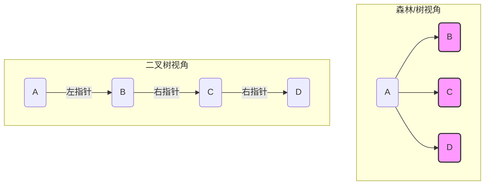

# 核心考点：树/森林与二叉树的转换

> [!summary] **一句话核心原理**
> **孩子兄弟表示法**（Left-Child, Right-Sibling）：
> *   **左指针 (Left Pointer)** $\to$ 指向**第一个孩子** (First Child)
> *   **右指针 (Right Pointer)** $\to$ 指向**下一个兄弟** (Next Sibling)

---

## 1. 树/森林 $\to$ 二叉树 (编码过程)

**口诀：弟借兄臂，子承父业。**
本质是将“层级关系”和“兄弟关系”映射到二叉树的左右指针。

### 核心步骤 (不丢分操作流)
1.  **连兄弟（串糖葫芦）：** 
    *   **树内：** 将所有**兄弟节点**（同一个父节点的孩子）用横线连起来。
    *   **森林间：** 将森林中每一棵树的**根节点**视为兄弟，用横线连起来。
2.  **断连线：** 只保留父节点与**第一个孩子**的连线，断开与其他孩子的连线。
3.  **旋转：** 顺时针旋转45度（即：横线变右孩子，竖线变左孩子）。

### ⚡️ 高分防错技巧：层序处理法
不要一个分支走到黑！**按层序（从上到下，从左到右）** 处理节点，绝对不会乱。

*   **处理节点 X 的步骤：**
    1.  看 X 在原树中有没有孩子？
    2.  **有孩子** $\to$ 把所有孩子用**右指针**串成一串“冰糖葫芦”。
    3.  把这串“糖葫芦”的**头部**（大儿子），挂在 X 的**左指针**下。
    4.  **无孩子** $\to$ X 的左指针置空。
    5.  继续处理下一个节点。

---

## 2. 二叉树 $\to$ 树/森林 (解码过程)

**口诀：左孩右串，拆回原籍。**

### 核心步骤 (还原流)
1.  **定根源：** 
    *   二叉树的**根节点**及其**右指针链上的所有节点**，分别是森林中各棵树的**根**。
    *   若右指针链为空，则还原为单纯的一棵树。
2.  **找孩子 (核心逆运算)：**
    *   对于节点 X，看它的**左指针**指向谁（假设是 Y）。
    *   **Y 及其右指针链上串着的一整串节点**，全部拆下来，统统作为 **X 的孩子**。

### ⚡️ 考场实战演示 (层序还原)
1.  **画根：** 先画出二叉树根节点及其右链上的所有节点（确立森林的根）。
2.  **按层扫描：** 按照二叉树的层序，依次处理每个节点 X。
3.  **还原孩子：**
    *   Check：X 有左孩子 Y 吗？
    *   If Yes：找到 Y 以及 Y 右边连着的一串（Y-Z-W...）。
    *   Action：把 Y, Z, W... 全部挂在 X 下面做儿子。
    *   If No：X 是叶子节点，跳过。

---

## 3. 必背逻辑图解 (Obsidian 可视化)

> [!tip] 对应关系速查表
> | 原树/森林关系 | 二叉树指针 | 物理含义 |
> | :--- | :--- | :--- |
> | **长子** (First Child) | **左指针** (LChild) | 它是这一层的老大，挂父节点左边 |
> | **兄弟** (Next Sibling) | **右指针** (RChild) | 它们是平级关系，手拉手往右排 |
> | **森林的下一棵树根** | **根的右指针** | 树与树之间也是“兄弟”关系 |

### 示例：二叉树转森林

**给定二叉树结构：**
*   Root: A
*   A.Left: B (B.Right: C) $\to$ A的左孩是B，B右边串着C
*   A.Right: D (D.Right: E) $\to$ A右边串着D，D右边串着E

**还原逻辑：**
1.  **剥离根：** A 的右链是 D, E。$\to$ **森林有三棵树，根分别是 A, D, E。**
2.  **还原A的孩子：** A 左边是 B，B 右串是 C。$\to$ **A 的孩子是 B, C。**
3.  **还原D, E的孩子：** 检查 D, E 的左指针...（以此类推）

---

## 4. 避坑指南 (Priority: High)

> [!danger] 易错点警示
> 1.  **森林转二叉树的第一步：** 千万别忘了**把森林里所有树的根节点**先看作兄弟串起来！很多同学只转了内部，忘了转根之间的关系，导致丢分。
> 2.  **叶子节点判断：** 在二叉树中，只有**左指针为空**，原树节点才是**无孩子**的（叶子）。右指针为空只代表它是兄弟里的老幺，不代表没孩子。
> 3.  **做题顺序：** 无论正转反转，**严格遵守层序遍历（一层一层处理）** 是保证 100% 正确率的唯一法门。手算时不要跳跃。
