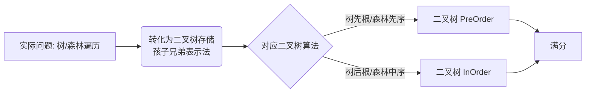

---
tags:
  - 考研
  - 数据结构
  - 树
  - 森林
  - 遍历
priority: 9
difficulty: 4
---

# 树与森林的遍历

> [!summary] **考研速记核心结论 (985上岸必背)**
> 只要记住**“一一对应”**关系，选择题秒杀，大题不丢分。所有复杂的树/森林遍历问题，都可以转化为**二叉树**遍历问题解决。

## 1. 核心映射表 (必考点)

这是本节最功利的内容，**必须死记硬背**，考场上直接映射，不要现场推导。

| 原结构 | 遍历方式 | **等价于** | 对应二叉树(孩子兄弟法)的遍历 | 逻辑内核 |
| :--- | :--- | :--- | :--- | :--- |
| **树** | 先根遍历 | = | **先序**遍历 (PreOrder) | 深度优先 (DFS) |
| **树** | 后根遍历 | = | **中序**遍历 (InOrder) | 深度优先 (DFS) |
| **树** | 层序遍历 | = | (无直接对应，需用队列) | **广度优先 (BFS)** |
| | | | | |
| **森林** | 先序遍历 | = | **先序**遍历 (PreOrder) | 依次对每棵树先根 |
| **森林** | 中序遍历 | = | **中序**遍历 (InOrder) | 依次对每棵树**后根** |

> [!warning] **避坑指南**
> 1. **树没有中序遍历**：树只有先根、后根、层序。
> 2. **森林的中序 = 树的后根**：森林的中序遍历，其实就是对森林里每一棵树分别做“后根遍历”。
> 3. **一一对应**：
>    - 树/森林 **先** = 二叉树 **先**
>    - 树 **后** / 森林 **中** = 二叉树 **中**
>    - **没有任何一种情况对应二叉树的“后序”！** (记下来，排除法神技)

---

## 2. 树的遍历 (详细拆解)

### 2.1 先根遍历 (PreOrder)
*   **规则**：先访问根 -> 依次先根遍历各子树。
*   **手工解题技巧**：画轮廓线，第一次经过节点左侧时访问（同二叉树）。
*   **代码实现思路**：若用`孩子兄弟表示法`，直接写二叉树先序递归。

### 2.2 后根遍历 (PostOrder)
*   **规则**：先依次后根遍历各子树 -> 最后访问根。
*   **手工解题技巧**：画轮廓线，最后一次经过节点右侧/离开时访问。
*   **注意**：树的后根序列 = 对应二叉树的**中序**序列。

### 2.3 层序遍历 (LevelOrder)
*   **性质**：**广度优先 (BFS)**。
*   **算法模板 (队列实现)**：
    1. 根入队。
    2. 若队空则结束；否则出队一个元素并访问。
    3. 将该元素的**所有**孩子节点（注意是所有直接孩子）依次入队。
    4. 循环步骤2。

---

## 3. 森林的遍历 (详细拆解)

森林 = $T_1, T_2, ..., T_m$ 的集合。

### 3.1 森林的先序
*   **定义**：访问第一棵树的根 -> 先序遍历第一棵树中除根外的子树森林 -> 先序遍历除去第一棵树后的剩余森林。
*   **人话版 (做题用)**：
    1. 依次对每一棵树进行**先根遍历**。
    2. 或者：转成二叉树，求**二叉树的先序**。

### 3.2 森林的中序
*   **定义**：中序遍历第一棵树的子树森林 -> 访问第一棵树的根 -> 中序遍历剩余森林。
*   **人话版 (做题用)**：
    1. 依次对每一棵树进行**后根遍历**。
    2. 或者：转成二叉树，求**二叉树的中序**。

---

## 4. 985 高分策略：代码与算法题

若考到树/森林的算法大题（较冷门但致命），**千万不要**直接手写多叉树递归（容易错且难调试）。

**标准解题路径 (完全不丢分)**：
1.  **存储结构**：说明使用**孩子兄弟表示法** (Left-Child, Right-Sibling) 存储树/森林。
    *   逻辑上：这就变成了一棵**二叉树**。
2.  **算法转换**：
    *   题目求树的先根 -> 写二叉树先序代码。
    *   题目求树的后根 -> 写二叉树中序代码。
    *   题目求森林的遍历 -> 同上转化。

> [!tip] **手工模拟技巧 (防粗心)**
> 画出树/森林的图形，想象一条线从根出发，沿着树的轮廓**从左向右、从深到浅**描边。
> *   **先根**：遇到节点就记录。
> *   **后根**：从节点“离开/回溯”时才记录。
