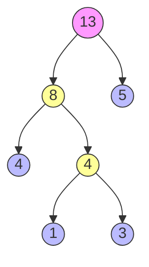

> [!tip] **功利化综述**
> 考研数据结构必考点，通常出现在**选择题**（性质判断、WPL计算）或**大题**（手绘构造、编码设计）。
> **核心目标**：拿分。
> **核心逻辑**：权值越小越靠下，权值越大越靠上。

## 1. 核心概念与公式

### 1.1 关键定义
*   **权 (Weight)**：赋予结点某种含义的数值（如频率、重要性）。
*   **带权路径长度 (WPL - Weighted Path Length)**：
    *   **结点 WPL**：$WPL_{node} = \text{路径长度} \times \text{权值}$
    *   **树 WPL**：$WPL_{tree} = \sum_{i=1}^{n} (w_i \times l_i)$
    *   **注意**：路径长度 = 经过的边数（层数 - 1）。
    *   **考点陷阱**：**只计算叶子结点**，不要算非叶子结点！

### 1.2 哈夫曼树定义
又称**最优二叉树**。在含有 $n$ 个带权叶子结点的二叉树中，**WPL 最小**的那一棵。

---

## 2. 构造哈夫曼树 (手绘必会)

**构造口诀**：**“选两小，造新树，删两小，加新权，重复之”**

### 2.1 算法流程
1.  **选两小**：从当前森林中找出**根结点**权值**最小**的两棵树。
2.  **造新树**：将这两棵树作为左右子树，构造一棵新树。
    *   **新根权值** = 左信结点权值 + 右信结点权值。
3.  **删两小，加新权**：从集合中删除刚才选中的两个结点，将新生成的根结点加入集合。
4.  **重复**：直到集合中只剩下一棵树。

### 2.2 构造演示 (Mermaid 可视化)
假设叶子权重为：`{1, 3, 4, 5}`

**步骤分解：**
1. 选 `1, 3` $\to$ 合并为 `4` (新)
2. 集合变为 `{4(旧), 5, 4(新)}`
3. 选 `4(旧), 4(新)` $\to$ 合并为 `8`
   *(注：这里选4和4合并，还是4和5合并，会导致树形态不同，但WPL不变)*
4. 集合变为 `{5, 8}` $\to$ 合并为 `13`

> [!example] **WPL 计算秒杀技巧**
> **常规法**：$\sum (叶子权值 \times 路径长度) = 1\times3 + 3\times3 + 4\times2 + 5\times1 = 3 + 9 + 8 + 5 = 25$
> **加和法（极速）**：**WPL = 所有非叶子结点的权值之和**
> 上图中非叶子结点为：4(新), 8, 13。
> $WPL = 4 + 8 + 13 = 25$
> *考试用此法验算，速度快且不易出错。*

---

## 3. 核心性质 (选择题判分点)

> [!WARNING] **死记硬背区**
> 只要记住这几条，选择题**完全不丢分**。

1.  **结点总数**：包含 $n$ 个叶子结点的哈夫曼树，总结点数 $N = 2n - 1$。
    *   *推导*：每次合并增加1个结点，共合并 $n-1$ 次。 $N = n + (n - 1)$
2.  **不存在度为1的结点**：哈夫曼树中只有度为0（叶子）和度为2（分支）的结点。
    *   *考点*：如果题干说某二叉树度为1的结点数为0，它**不一定**是哈夫曼树，但哈夫曼树一定满足此条件。
3.  **不唯一性**：
    *   **形态不唯一**（左右子树可交换、权值相同时选择顺序可变）。
    *   **WPL 值唯一且最小**。
4.  **最值特性**：权值越小的结点，离根越远；权值越大的结点，离根越近。

---

## 4. 哈夫曼编码 (应用)

### 4.1 概念
*   **前缀编码**：没有一个编码是另一个编码的前缀（如 A:0, B:10, C:110）。
    *   *作用*：解码时无歧义，无需分隔符。
    *   *哈夫曼编码*：一种**最优的前缀编码**（总位数最少）。

### 4.2 构造方法
1.  构造哈夫曼树（字符频率 = 权值）。
2.  **左0右1**：从根出发，左分支标0，右分支标1（反之亦可，题干无要求则随意）。
3.  **路径即编码**：从根到叶子的路径序列即为该字符的编码。

> [!danger] **防坑指南**
> 1.  编码的字符**必须在叶子结点上**，不能在分支结点上，否则不满足前缀编码要求。
> 2.  求“压缩后二进制总长度”其实就是求 **WPL**。

---

## 5. 考研实战 CheckList (完全不丢分)

- [ ] **看清题意**：是求 WPL 还是求编码？
- [ ] **计算 WPL**：用“常规法”算一遍，用“非叶子结点求和法”验算一遍。
- [ ] **构造过程**：当遇到两个以上最小权值相同时（如现有权值 2, 2, 2, 3），任选两个即可，形态虽变，WPL 不变，**不要纠结**。
- [ ] **叶子数量**：确认初始给定的 $n$ 个数最终都在叶子上，没漏掉。
- [ ] **应用题**：如果问“最少需要多少比特位”，直接构造哈夫曼树求 WPL。

### 默写模板（记忆用）
> 哈夫曼树是 WPL 最小的二叉树；
> 只有度0和度2结点，总结点 $2n-1$；
> 权小路长，权大路短；
> 对应的前缀编码长度最短，用于数据压缩。
