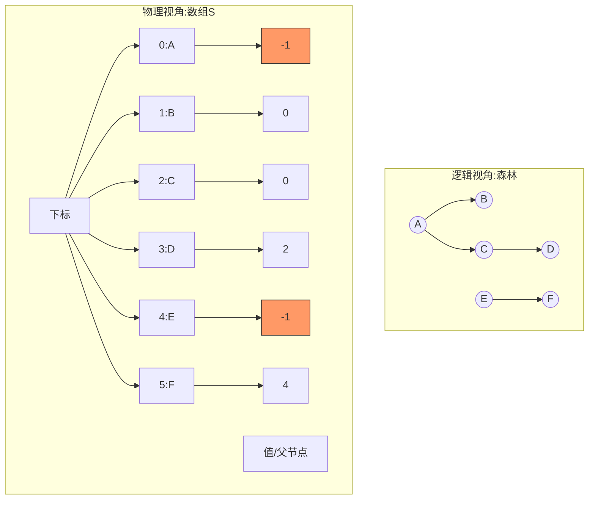
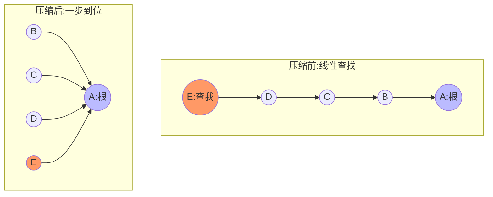

---
tags:
  - 考研
  - 数据结构
  - 并查集
  - 算法
  - 2022新大纲
  - 路径压缩
priority: 8
difficulty: 5
---

> [!abstract] **功利化综述**
> **核心目标**：解决“元素分组”与“归属查询”问题。
> **考查重点**：
> 1.  **物理存储**：双亲表示法（数组）。
> 2.  **核心操作**：`Union`（并）和 `Find`（查）。
> 3.  **高分关键**：**Union操作的优化（小树并入大树）**，这是拉开分差、防止时间复杂度退化的考点。
> 4.  **复杂度**：未优化 $O(n)$ vs 优化后 $O(\log_2 n)$。

---

### 一、 逻辑与物理结构

*   **逻辑结构**：集合（Set）。元素之间只有“同属一个集合”或“不同集合”的关系。互不相交。
*   **物理存储**：**静态数组**（树的双亲表示法）。
    *   `S[i]` 表示元素 `i` 的父结点下标。
    *   **根结点特权**：`S[root] < 0`。
        *   普通模式：`-1` 表示是根。
        *   **优化模式**：数值的绝对值表示该集合的**结点总数**（如 `-6` 表示该集合有6个元素）。



---

### 二、 核心代码模板 (背诵版)

该版本为**C语言考研通用标准**，涵盖了初始化、查、并。

#### 1. 结构定义与初始化
```c
#define SIZE 100
int UFSets[SIZE]; // 集合元素数组

// 初始化：所有元素自成一派，值为-1
void Initial(int S[]) {
    for(int i=0; i<SIZE; i++)
        S[i] = -1;
}
```

#### 2. 查 (Find)
**核心逻辑**：一路向北（向上），直到找到负值的根结点。
```c
// 找x所属集合的根结点下标
int Find(int S[], int x) {
    while(S[x] >= 0) // 只要不是根，就继续往上找
        x = S[x];
    return x; // 返回根结点下标
}
```

#### 3. 并 (Union) - **基础版**
**操作**：直接将一个根结点挂到另一个根结点下面。
**缺点**：可能形成细长的树，导致`Find`效率退化为 $O(n)$。
```c
void Union(int S[], int root1, int root2) {
    if(root1 == root2) return; // 同一集合不用并
    S[root2] = root1; // 让root2的父结点变成root1
}
```

---

### 三、 进阶考点：Union优化 (小树并大树)

**这是985上岸必须掌握的细节。**

> [!fail] **未优化的风险**
> 极端情况下，树退化成线性链表。
> *   树高：$h = n$
> *   Find复杂度：$O(n)$

> [!success] **优化策略：小树并入大树**
> 用根结点的值存储集合大小（负数形式）。
> *   `S[root] = -8` 代表该树有8个结点。
> *   **规则**：结点少的树 -> 孩子；结点多的树 -> 根。
> *   **结果**：树高不超过 $\lfloor \log_2 n \rfloor + 1$。
> *   **Find复杂度**：$O(\log_2 n)$。

#### 优化版 Union 代码 (必背)
```c
void Union_Optimized(int S[], int root1, int root2) {
    if(root1 == root2) return;

    // 比较绝对值，绝对值大的说明结点多（大树）
    // 注意：S[]里存的是负数，所以 S[root2] > S[root1] 意味着 root2 的绝对值更小（小树）
    // 逻辑：值越大(越接近0)，代表结点数越少(小树)
    
    if(S[root2] > S[root1]) { 
        // root2是小树，root1是大树 -> 小并大
        S[root1] += S[root2]; // 1. 累加结点总数
        S[root2] = root1;     // 2. 小树根指向大树根
    } else {
        // root1是小树，root2是大树 -> 小并大
        S[root2] += S[root1]; // 1. 累加结点总数
        S[root1] = root2;     // 2. 小树根指向大树根
    }
}
```

---

### 四、 考点速查表 (不丢分自检)

| 考查维度 | 普通并查集 | **优化并查集 (Union by Size)** | 备注 |
| :--- | :--- | :--- | :--- |
| **Union 复杂度** | $O(1)$ | $O(1)$ | 无论是否优化，并操作本身只需修改指针 |
| **Find 复杂度** | 最坏 $O(n)$ | 最坏 $O(\log_2 n)$ | **核心考点**：树高决定查找效率 |
| **树高限制** | 可能达到 $n$ | $\le \lfloor \log_2 n \rfloor + 1$ | 优化后的树更“胖”更“矮” |
| **数组含义** | 仅表示父子关系 | **根结点值蕴含集合大小** | 看到负数值不仅仅是-1，要反应过来 |

> [!tip] **应试技巧**
> 1. 如果题目让你手绘并查集过程，注意区分是否要求“优化”。如果未要求，通常默认左边并入右边或序号小的并入序号大的（看题目约定）。
> 2. 如果题目要求**优化**，务必计算结点数，严格执行“小并大”。
> 3. 代码题中，如果涉及集合合并，直接默写并查集模板，是最稳妥的得分手段。
> 4. **辨析**：并查集不涉及“删除”操作，只管“并”和“查”。


> [!danger] **考研功利化视点**
> **为什么学这节？** 为了防止出题老师“不讲武德”。
> 上一节的`Union`优化（小树并大树）已经足够优秀，但如果题目考察**最坏时间复杂度**的极限优化，或者代码题要求**最高效率**，必须加上本节的**路径压缩**。
> **985上岸标准**：不仅要会写`Union`优化，还要会写`Find`优化，并能准确说出 $O(\alpha(n))$ 这个装X的复杂度。

---

### 一、 核心逻辑：路径压缩 (Path Compression)

*   **痛点**：即便用了`Union`优化，树还是可能有多层。每次`Find`都要爬楼梯，累。
*   **策略**：**“先找根，再挂靠”**。
    1.  先走一遍找到根结点。
    2.  再走一遍，把**路径上所有**经过的结点，直接改为**根结点的孩子**。
*   **效果**：树的高度被极度压缩，变成了“扁平化”管理。下次再查这些点，一步到位。



---

### 二、 满分代码模板 (Find优化版)

此代码在考试中通用，结合了**查找**与**压缩**两个步骤。

```c
// 路径压缩版 Find 函数 (Iterative版本 - 推荐，不易爆栈)
int Find_Optimized(int S[], int x) {
    // 1. 先找到根结点
    int root = x;
    while(S[root] >= 0) {
        root = S[root];
    }
    
    // 2. 路径压缩：把沿途所有结点的父节点都设为root
    while(x != root) {
        int t = S[x]; // 暂存原父结点
        S[x] = root;  // 【核心操作】认祖归宗，直接挂到根下
        x = t;        // 继续处理原父结点
    }
    
    return root;
}
```

> [!tip] **极简递归写法 (C++ style / 高手向)**
> 如果你对递归很熟，可以用这一行代码实现路径压缩（考试可用）：
> `return S[x] < 0 ? x : (S[x] = Find_Optimized(S, S[x]));`

---

### 三、 复杂度分析 (选择题必考)

这是拉开分差的关键。我们需要对比三种情况：
1.  **无优化**：随意合并。
2.  **仅Union优化**：小树并大树。
3.  **双重优化**：小树并大树 + 路径压缩。

假设有 $n$ 个独立元素，进行 $n-1$ 次合并（构建成一个大集合）和 $m$ 次查找。

| 优化策略 | 单次Find最坏复杂度 | 树的高度 $h$ | 总时间复杂度 (n次操作) | 备注 |
| :--- | :--- | :--- | :--- | :--- |
| **无优化** | $O(n)$ | $O(n)$ | $O(n^2)$ | 可能会退化成链表 |
| **仅 Union 优化** | $O(\log_2 n)$ | $\le \lfloor \log_2 n \rfloor + 1$ | $O(n \log_2 n)$ | 已经很优秀 |
| **Path Compression** | **$O(\alpha(n))$** | **极低 (近乎常数)** | **$O(n \alpha(n))$** | **985 答题标准** |

> [!abstract] **关于 $\alpha(n)$**
> *   $\alpha(n)$ 是 **阿克曼函数 (Ackermann Function)** 的反函数。
> *   增长极慢，对于宇宙中所有实际可观测的 $n$ 值，$\alpha(n) \le 4$。
> *   **应试话术**：如果面试或填空题问到，回答 **“时间复杂度接近于常数级 $O(1)$，准确说是 $O(\alpha(n))$”**。

---

### 四、 备考总结 (Cheat Sheet)

1.  **代码优先级**：
    *   **Find操作**：**强烈建议写带路径压缩的版本**（代码只多3行，收益巨大）。
    *   **Union操作**：如果题目没给数据结构具体定义，写简单的“直接挂”即可；如果题目强调了“高性能”或“树高限制”，必须写“小树并大树”优化。

2.  **概念辨析**：
    *   **Union优化**（小树并大树）：限制树高增长，从源头控制。
    *   **Find优化**（路径压缩）：在通过的时候顺手打平树高，越用越快。

3.  **可视化资源**：
    *   视频中提到的旧金山大学算法演示网站 (USF CA Visualization)，复习时若遗忘流程，可去该网站拖动滑块模拟。
