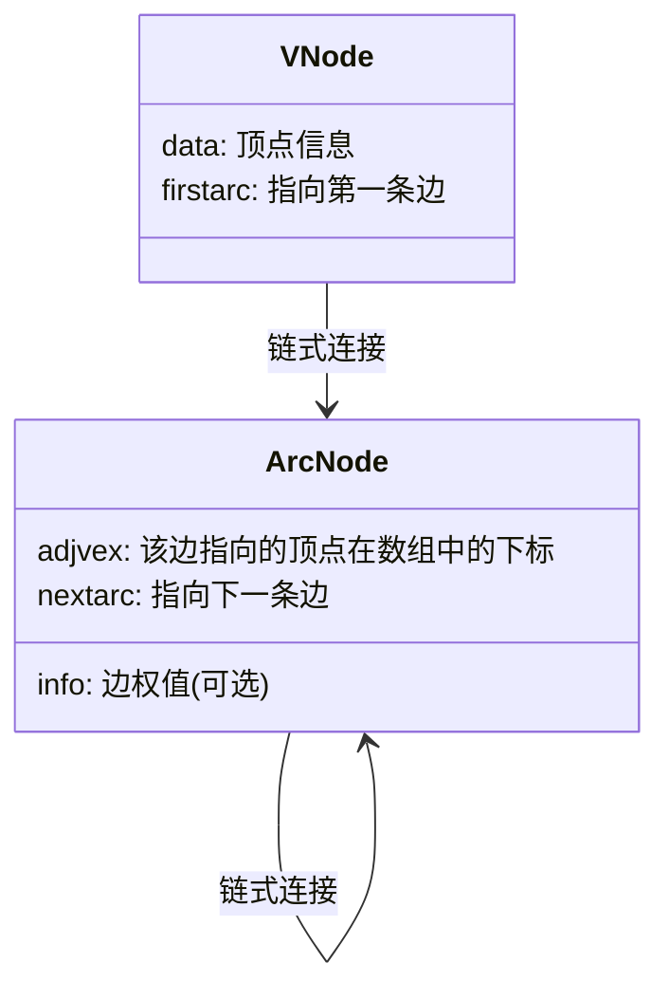

---
tags:
  - 考研
  - 数据结构
  - 图论
  - 存储结构
  - 邻接表
priority: 10
difficulty: 5
---

> [!summary] **核心考点速览**
> 1.  **定义与实现**：顺序存储（顶点表）+ 链式存储（边表）。
> 2.  **空间复杂度**：这是考研选择题高频点，分有向和无向。
> 3.  **度数计算**：重点掌握有向图求“入度”的缺陷。
> 4.  **唯一性判定**：邻接表表示**不唯一**（死记）。

### 一、 逻辑结构与存储实现

**核心思想**：类似于树的“孩子表示法”。
- **顶点表（Vertex Node）**：用一维数组存储。包含顶点数据 `data` 和指向第一条边的指针 `firstarc`。
- **边表（Edge Node/Arc Node）**：用链表存储。包含邻接点索引 `adjvex` 和指向下一条边的指针 `nextarc`。（若是带权图，链表节点中增加 `weight` 域）。



### 二、 空间复杂度 (必考)

设图有 $n$ 个顶点（$|V|$），$e$ 条边（$|E|$）。

| 图类型 | 边表节点总数 | 空间复杂度 | 备注 |
| :--- | :---: | :---: | :--- |
| **无向图** | $2e$ | **$O(n + 2e)$** | 每条边 $(a, b)$ 既在 $a$ 的链表中，也在 $b$ 的链表中，**冗余存储**。 |
| **有向图** | $e$ | **$O(n + e)$** | 仅存储出边（即从该节点发出的弧）。 |

> [!tip] **对比**
> 邻接矩阵的空间复杂度恒为 $O(n^2)$。因此，**邻接表特别适合存储稀疏图**。

### 三、 度、入度与出度的计算

这是邻接表最大的“特性”也是“缺陷”，极易出大题或选择题干扰项。

| 操作 | 无向图 | 有向图 |
| :--- | :--- | :--- |
| **求度 (Degree)** | **极快** <br> 遍历该顶点的链表，节点数即为度。 | **麻烦** <br> 度 = 出度 + 入度。 |
| **求出度 (Out)** | / | **极快** <br> 遍历该顶点的链表，节点数即为出度。 |
| **求入度 (In)** | / | **极慢 (致命弱点)** <br> 必须遍历**整个邻接表**（所有顶点的链表），统计指向该顶点的边数。 |

> [!failure] **痛点警示**
> 如果题目要求频繁计算有向图的**入度**，**不要**单纯使用标准邻接表（通常需要建立逆邻接表或改用其他结构）。

### 四、 邻接表 vs 邻接矩阵 (易混淆点判别)

该部分内容直接决定选择题能否秒杀。

| 比较维度 | 邻接矩阵 (Adjacency Matrix) | 邻接表 (Adjacency List) |
| :--- | :--- | :--- |
| **表示唯一性** | **唯一** (确定编号后，矩阵固定) | **不唯一** (链表中边节点的次序可以任意交换) |
| **适用场景** | 稠密图 | 稀疏图 |
| **找相邻边** | 需遍历整行/整列 | 直接遍历链表 (找入边除外) |

### 五、 必背代码逻辑 (C语言风格)

不要求默写完整代码，但要能看懂结构体定义，用于算法题手写伪代码。

```c
// 边/弧节点
typedef struct ArcNode {
    int adjvex;           // 该边指向的顶点下标
    struct ArcNode *next; // 指向下一条边的指针
    // int weight;        // 若为网图，增加权值
} ArcNode;

// 顶点节点
typedef struct VNode {
    char data;            // 顶点信息
    ArcNode *first;       // 指向第一条边
} VNode, AdjList[MaxVertexNum];

// 图
typedef struct {
    AdjList vertices;     // 邻接表
    int vexnum, arcnum;   // 顶点数和边数
} ALGraph;
```

---
**本节复习自测（遮住答案回答）：**
1. 邻接表表示一个图，结果是唯一的吗？ -> **不唯一**。
2. $n$ 个顶点 $e$ 条边的无向图，邻接表需要多少个边节点？ -> **$2e$**。
3. 想知道有向图中某个点被多少个点指向（入度），邻接表效率高吗？ -> **低，需要全表扫描**。
