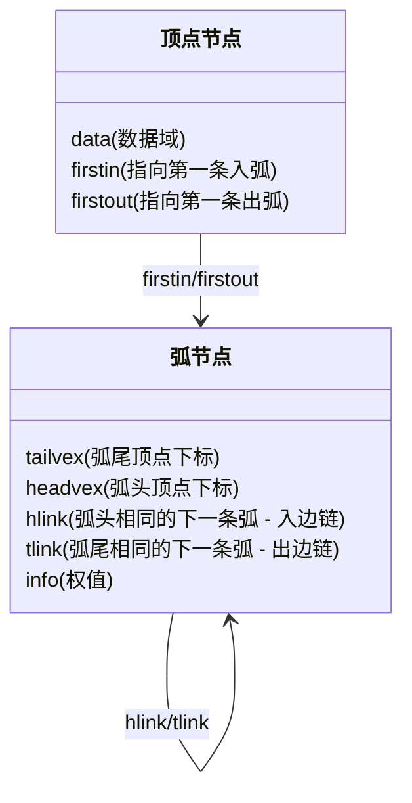
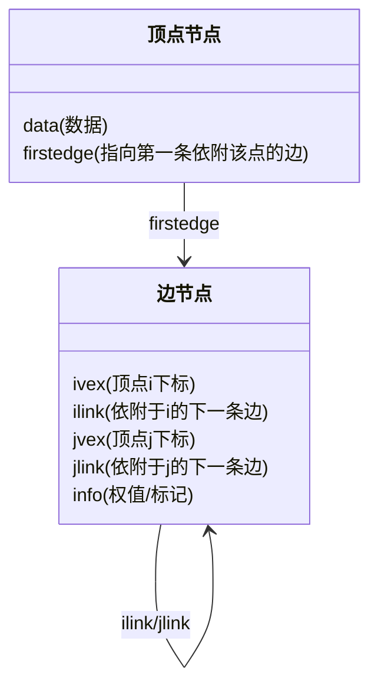

## 🚀 核心考点速记图谱

> **功利化导读：** 
> 这一节是图存储的“进阶版”。考研中，**代码大题几乎不考这两种结构的完整实现**（太繁琐），但**选择题**非常喜欢考它们的**适用场景、节点结构定义、指针含义**以及**解决了什么痛点**。
> 
> **一句话记忆核心：**
> *   **有向图**求入度难 $\rightarrow$ **十字链表**（整合了邻接表和逆邻接表）。
> *   **无向图**删边/点难 $\rightarrow$ **邻接多重表**（一条边只存一个节点，去冗余）。

---

## 一、 十字链表 (Orthogonal List)

### 1. 适用场景
*   **仅适用于：** **有向图**。
*   **解决痛点：** 
    *   **邻接矩阵**：空间太浪费 $O(V^2)$。
    *   **邻接表**：找**出度**容易，找**入度**（入边）极难（需遍历全表）。
    *   **十字链表**：**既容易找入度，也容易找出度**。

### 2. 结构可视化 (Mermaid)

在Obsidian中可渲染如下结构：

![[Pasted image 20260205133645.png]]

### 3. 指针逻辑解析 (不丢分关键)
结合课件图示逻辑：
*   **顶点结构**：`[ data | firstin | firstout ]`
    *   `firstout`（绿色系）：顺藤摸瓜找到所有**出边**（类似邻接表）。
    *   `firstin`（橙色系）：顺藤摸瓜找到所有**入边**（类似逆邻接表）。
*   **弧结构**：`[ tail | head | hlink | tlink ]`
    *   **tlink (Tail Link)**：和当前弧**起点（Tail）相同**的下一条弧 $\rightarrow$ 对应**出边**。
    *   **hlink (Head Link)**：和当前弧**终点（Head）相同**的下一条弧 $\rightarrow$ 对应**入边**。

### 4. 空间复杂度
*   与邻接表一致：**$O(|V| + |E|)$**。

---

## 二、 邻接多重表 (Adjacency Multilist)

### 1. 适用场景
*   **仅适用于：** **无向图**。
*   **解决痛点：**
    *   **邻接表**存无向图：每条边存两份（冗余），**删除边/节点**非常麻烦（要搜两个地方）。
    *   **邻接多重表**：**每条边只对应一个边节点**，操作统一。

### 2. 结构可视化 (Mermaid)

![[Pasted image 20260205135019.png]]
### 3. 核心优势 (选择题考点)
*   **唯一性**：无向图的每一条边 $(u, v)$ 在内存中**只有一个边节点**。i、j逻辑上完全平等，没有顺序之分
*   **操作便利**：
    *   **删边**：只需修改指针，不用像邻接表那样删两处。
    *   **删点**：顺着链表找到所有关联边进行处理，逻辑更清晰。
*   **指针逻辑**：
    *   `ilink` 指向下一条与 `ivex` 相连的边。
    *   `jlink` 指向下一条与 `jvex` 相连的边。
    *   (不论从哪个顶点出发，都能把所有相连的边找出来)。

---

## 三、 考研必背对比表 (High Efficiency)

此表背熟，选择题秒杀。

| 特性        | 邻接表 (Adjacency List) | 十字链表 (Orthogonal List) | 邻接多重表 (Adj Multilist) |
| :-------- | :------------------- | :--------------------- | :-------------------- |
| **适用图类**  | 有向图 / 无向图            | **有向图**                | **无向图**               |
| **空间复杂度** | $$O(V+E)$$           | $$O(V+E)$$             | $$O(V+E)$$            |
| **主要解决**  | 相比矩阵节省空间             | 解决有向图**求入度**难          | 解决无向图**边冗余、删除难**      |
| **边的存储**  | 无向图一条边存2次            | 每一条弧存1次                | 无向图一条边**只存1次**        |
| **表示唯一性** | 不唯一 (依赖输入/链接顺序)      | 不唯一                    | 不唯一                   |

---

## 💡 避坑指南 (易错点)

1.  **关于表示唯一性**：
    *   邻接表、十字链表、邻接多重表的表示**都不是唯一的**（取决于建图时边插入的顺序，链表链接顺序可能不同）。
    *   只有**邻接矩阵**的表示是唯一的（确定了顶点编号后）。
2.  **关于代码考察**：
    *   虽然不考手写完整代码，但要能看懂 `struct` 定义。
    *   看到 `tailvex`, `headvex` $\rightarrow$ 反应出 **十字链表 (有向)**。
    *   看到 `ivex`, `ilink`, `jvex`, `jlink` $\rightarrow$ 反应出 **邻接多重表 (无向)**。
3.  **删除操作**：
    *   如果在题目中问“哪个结构删除无向图的边最方便” $\rightarrow$ 选 **邻接多重表**。
