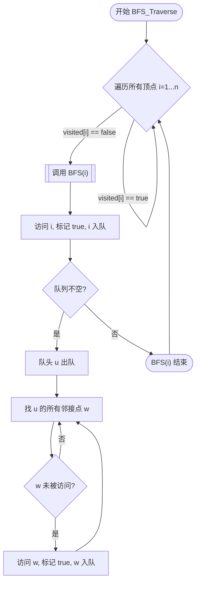

# 图的广度优先遍历 (BFS)

> [!summary] 核心口诀
> **类似树的层序遍历** + **辅助队列** + **visited数组**。
> 由近及远，层层推进。

## 1. 算法核心思想

*   **直观理解**：以起始点为中心，向外一圈一圈扩散（类似水波纹）。
*   **类比**：树的**层序遍历**。
*   **关键区别**：图可能存在**回路**（环），因此必须引入 `visited[]` 标记数组，防止重复访问陷入死循环。

## 2. 算法流程 (标准模板)

BFS算法不仅要处理连通图，还要考虑**非连通图**（存在多个连通分量）。

### 2.1 核心步骤逻辑
1.  **初始化**：`visited` 数组全 false，初始化辅助队列 `Q`。
2.  **外层循环**（处理非连通）：遍历所有顶点 $v$，若 `!visited[v]`，则调用 `BFS(v)`。
3.  **BFS函数**：
    *   访问初始点 $v$，标记 `visited[v]=true`，入队。
    *   **While 队列不空**：
        *   出队队头元素 $u$。
        *   **For 循环**（检测 $u$ 的所有邻接点 $w$）：
            *   若 `!visited[w]`：访问 $w$，标记 true，**$w$ 入队**。

### 2.2 伪代码可视化

> [!important] 考研易错点
> *   **BFS_Traverse 调用次数** = **连通分量个数** (对于无向图)。
> *   **visited 标记时机**：必须在**入队前/访问时**立即标记，而不是出队时标记（否则会导致节点重复入队）。

## 3. 性能分析 (必考重点)

时间复杂度主要取决于**访问顶点**和**处理边**的开销。
设顶点数为 $\vert V \vert$，边数为 $\vert E \vert$。

| 存储结构 | 时间复杂度 | 原因分析 (空间换时间逻辑) |
| :--- | :--- | :--- |
| **邻接矩阵** | $O(\vert V \vert^2)$ | 访问顶点需 $O(\vert V \vert)$。查找每个顶点的邻接点需遍历整行，耗时 $O(\vert V \vert)$，共 $\vert V \vert$ 个顶点，故为 $O(\vert V \vert^2)$。 |
| **邻接表** | $O(\vert V \vert + \vert E \vert)$ | 访问顶点需 $O(\vert V \vert)$。查找邻接点需遍历所有边表节点，无向图总表节点数为 $2\vert E \vert$，忽略系数即 $O(\vert E \vert)$。 |

*   **空间复杂度**：最坏情况（例如星型图，中心点入队后，周围点全部入队）为 $O(\vert V \vert)$，来自于辅助队列。

## 4. BFS 的应用与性质

### 4.1 广度优先生成树/森林
在 BFS 过程中，保留“第一次访问某顶点”时经过的边，构成生成树。
*   **连通图** $\rightarrow$ 生成树。
*   **非连通图** $\rightarrow$ 生成森林。

| 存储结构 | 生成树唯一性 | 解析 |
| :--- | :--- | :--- |
| **邻接矩阵** | **唯一** | 矩阵表达形式唯一，遍历邻接点顺序固定（如下标从小到大）。 |
| **邻接表** | **不唯一** | 邻接表中边结点的链接顺序人为决定，顺序不同导致遍历次序不同，生成的树形状不同。 |

### 4.2 最短路径 (无权图)
*   BFS 必定能找到从源点到各结点的**最少边数**路径。
*   **适用性**：仅适用于无权图（或所有边权值相等）。

## 5. 实战技巧 (应试)

1.  **手绘序列题**：
    *   画出辅助队列，严格按照“出队一个，将其所有未访问邻居入队”的逻辑操作。
    *   **注意邻接顺序**：若题目给出了邻接表，必须严格按链表顺序访问；若给邻接矩阵或未指定，通常默认按顶点编号递增顺序。
2.  **代码填空**：
    *   关注 `visited` 数组的初始化。
    *   关注 `FirstNeighbor(G, x)` 和 `NextNeighbor(G, x, y)` 两个基本操作的配合。
3.  **非连通图**：
    *   如果题目问“调用几次 BFS 函数”，就是在问“有几个连通分量”。
