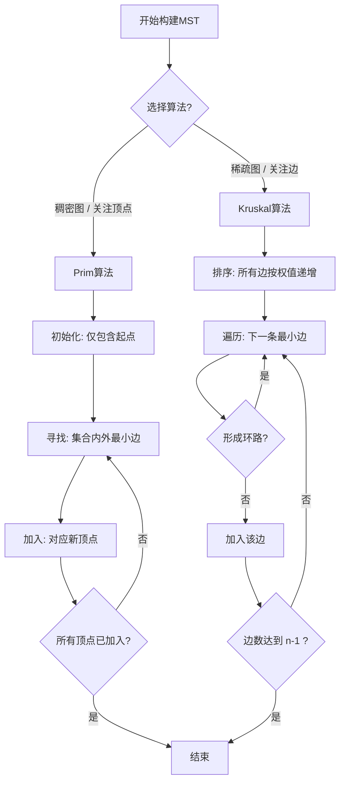

> [!summary] 极简综述
> **最小生成树 (MST)** 是针对**带权连通无向图**的概念。
> 目标：找到包含所有顶点的子图，边数为 $n-1$，保持连通，且**权值之和最小**。
> 核心考法：**Prim算法** (加点法) vs **Kruskal算法** (加边法) 的**手算过程**及**复杂度对比**。

### 1. 核心概念与性质 (必背)

*   **定义**：一个连通图的生成树是包含全部顶点的一个极小连通子图。
*   **代价**：生成树上所有边的权值之和。
*   **MST性质**：
    1.  **边数**：$n$ 个顶点，一定只有 $n-1$ 条边。
    2.  **权值和唯一**：虽然MST的形态可能不唯一，但**最小权值之和是唯一的**。
    3.  **形态唯一性判定**：若图中所有边权值**互不相等**，则MST形态唯一。
    4.  **连通性**：原图不连通 $\rightarrow$ 生成森林 (非树)。

---

### 2. 两大算法对比 (高频考点)

> [!tip] 记忆口诀
> **P点稠，K边稀** (Prim适合点多边稠密，Kruskal适合边稀疏)。
> **P加点，K加边** (Prim不断抓点进集合，Kruskal不断选最短边连通)。

| 维度 | Prim 算法 (普里姆) | Kruskal 算法 (克鲁斯卡尔) |
| :--- | :--- | :--- |
| **核心思想** | **归并顶点**。从某点出发，每次选“已选集合”到“未选集合”中权值最小的边连接。 | **归并边**。全局排序，每次选权值最小且**不构成回路**的边。 |
| **数据结构** | 两个数组：`isJoin` (标记是否加入), `lowcost` (到集合的最短距离)。 | **并查集** (Union-Find)：用于判断两个顶点是否已连通 (防环)。 |
| **时间复杂度** | $O(\vert V \vert^2)$ | $O(\vert E \vert \log_2 \vert E \vert)$ |
| **复杂度关联** | 只与顶点数 $\vert V \vert$ 有关，与边无关。 | 主要取决于边数 $\vert E \vert$ (排序开销)。 |
| **适用场景** | **稠密图** (边多点少)。 | **稀疏图** (边少点多)。 |

---

### 3. 算法手算流程 (绝对不丢分)

#### A. Prim 算法 (手动模拟步骤)

**场景**：给出一个带权图，要求从顶点 $V_0$ 开始构建 MST。

1.  **初始化**：画圈，圈内是“已选点集 $U$”，圈外是“未选点集 $V-U$”。初始时 $U=\{V_0\}$。
2.  **找最小**：扫描所有连接“圈内”和“圈外”的边，找出权值最小的那条。
3.  **并入**：将该边连接的圈外点拉入圈内。
4.  **更新**：重复步骤2和3，直到所有点都在圈内。

> [!example] 考试技巧
> 做题时，可以直接在图上操作：
> 1. 把起点涂黑。
> 2. 找所有**一端黑、一端白**的边中最小的那条，涂黑该边和对应的白点。
> 3. 重复直到全黑。
> *注意：如果有两条权值相同的最小边，选哪条都行，这导致了MST形态的多样性。*

#### B. Kruskal 算法 (手动模拟步骤)

**场景**：给出一个带权图，求 MST。

1.  **排序**：将图中所有边按权值**从小到大**列出来 (草稿纸上必写这一步，防止眼花漏看)。
2.  **选边**：按顺序扫描每一条边。
3.  **判环**：
    *   如果这条边的两个顶点**还没连通** $\rightarrow$ **选中**。
    *   如果这条边的两个顶点**已经连通** (即加入后会形成环) $\rightarrow$ **跳过/舍弃**。
4.  **终止**：当选够 $n-1$ 条边时停止。

---

### 4. 深度原理与代码细节 (985 进阶)

#### Prim 的实现细节
*   **lowcost数组**：`lowcost[i]` 存储顶点 $i$ 到当前生成树集合的最短边权值。
*   **更新机制**：每加入一个新点 $v_{new}$，需要遍历所有剩余点 $j$，若 $Weight(v_{new}, j) < lowcost[j]$，则更新 $lowcost[j]$。
*   **为何是 $O(\vert V \vert^2)$**：
    *   外层循环：需要并入 $n-1$ 个点。
    *   内层操作：遍历寻找最小 `lowcost` ($O(n)$) + 更新剩余点的 `lowcost` ($O(n)$)。
    *   总计 $O(n) \times O(n) = O(n^2)$。

#### Kruskal 的实现细节
*   **并查集 (Union-Find)**：这是Kruskal高效的关键。
    *   `Find(x)`：查找顶点所属集合的根节点。
    *   `Union(x, y)`：合并两个集合。
*   **为何是 $O(\vert E \vert \log \vert E \vert)$**：
    *   时间主要消耗在**对边进行排序**上 (通常用堆排序或快排)。
    *   并查集的操作接近常数级 (经过路径压缩优化后)，可忽略不计。

---

### 5. 常见坑点与错题集

> [!failure] 避坑指南
> 1.  **连通分量**：如果图本身不连通，算法结束后得到的是**最小生成森林**，不是树。
> 2.  **唯一性误区**：
>     *   错：最小生成树的边权之和不唯一。（**绝对错误**，权值和必须唯一）
>     *   错：最小生成树的边的集合是唯一的。（**错误**，权值相同时边可以替换）
> 3.  **Prim vs Kruskal 选择**：
>     *   选择题问“边稠密图用哪个效率高？” $\rightarrow$ 选 **Prim**。
>     *   选择题问“时间复杂度与边数无关的是？” $\rightarrow$ 选 **Prim**。
> 4.  **环的判断**：Kruskal中，不是看顶点是否被访问过，而是看两个顶点是否**已经**在同一个连通分量中。

### 6. 可视化辅助 (Mermaid)

