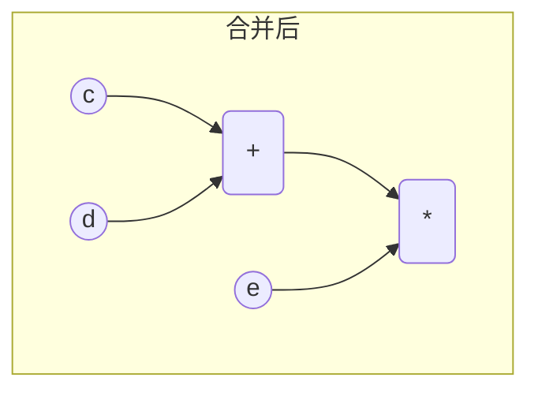

# 核心考点：表达式构造有向无环图 (DAG)

> [!summary] **功利化解题核心**
> 凭感觉画图必错（容易漏掉公共子式），必须采用**“分层构造 + 逐层合并”**的标准SOP流程。
> **目标**：求最少顶点数（= 操作数顶点 + 运算符顶点）。

## 🚀 满分SOP流程 (绝对不丢分)

### Step 1: 操作数排队 (底层)
将表达式中**所有**出现的操作数，提取**不重复**的变量，在最底层排成一排。
*   **原则**：无论出现多少次 $x$，图中只有一个 $x$ 节点。

### Step 2: 标号与分层 (核心)
按运算顺序（优先级）给运算符编号。将运算符按**依赖关系**分层加入图中。
*   **分层原则**：如果一个运算符依赖于某个运算结果，它必须位于该结果的**上一层**。
*   **技巧**：直接操作底层变量的算作 Layer 1，依赖 Layer 1 的算作 Layer 2，以此类推。

### Step 3: 自底向上“消消乐” (合并)
**从下往上**，逐层检查**同一层**内是否存在完全相同的运算。
*   **合并条件**：
    1.  运算符相同（如都是 `+`）。
    2.  左操作数指向同一个节点。
    3.  右操作数指向同一个节点。
*   **操作**：若满足，保留一个，删掉其余，将上层指针统统指向保留的这个。

---

## 🎨 流程可视化演示

假设表达式片段：`... (c+d) * e + (c+d) * e ...`

### 1. 初始构建 (分层)

```mermaid
graph TD
    %% --- Layer 0: 操作数 ---
    subgraph Layer0 [Layer 0: 操作数]
        direction LR
        c((c))
        d((d))
        e((e))
    end

    %% --- Layer 1: 加法层 (使用 &#43; 代替 +) ---
    subgraph Layer1 [Layer 1: 加法层]
        direction LR
        A1("#43;")
        A2("#43;")
    end

    %% --- Layer 2: 乘法层 (使用 &#42; 代替 *) ---
    %% 提示：如果你想要显示 '×' 符号，可以使用 &#215;
    subgraph Layer2 [Layer 2: 乘法层]
        direction LR
        M1("#42;")
        M2("#42;")
    end

    %% --- 连接关系 ---
    %% c 和 d 连接到加法层
    c --> A1
    d --> A1
    c --> A2
    d --> A2

    %% 加法层结果 + e 连接到乘法层
    A1 --> M1
    e --> M1
    A2 --> M2
    e --> M2

    %% --- 样式设置 ---
    %% 红色节点 (加法)
    style A1 fill:#d9534f,stroke:#fff,stroke-width:2px,color:#fff
    style A2 fill:#d9534f,stroke:#fff,stroke-width:2px,color:#fff
    
    %% 蓝色节点 (乘法)
    style M1 fill:#428bca,stroke:#fff,stroke-width:2px,color:#fff
    style M2 fill:#428bca,stroke:#fff,stroke-width:2px,color:#fff
    
    %% 黑色/灰色节点 (操作数)
    style c fill:#333,stroke:#fff,stroke-width:2px,color:#fff
    style d fill:#333,stroke:#fff,stroke-width:2px,color:#fff
    style e fill:#333,stroke:#fff,stroke-width:2px,color:#fff
```

### 2. 执行合并 SOP

1.  **检查 Layer 1**：发现 `A1(+)` 和 `A2(+)` 左右都是 `c` 和 `d`。
    *   $\rightarrow$ **合并**：删掉 A2，M2 的左指针改指 A1。
2.  **检查 Layer 2**：发现 `M1(*)` 和 `M2(*)` 左边都来自 `A1` (合并后)，右边都来自 `e`。
    *   $\rightarrow$ **合并**：删掉 M2。

### 3. 最终结果 (最简 DAG)

---

## ⚠️ 高频陷阱与易错点

### 1. 隐式乘号 (Implicit Multiplication)
*   **陷阱**：题目给出 $(x+y)((x+y)/x)$。
*   **处理**：中间隐含一个 `*` 号，千万别漏算这个顶点！
*   **正确理解**：$(x+y) \times ((x+y)/x)$。

### 2. 只有“同层”才合并
*   **原理**：底层加法 `a+b` 和高层加法 `X+Y` 即使都是加号，操作数不同绝对不可能合并。
*   **操作**：眼光只需聚焦在**水平方向**的同类项。

### 3. 2019年统考真题复盘 (经典反例)
*   **题目**：$(x+y)((x+y)/x)$
*   **错误直觉 (选B 6个)**：
    *   算出 $x+y$ 是公共的，合并一次。
    *   算出 $(x+y)/x$。
    *   最后相乘。
    *   **漏了什么？** 漏了底层的 $x$ 是同一个节点！
*   **正确SOP (选A 5个)**：
    1.  操作数：$x, y$ (2个)。
    2.  Layer 1：$x+y$ (1个 `+`)。
    3.  Layer 2：$(x+y)/x$ (1个 `/`，左边连Layer1，右边连底层的 $x$)。
    4.  Layer 3：相乘 (1个 `*`，连 Layer1 和 Layer2)。
    5.  Total：2(数) + 1(+) + 1(/) + 1(*) = **5个顶点**。

## 💡 结论记忆
> **DAG 顶点数 = 不重复操作数个数 + 每一层合并后的运算符个数**
