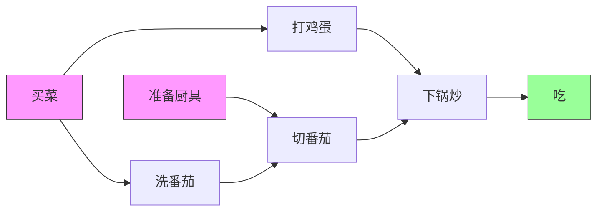

> [!NOTE] **考研复习指导**
> 本节内容极大概率出现在**选择题**（概念辨析、手推序列）和**算法大题**（判断环、输出序列）中。
> 核心考点：**AOV网定义**、**手算拓扑序列**、**判环逻辑**、**DFS实现原理**。
> 请务必掌握邻接表与邻接矩阵在不同排序下的效率差异。

### 一、 核心概念：AOV网与DAG

**1. AOV网 (Activity On Vertex Network)**
*   **定义**：用顶点表示活动，用有向边 $<V_i, V_j>$ 表示活动 $V_i$ 必须先于 $V_j$ 进行（前驱后继关系）。
*   **性质**：
    *   必须是 **有向无环图 (DAG)**。
    *   **若存在回路**：某项活动以自己为先决条件，工程无法进行（死循环）。

**2. 番茄炒蛋工程示例 (可视化)**

*   **源点 (Source)**：入度为0的顶点（如：准备厨具、买菜）。
*   **汇点 (Sink)**：出度为0的顶点（如：吃）。

---

### 二、 拓扑排序 (Topological Sort)

**1. 定义**
对一个有向无环图(DAG)的所有顶点排成一个线性序列，满足：若存在边 $u \to v$，则序列中 $u$ 必在 $v$ 前面。

**2. 算法流程 (Kahn算法 - 必背)**
1.  **选点**：在AOV网中选择一个**没有前驱（入度为0）**的顶点并输出。
2.  **删边**：从网中删除该顶点及其所有以它为起点的有向边（即：将它指向的顶点入度-1）。
3.  **循环**：重复上述两步，直到图为空或当前图中不存在无前驱的顶点。

**3. 代码实现关键点 (邻接表)**
*   **辅助结构**：
    *   `indegree[]`：记录当前各顶点的入度。
    *   `stack` 或 `queue`：保存当前入度为0的顶点（避免每次遍历数组寻找，优化时间）。
    *   `print[]`：记录结果序列。
*   **核心逻辑**：
    ```cpp
    // 伪代码逻辑，考试写代码参考此结构
    Push all nodes with indegree 0 to Stack;
    while(Stack is not empty) {
        v = Pop(Stack);
        Output(v);
        count++; // 计数器，用于判环
        for(each neighbor w of v) {
            indegree[w]--;
            if(indegree[w] == 0) Push(w, Stack);
        }
    }
    if(count < |V|) return Error; // 存在回路
    ```

**4. 复杂度分析 (高频考点)**

| 存储结构 | 时间复杂度 | 原因 |
| :--- | :--- | :--- |
| **邻接表** | $O(\vert V \vert + \vert E \vert)$ | 需遍历所有顶点和所有边（处理入度）。 |
| **邻接矩阵** | $O(\vert V \vert^2)$ | 删除每个顶点时，需遍历行/列寻找边，共遍历 $\vert V \vert$ 次全行。 |

> [!Warning] **考场防坑**
> *   **不唯一性**：拓扑排序序列可能**不唯一**（当同时存在多个入度为0的顶点时，选择顺序不同结果不同）。
> *   **判环依据**：若算法结束后，输出的顶点数 < 图的顶点总数，说明图中**存在回路**（剩余顶点的入度均不为0）。

---

### 三、 逆拓扑排序 (Inverse Topological Sort)

**1. 定义与流程**
*   **核心**：每次删除**无后继（出度为0）**的顶点。
*   **手算技巧**：找“最后做的事”，倒着往回删。

**2. 存储结构对效率的影响**
*   **邻接表**：实现逆拓扑排序很麻烦。因为邻接表找“谁指向我”（入边）很难，需遍历全表。复杂度差。
*   **逆邻接表**：每个顶点存“指向它的边”，极适合逆拓扑排序。
*   **邻接矩阵**：删顶点 $v$ 时，查第 $v$ 列即可找到指向它的边，比邻接表方便。

---

### 四、 DFS实现排序 (高级考法)

**1. DFS实现逆拓扑排序**
*   **原理**：利用递归的**退出机制（回溯）**。当一个顶点的所有邻接点都被访问完后（意味着它的一条路径走到了尽头），该顶点才会被压入栈或输出。
*   **结论**：在DFS算法中，**顶点退出递归栈的顺序**（即`printf`放在DFS调用之后）即为**逆拓扑有序序列**。
    *   *注：若将此序列逆转，即可得到拓扑排序序列。*

**2. DFS代码逻辑 (复现课程展示)**
```cpp
bool visited[MAX_VERTEX_NUM]; 
// 伪代码：基于DFS的逆拓扑排序
void DFS_InverseTopo(Graph G, int v) {
    visited[v] = TRUE;
    for(w = FirstNeighbor(G, v); w >= 0; w = NextNeighbor(G, v, w)) {
        if(!visited[w]) {
            DFS_InverseTopo(G, w);
        }
    }
    // 关键点：所有子孙访问完毕后，输出当前顶点
    // 此时v相当于“出度逻辑上处理完毕”
    print(v); 
}
```

**3. DFS判环**
*   **思路**：如果在DFS过程中，发现一条边指向**已经访问过且仍在递归栈中（正在被访问）**的顶点，说明存在回路（Back Edge）。
*   此逻辑是算法大题常考点。

---

### 五、 考研通关总结 (背诵区)

1.  **AOV网** = 顶点表活动 + 有向边表优先关系 + **无环**。
2.  **判环方法**：
    *   **拓扑排序法**：看入队/出队元素个数是否等于 $\vert V \vert$。
    *   **DFS法**：看是否遇到指向“祖先”的回边。
3.  **序列性质**：
    *   若图中有环 $\rightarrow$ 无拓扑序列。
    *   若图是DAG $\rightarrow$ 必有拓扑序列。
    *   序列通常不唯一；若图中每对顶点都有路径相连（全序关系），则序列唯一（充分条件，非必要）。
4.  **操作效率**：
    *   **拓扑排序**：首选**邻接表**。
    *   **逆拓扑排序**：首选**邻接矩阵**或**逆邻接表**。
