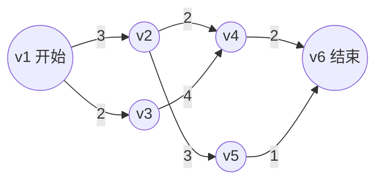

# 关键路径 (Critical Path) & AOE网

> **考研功利化总结**：
> 1.  **必考点**：AOE网定义辨析、关键路径求解（手算4个参数）、关键活动特性（多选题陷阱）。
> 2.  **核心口诀**：**早发生往后推取大，晚发生往前推取小。**
> 3.  **高分陷阱**：多条关键路径时，只缩短一条上的活动无法缩短工期；缩短过度会导致关键变成非关键。

## 一、 AOE网 vs AOV网 (概念速记)

| 特性 | AOV网 (Activity On Vertex) | AOE网 (Activity On Edge) |
| :--- | :--- | :--- |
| **侧重** | 活动之间的**拓扑（先后）关系** | 工程的**时间进度**、最短工期 |
| **顶点(V)** | 表示**活动** (Activity) | 表示**事件** (Event，瞬间发生) |
| **边(E)** | 表示优先关系 | 表示**活动** (持续一段时间，有权值) |
| **权值** | 无（或不重要） | 表示活动持续的时间 |
| **关键点** | 拓扑排序 | 关键路径 |

> [!NOTE] 核心理解
> **事件(顶点)**：比如“番茄切好了” —— 是一个时刻，不消耗时间。
> **活动(边)**：比如“切番茄” —— 是一个过程，消耗时间。

## 二、 核心求解步骤 (不丢分流程)

求解关键路径本质就是求四个参数。假设图有 $n$ 个顶点，源点 $v_1$，汇点 $v_n$。

### 1. 求解四个核心参数

| 参数 | 符号 | 定义 | **计算公式 (背诵)** | 计算顺序 |
| :--- | :--- | :--- | :--- | :--- |
| **事件**最早发生 | $ve(k)$ | 事件 $v_k$ 发生的最早时刻 | $\max\{ve(j) + Weight(j, k)\}$   (所有指向k的前驱事件+边权，取最大) | **从源到汇** (拓扑序) |
| **事件**最迟发生 | $vl(k)$ | 不拖累工期下，事件 $v_k$ 最晚时刻 | $\min\{vl(j) - Weight(k, j)\}$   (所有k指向的后继事件-边权，取最小) | **从汇到源** (逆拓扑序) |
| **活动**最早开始 | $e(i)$ | 边 $a_i = <v_k, v_j>$ 的最早开始 | $= ve(k)$   (起点的最早发生时间) | 算出事件后推导 |
| **活动**最迟开始 | $l(i)$ | 边 $a_i = <v_k, v_j>$ 的最晚开始 | $= vl(j) - Weight(k, j)$   (终点的最迟 - 活动耗时) | 算出事件后推导 |

### 2. 判定关键活动与路径
*   **时间余量**：$d(i) = l(i) - e(i)$
*   **关键活动**：$d(i) = 0$ 的活动（即 $l(i) = e(i)$，活动不能拖延，一拖延整个工期就炸）。
*   **关键路径**：由关键活动组成的从源点到汇点的路径（总权值最大的路径）。

---

## 三、 实例复现 (课程案例 V1-V6)

根据课程STT复现的AOE网逻辑：

### Step 1: 事件(顶点)的最早发生时间 $ve$ (Forward, Max)
*   $ve(1) = 0$
*   $ve(2) = ve(1) + 3 = 0+3 = 3$
*   $ve(3) = ve(1) + 2 = 0+2 = 2$
*   $ve(5) = ve(2) + 3 = 3+3 = 6$
*   $ve(4)$ (有两个前驱 v2, v3):
    *   路径1: $ve(2) + 2 = 3+2 = 5$
    *   路径2: $ve(3) + 4 = 2+4 = 6$
    *   取**最大值**: $ve(4) = 6$
*   $ve(6)$ (有两个前驱 v5, v4):
    *   路径1: $ve(5) + 1 = 6+1 = 7$
    *   路径2: $ve(4) + 2 = 6+2 = 8$
    *   取**最大值**: $ve(6) = 8$ (这也是**整个工期**)

### Step 2: 事件(顶点)的最迟发生时间 $vl$ (Backward, Min)
*   $vl(6) = ve(6) = 8$ (汇点最迟=最早)
*   $vl(5) = vl(6) - 1 = 8-1 = 7$
*   $vl(4) = vl(6) - 2 = 8-2 = 6$
*   $vl(3) = vl(4) - 4 = 6-4 = 2$
*   $vl(2)$ (有两个后继 v5, v4):
    *   路径1 (from v5): $vl(5) - 3 = 7-3 = 4$
    *   路径2 (from v4): $vl(4) - 2 = 6-2 = 4$
    *   取**最小值**: $vl(2) = 4$
*   $vl(1)$ (有两个后继 v2, v3):
    *   路径1: $vl(2) - 3 = 4-3 = 1$
    *   路径2: $vl(3) - 2 = 2-2 = 0$
    *   取**最小值**: $vl(1) = 0$

### Step 3: 找关键活动 ( $e(i) = l(i)$ 或 $vl(终点)-ve(起点)-权值=0$ )

| 活动 | 路径 | 持续 | $e(i)=ve(起)$ | $l(i)=vl(终)-权$ | 余量 $l-e$ | 是否关键? |
| :--- | :--- | :--- | :--- | :--- | :--- | :--- |
| a1 | v1->v2 | 3 | 0 | 4-3=1 | 1 | No |
| **a2** | **v1->v3** | **2** | **0** | **2-2=0** | **0** | **Yes** |
| a3 | v2->v4 | 2 | 3 | 6-2=4 | 1 | No |
| a4 | v2->v5 | 3 | 3 | 7-3=4 | 1 | No |
| **a5** | **v3->v4** | **4** | **2** | **6-4=2** | **0** | **Yes** |
| **a6** | **v4->v6** | **2** | **6** | **8-2=6** | **0** | **Yes** |
| a7 | v5->v6 | 1 | 6 | 8-1=7 | 1 | No |

**结论**：
*   **关键路径**：$v_1 \to v_3 \to v_4 \to v_6$
*   **工期**：8

---

## 四、 985上岸避坑指南 (多选题陷阱)

> [!WARNING] 重点背诵
> 此处内容决定你是否能拿满分，通常在选择题中考察概念辨析。

1.  **关键路径不唯一**：
    *   一个AOE网可能有多条关键路径（总长度相等且均为最长）。
    *   例如：若图中 $v_1 \to v_2 \to v_5 \to v_6$ 也等于8，则这也是关键路径。

2.  **缩短工期的策略**：
    *   **单条关键路径时**：缩短路径上任意一个关键活动的时间，**可以**缩短工期（直到它不再是关键活动）。
    *   **多条关键路径时**：仅缩短其中一条路径上的关键活动，**无法**缩短整个工程的工期（因为其他关键路径长度没变，还是那么长）。
    *   **正确做法**：必须缩短**所有**关键路径上**共有的**关键活动，或者**同时缩短**每一条关键路径上的活动。

3.  **缩短的极限**：
    *   关键活动缩短到一定程度，可能会变成非关键活动（因为别的路径变成了最长）。
    *   **并非**关键活动时间越短，工期越短（有下限）。

4.  **性质总结**：
    *   关键路径上的活动都是关键活动。
    *   关键路径是源点到汇点路径长度**最长**的路径（决定了最短工期）。
    *   关键活动的时间余量为0。
