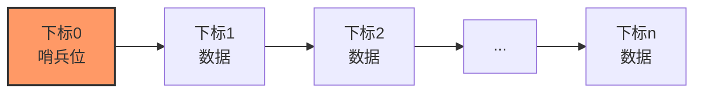
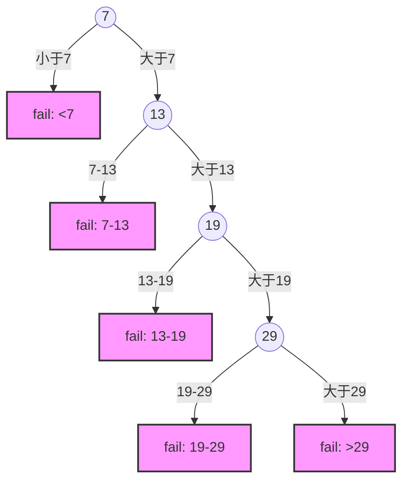

### 一、 算法核心与适用性

> [!summary] 核心思想
> **"暴力枚举"**：从头到尾（或反向）逐个比对。
> - **适用范围**：顺序表、链表（单链/双链）。
> - **有序性要求**：有序、无序均可（有序时可优化失败效率）。
> - **时间复杂度**：$O(n)$。

### 二、 核心代码实现（哨兵法）

**考点**：常规写法需判断 `i` 是否越界及 `key` 是否相等。**哨兵法**通过在下标 `0` 处存目标值，**省去了循环内的下标越界检查**，微调提升效率（但在量级上仍是 $O(n)$）。

**结构可视化**：


**C语言逻辑复现**：
```c
// 假设数据从下标1开始存储，arr[0]为哨兵
int SequentialSearch_Sentinel(int arr[], int n, int key) {
    arr[0] = key; // 1. 设置哨兵，无需判断越界
    int i = n;    // 2. 从后往前查找
    while (arr[i] != key) {
        i--;      // 3. 既然arr[0]==key，循环定会终止
    }
    return i;     // 4. 若返回0，则说明查找失败（原表中无此元素）
}
```

### 三、 查找效率分析（ASL - 平均查找长度）

此部分为**计算题高频考点**，分为无序表与有序表两种情况。

#### 1. 一般情况（无序表/普通顺序查找）

假设每个元素查找概率相等（$P_i = 1/n$）。

*   **查找成功 ($ASL_{success}$)**：
    *   公式：$ASL_{success} = \sum P_i \times C_i = \frac{1+2+...+n}{n} = \frac{n+1}{2}$
    *   **结论**：查找成功平均需要对比一半元素。
*   **查找失败 ($ASL_{failure}$)**：
    *   **不带哨兵**：需对比 $n$ 次（确认遍历完）或 $n+1$ 次（视具体实现而定）。
    *   **带哨兵**：需对比 $n+1$ 次（包含哨兵那一项的对比）。
    *   **量级**：均为 $O(n)$。

#### 2. 优化一：有序表查找（判定树分析）

若表内元素**有序**（如递增），查找失败时可**提前终止**（当 `当前值 > 目标值` 时）。

**查找判定树（Decision Tree）可视化**：
*   **圆形节点**：查找存在的元素（成功）。
*   **方形节点**：虚构的查找失败区间（失败）。



*   **ASL计算关键点**：
    *   **成功**：与无序表相同，仍为 $\frac{n+1}{2}$（因为还是线性扫描）。
    *   **失败**：对于 $n$ 个元素的表，有 $n+1$ 种失败情况（即 $n+1$ 个方形节点）。
    *   **失败ASL公式**：$ASL_{failure} = \frac{\sum (\text{方形节点所在层数} \times 1)}{n+1} = \frac{n}{2} + \frac{n}{n+1}$
    *   *注意*：判定树中方形节点的父节点就是最后一次比较的元素。

#### 3. 优化二：按概率排序

*   **策略**：将查找概率高（常用）的元素排在前面。
*   **效果**：
    *   **优点**：大幅降低 $ASL_{success}$。
    *   **缺点**：破坏了有序性，导致 $ASL_{failure}$ 退化回无序表状态（必须遍历到最后才能确认失败）。
*   **应用**：适用于**查找成功率极高**的场景。

### 四、 避坑指南（Do Not Lose Points）

1.  **代码填空**：如果题目给出的代码有 `arr[0]=key`，务必选填 `return i` 而非 `return -1`，且循环条件通常较短。
2.  **概念辨析**：
    *   顺序查找对存储结构**不敏感**（顺序表、链表算法逻辑一致）。
    *   折半查找（二分）**必须**是顺序存储且有序，**不能**是链表。
3.  **ASL计算**：
    *   遇到"有序表顺序查找失败ASL"题，**画出判定树**数层数是最稳妥的方法，不要死记公式，因为边界条件（如 $>max$ 时比较次数）可能因教材定义微调，画图可破万变。
    *   失败节点的个数永远是 $n+1$。
