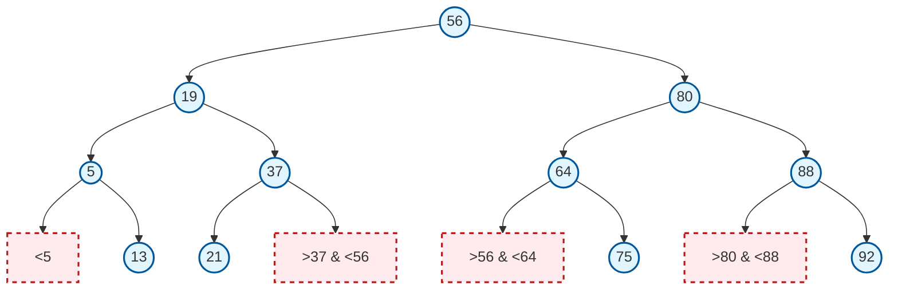

---
tags:
  - 考研
  - 数据结构
  - 查找
  - 算法
  - 二分
priority: 10
difficulty: 6
---

> [!abstract] 核心考点速览
> **折半查找 (Binary Search)** 是考研数据结构查找章节中**性价比最高**的考点。
> 1.  **代码实现**：闭眼能写，注意边界 `low <= high`。
> 2.  **判定树 (重点)**：大题高频点，必须掌握**画法**和**树高**计算。
> 3.  **ASL 计算**：区分查找成功与失败的平均查找长度。
> 4.  **前提**：必须是**有序**的**顺序表** (链表不行)。

## 一、 算法核心与代码模板

### 1. 适用条件 (缺一不可)
*   **有序**：关键字必须按升序或降序排列。
*   **顺序表**：支持随机存取 (数组)，**链表不可用** (链表找中间节点需 $O(n)$，会退化)。

### 2. 标准代码 (C++ 风格)
*请直接背诵，注意注释中的易错点。*

```cpp
int BinarySearch(SeqList L, ElemType key) {
    int low = 0; 
    int high = L.length - 1;
    int mid;
    
    // 易错点1: 必须是 <=，否则当 low==high 时会漏掉元素
    while (low <= high) {
        mid = (low + high) / 2; // 或 mid = (low + high) >> 1;
        
        if (L.elem[mid] == key) {
            return mid; // 查找成功
        }
        else if (L.elem[mid] > key) {
            high = mid - 1; // 易错点2: 左半区，high 要移位
        }
        else {
            low = mid + 1;  // 易错点3: 右半区，low 要移位
        }
    }
    return -1; // 查找失败
}
```

---

## 二、 折半查找判定树 (考研大题杀手锏)

判定树直观反映了查找过程，本质是一棵**平衡二叉排序树 (BST)**。

### 1. 判定树的构造规律 (高频考点)

对于 $n$ 个结点的判定树，其形状由 `mid` 的取整方式决定：

| 取整方式 | 计算公式 | 左右子树结点数特征 | 判定树形态倾向 |
| :--- | :--- | :--- | :--- |
| **向下取整** (主流/默认) | $mid = \lfloor \frac{low+high}{2} \rfloor$ | **右子树结点数 $\ge$ 左子树** <br> ($N_{right} = N_{left}$ 或 $N_{right} = N_{left} + 1$) | 总是向**右**“丰满” |
| **向上取整** | $mid = \lceil \frac{low+high}{2} \rceil$ | **左子树结点数 $\ge$ 右子树** <br> ($N_{left} = N_{right}$ 或 $N_{left} = N_{right} + 1$) | 总是向**左**“丰满” |

> [!tip] 考试技巧：如何快速画出 $n$ 个结点的判定树？
> **(以向下取整为例)**
> 1.  根结点为中间点。
> 2.  若剩余 $N$ (偶数)个结点：左子树分 $N/2 - 1$ 个，右子树分 $N/2$ 个 (右边多)。
> 3.  若剩余 $N$ (奇数)个结点：左右平分。
> 4.  递归重复上述步骤。

### 2. 判定树的性质 (填空/选择必备)
1.  **平衡性**：判定树一定是平衡二叉树，左右子树高度差绝对值 $\le 1$。
2.  **树高**：$h = \lceil \log_2(n+1) \rceil$ (不含失败叶子结点层)。[[5.2.1 二叉树的定义和性质]]
    *   这也是折半查找在**最坏情况**下的比较次数。
3.  **失败结点**：
    *   若有 $n$ 个成功结点 (圆圈)，则有 $n+1$ 个失败结点 (方形/空链域)。
    *   查找失败的比较次数 $\le h$。

---

## 三、 查找效率分析 (ASL)

假设有一棵判定树，层次数为 $1 \sim h$。

### 1. 查找成功 ($ASL_{succ}$)
$$ ASL_{succ} = \frac{1}{n} \sum_{i=1}^{n} (\text{第} i \text{个结点所在的层数}) $$
*   **物理意义**：找到表中存在的元素，平均需要比较多少次。

### 2. 查找失败 ($ASL_{fail}$)
$$ ASL_{fail} = \frac{1}{n+1} \sum_{j=1}^{n+1} (\text{第} j \text{个失败结点(空链域)的父结点层数} + 1) $$
*   **注意**：很多教材将失败结点画在判定树的下一层（作为叶子），此时直接算叶子结点的层数即可。[[5.2.2 二叉树的存储结构]]
*   **物理意义**：表中不存在该元素，确定“不存在”平均需要比较多少次。

### 3. 时间复杂度
*   **平均/最坏**：$O(\log_2 n)$。
*   **对比顺序查找**：$O(n)$。虽然折半通常更快，但**不是绝对** (例如找 mid 位置的元素，折半1次，顺序需 $n/2$ 次；但找第一个元素，顺序1次，折半需 $\log n$ 次)。

---

## 四、 案例复现与可视化 (Obsidian 视图)

假设数组：`[5, 13, 19, 21, 37, 56, 64, 75, 80, 88, 92]` (共11个元素)
`mid = floor((0+10)/2) = 5`，对应元素 `56`。



**ASL 计算演示 (基于上图逻辑)：**
*   **总元素 n=11**
*   **第1层**：1个 (56) $\rightarrow 1 \times 1$
*   **第2层**：2个 (19, 80) $\rightarrow 2 \times 2$
*   **第3层**：4个 $\rightarrow 4 \times 3$
*   **第4层**：4个 $\rightarrow 4 \times 4$
*   $$ ASL_{succ} = \frac{1}{11} (1\times1 + 2\times2 + 4\times3 + 4\times4) = \frac{33}{11} = 3 $$

---

## 五、 避坑指南 (Exam Traps)

1.  **题目陷阱**：“折半查找的平均查找长度一定小于顺序查找？”
    *   **错**。个例不一定，整体效率折半优于顺序。
2.  **代码陷阱**：计算 Mid 时，`low + high` 可能溢出。
    *   虽然考研不严格扣分，但最佳写法是 `mid = low + (high - low) / 2`。
3.  **数据结构陷阱**：
    *   题目：在一个**有序链表**上进行二分查找。
    *   判错：二分查找依赖随机存取，链表不支持，时间复杂度会退化。
4.  **判定树陷阱**：
    *   题目给出序列，问判定树结构。一定要看清题目要求是 `floor` 还是 `ceil` 取整！这直接决定树是左偏还是右偏。
