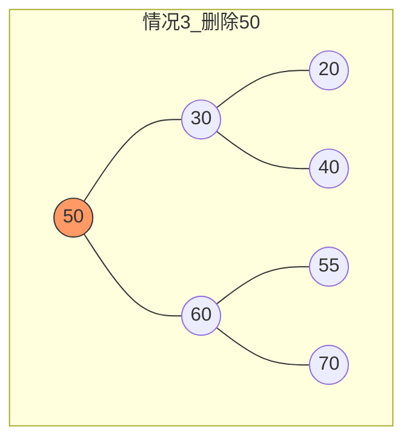
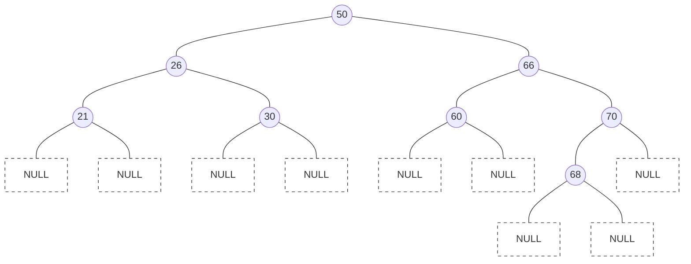

## 核心定义与性质 (The Golden Rules)

**二叉排序树 (BST)**，又称二叉查找树。

1.  **定义（递归）**：
    *   **左**子树所有结点值 < **根**结点值
    *   **根**结点值 < **右**子树所有结点值
    *   左、右子树也分别为二叉排序树
    *   *注意：不允许有重复值（考研标准语境下，除非题目特指）。*

2.  **核心性质（解题万能钥匙）**：
    *   对BST进行**中序遍历 (In-Order Traversal)**，必然得到一个**递增的有序序列**。
    *   *应用：* 验证是否为BST，或已知树形求序列。

---

## 核心操作逻辑 (Operations)

### 1. 查找 (Search)
*   **逻辑**：从根开始，小往左走，大往右走，相等则命中。
*   **复杂度**：
    *   时间：$O(h)$，取决于树高。
        *   最好（平衡）：$O(\log_2 n)$
        *   最坏（单支）：$O(n)$
    *   **空间（易错点）**：
        *   递归实现：$O(h)$ （栈深）
        *   非递归（循环）实现：$O(1)$ **(推荐，效率更高)**

### 2. 插入 (Insert)
*   **逻辑**：先执行查找，若失败（遇到 `NULL`），则在该位置生成新结点。
*   **特性**：新插入的结点**一定是叶子结点**。
*   **代码细节**：C++中指针参数需传引用 `BiTree &T`，否则无法修改指针指向。
*   **构造**：不同的插入序列可能生成不同形状的BST（如 `1,2,3` 生成单支树，`2,1,3` 生成平衡树）。

### 3. 删除 (Delete) - **高频考点**
删除后必须保持BST特性。

*   **情况1：叶子结点**
    *   直接删，双亲指针置空。
*   **情况2：仅有一棵子树 (左或右)**
    *   **子承父业**：让该子树的根直接替代被删结点位置。
*   **情况3：既有左又有右 (最复杂)**
    *   **核心思路**：找一个替身，变为情况1或2。
    *   **方案A (找前驱)**：转入**左**子树，向**右**走到尽头（左子树中最大值）。用该值覆盖目标，然后删除该前驱结点。
    *   **方案B (找后继)**：转入**右**子树，向**左**走到尽头（右子树中最小值）。用该值覆盖目标，然后删除该后继结点。

> **处理策略**：
> *   **前驱法**：找30右下的40替代50，删除原40。
> *   **后继法**：找60左下的55替代50，删除原55。

---

## 效率分析 (ASL - Average Search Length)

这是**计算题丢分重灾区**，请严格按照以下步骤计算。

### 1. 查找成功 ASL ($ASL_{succ}$)
$$ASL_{succ} = \frac{\sum (\text{第}i\text{层结点数} \times i)}{\text{结点总数 } n}$$

### 2. 查找失败 ASL ($ASL_{fail}$)
**通用满分法（补空法）**：
1.  将所有空指针（`NULL`）位置补上方形的“虚结点”。
2.  对于有 $n$ 个结点的BST，必有 $n+1$ 个虚结点。
3.  **注意**：查找失败是指指针指向这些虚结点的时刻。
4.  **计算公式**：
    $$ASL_{fail} = \frac{\sum (\text{虚结点父节点层数} \times \text{该层虚结点数})}{\text{虚结点总数 } (n+1)}$$
    *注：部分教材计算路径长度为“父节点层数”，部分为“父节点层数+1”（视是否包含最后一次判空比较）。**考研408通常按比较次数算，即等于虚结点父节点的层数（最后一次比较确定不相等，指针走向NULL）。** 若题目明确指出比较到NULL才算结束，则为父节点层数。*
    *   **STT课程逻辑校准**：课程中提到“比较1次、2次...”，是指比较关键字的次数。因此，失败长度 = **访问到父节点并确认不匹配的比较次数**。即：虚结点所在的层数 - 1 (如果把虚结点画在下一层)。
    *   **简便口诀**：**失败路径长度 = 查找该路径上最后一个真实结点的比较次数。**

#### 案例复现与计算演示

假设BST结构如下：

*(注：上图G1(68)为70的左孩子，演示不平衡情况)*

**ASL 成功计算**：
*   第1层 (50): 1个 $\times$ 1
*   第2层 (26, 66): 2个 $\times$ 2
*   第3层 (21, 30, 60, 70): 4个 $\times$ 3
*   第4层 (68): 1个 $\times$ 4
*   总数 $n=8$
*   $ASL_{succ} = (1\times1 + 2\times2 + 4\times3 + 1\times4) / 8 = 21/8 = 2.625$

**ASL 失败计算 (关键)**：
*   看所有指向NULL的链：
    *   21的左右空：需比较3次 (50,26,21) -> 2个
    *   30的左右空：需比较3次 -> 2个
    *   60的左右空：需比较3次 -> 2个
    *   68的左右空：需比较5次 (50,66,70,68,NULL) -> 2个
    *   70的右空：需比较3次 -> 1个
*   **修正**：根据图示层级：
    *   21, 30, 60 在第3层。它们的空孩子意味着比较3次后失败。共 $2+2+2=6$ 个空位。
    *   70 在第3层。它的右空孩子意味着比较3次后失败。1个空位。
    *   68 在第4层。它的左右空孩子意味着比较4次后失败。2个空位。
*   $ASL_{fail} = (3 \times 7 + 4 \times 2) / 9 = 29/9 \approx 3.22$

---

## 考研极简避坑指南 (Machiavellian Tips)

1.  **关键字序列 vs 树的形状**：
    *   题目给一个序列 `45, 24, 53...` 让你画树，**严格按照顺序插入**，不要自己排序！第一个数就是根。
    *   *特例*：若题目问“不同的插入序列是否可能生成相同的BST？” **是**。例如 `2, 1, 3` 和 `2, 3, 1`。

2.  **删除的替代点**：
    *   如果题目未指定用前驱还是后继，**通常两种画法都算对**。但选择题若有图，需验证它是用了哪一种。
    *   **技巧**：左子树最右下（前驱），右子树最左下（后继）。

3.  **ASL分母**：
    *   成功ASL分母是 $n$ (真实结点数)。
    *   失败ASL分母是 $n+1$ (空链域数量)。**千万别除以 $n$！**

4.  **最坏情况**：
    *   BST退化成链表时，查找效率为 $O(n)$。为了避免这种情况，引出了下一章的**AVL树（平衡二叉树）**。
