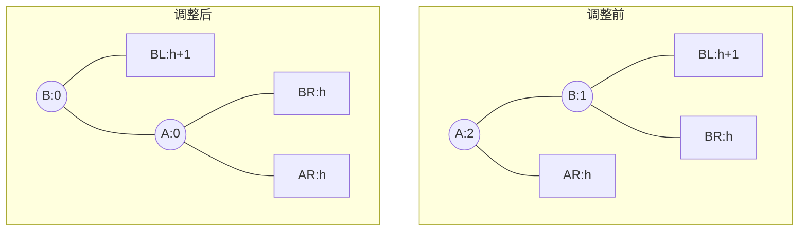
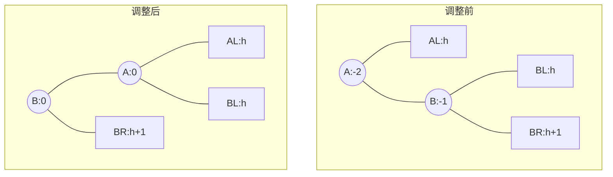
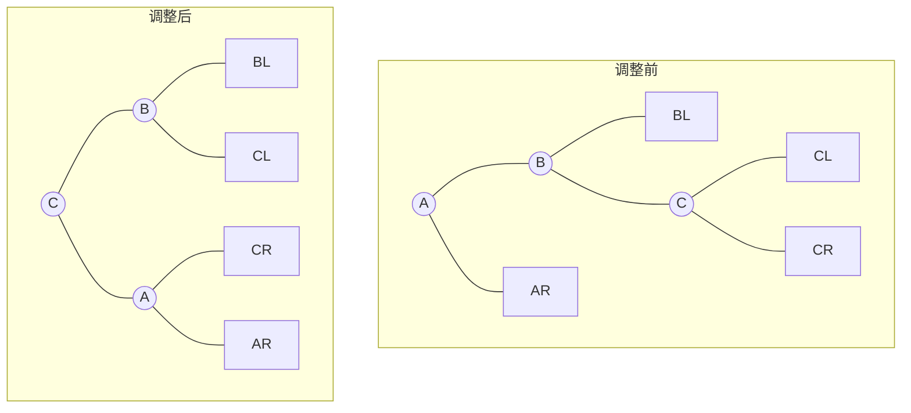

## 1. 核心定义与性质 (必考概念)

*   **定义**：任意结点的**左、右子树高度差的绝对值不超过1**。
*   **平衡因子 (Balance Factor, BF)**：
    $$BF = H_{\text{left}} - H_{\text{right}}$$
    *   **合法值**：$-1, 0, 1$。
    *   **非法值**：$\vert BF \vert > 1$ (绝对值大于1即不平衡)。
    *   *注意*：不要与ASL (平均查找长度) 混淆。
*   **存储结构**：结点结构体中需增加 `balance` 参数。

## 2. 插入与调整策略 (手算重点)

### 2.1 调整原则
1.  **目标**：插入新结点后，若出现不平衡，需调整以保持 $O(\log_2 n)$ 的查找效率。
2.  **定位**：从插入点往上找，找到**第一个**（离插入点最近的）不平衡结点（$\vert BF \vert > 1$）。
3.  **最小不平衡子树**：以该结点为根的子树。
    *   **结论**：只要调整好这棵“最小不平衡子树”，整棵树就会恢复平衡（祖先结点的BF会自动恢复）。

### 2.2 四种调整模型 (死记硬背)

设 **A** 为最小不平衡子树的根结点。

| 类型 | 插入位置描述 | 助记口诀 | 旋转操作 (均指“提拔”谁做根) |
| :--- | :--- | :--- | :--- |
| **LL型** | A的**左**孩子的**左**子树 | 左孩左，**右旋**爹 | **右单旋** (B上位，A变右孩) |
| **RR型** | A的**右**孩子的**右**子树 | 右孩右，**左旋**爹 | **左单旋** (B上位，A变左孩) |
| **LR型** | A的**左**孩子的**右**子树 | 左孩右，**先左后右** | **先左后右双旋** (C上位，B左A右) |
| **RL型** | A的**右**孩子的**左**子树 | 右孩左，**先右后左** | **先右后左双旋** (C上位，A左B右) |

> [!TIP] **极速手算技巧（孙子上位法）**
> *   **LL/RR型**：把中间那个值的结点拎起来当根，两边自动垂下。
> *   **LR/RL型**：把**孙子结点** (C) 拎起来当根，原来的根 (A) 和原来的儿子 (B) 分别做 C 的左右孩子。
> *   **验算铁律**：调整完必须核对 **“左 < 根 < 右”** 的BST性质，否则必错！

### 2.3 旋转过程可视化

#### (1) LL型：右单旋
*   **场景**：在B的左子树($B_L$)插入。
*   **操作**：B右上旋代替A，A右下旋成B右孩。B原右子树($B_R$)挂A左。

#### (2) RR型：左单旋
*   **场景**：在B的右子树($B_R$)插入。
*   **操作**：B左上旋代替A，A左下旋成B左孩。B原左子树($B_L$)挂A右。

#### (3) LR型：先左后右 (孙子C上位)
*   **场景**：在B(A左孩)的右子树插入。
*   **操作**：
    1.  **左旋**：C左上旋取代B。
    2.  **右旋**：C右上旋取代A。
*   **结果**：C是根，B是C左孩，A是C右孩。C的原左子树挂B右，C的原右子树挂A左。

#### (4) RL型：先右后左 (孙子C上位)
*   **场景**：在B(A右孩)的左子树插入。
*   **操作**：
    1.  **右旋**：C右上旋取代B。
    2.  **左旋**：C左上旋取代A。
*   **结果**：C是根，A是C左孩，B是C右孩。

## 3. 代码逻辑 (指针变换简述)

*   **右旋 (RotateRight)**：
    1.  `B->right` 变成 `A->left`
    2.  `A` 变成 `B->right`
    3.  `B` 变成新根 (更新父指针)
*   **左旋 (RotateLeft)**：
    1.  `B->left` 变成 `A->right`
    2.  `A` 变成 `B->left`
    3.  `B` 变成新根 (更新父指针)

## 4. 考点黑盒：最大深度与最少结点数 (选择题必杀)

*   **问题**：给定深度 $h$，求最少结点数 $N_h$？或者给定结点数 $n$，求最大深度？
*   **递推公式**：
    $$N_h = N_{h-1} + N_{h-2} + 1$$
    *   理解：根结点(1) + 左子树最少($h-1$) + 右子树最少($h-2$)。
*   **关键数列 (背诵)**：

| 高度 $h$ | 最少结点数 $N_h$ | 备注 |
| :---: | :---: | :--- |
| 0 | 0 | 空树 |
| 1 | 1 | 只有根 |
| 2 | 2 | 根+1子 |
| 3 | 4 | 1+2+1 |
| 4 | 7 | 2+4+1 |
| 5 | **12** | 4+7+1 |
| 6 | **20** | 7+12+1 |

*   **结论**：
    *   若结点数 $n=9$，最大高度只能是 **4** (因为 $h=5$ 至少要12个结点)。
    *   时间复杂度（平均查找长度）：$O(\log_2 n)$。
