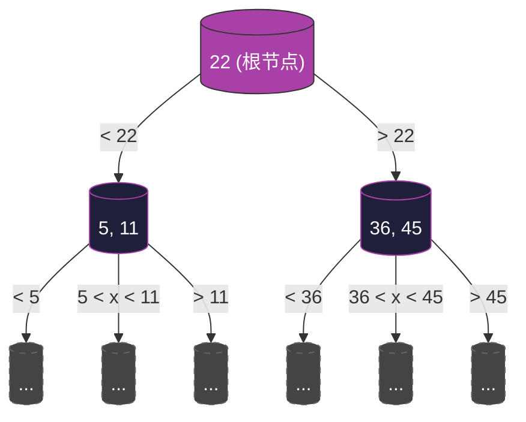

## 核心概念与考情分析

> [!summary] **功利化综述**
> *   **地位**：数据结构“排名前三”的难点，408及自主命题高频考点。
> *   **考查形式**：选择题（性质判定、高度计算）、大题（手算插入/删除/查找）。
> *   **代码要求**：**不考代码**，只考逻辑与手算。
> *   **核心逻辑**：通过**多路**（m叉）降低树高，通过**绝对平衡**保证效率。是“矮胖”的树。

---
![[Pasted image 20260217180101.png]]
## 一、B树的定义与结构 (m阶)

B树（B-Tree）是一种**多路平衡查找树**。
**记忆口诀**：**“m阶B树，根2非根半，所有叶同层”**。

### 1. 节点结构模型
每个节点包含关键字和指向子树的指针，结构如下：
$$ (n, P_0, K_1, P_1, K_2, \dots, K_n, P_n) $$
*   $K_i$：关键字（有序，$\small K_1 < K_2 < \dots < K_n$）。
*   $P_i$：指向子树的指针。
*   $n$：节点中实际关键字的个数。

**区间分割逻辑**：
*   $P_0$ 指向的子树中，所有关键字 $< K_1$。
*   $P_i$ 指向的子树中，所有关键字 $\in (K_i, K_{i+1})$。
*   $P_n$ 指向的子树中，所有关键字 $> K_n$。

### 2. **关键性质表 (背诵重点)**

对于一棵 **m阶** B树：

| 约束维度 | 根节点 (Root) | 非根内部节点 |
| :--- | :--- | :--- |
| **关键字个数 (n)** | $[1, m-1]$ | $[\lceil m/2 \rceil - 1, m-1]$ |
| **子树/分叉个数 (n+1)** | $[2, m]$ | $[\lceil m/2 \rceil, m]$ |

> [!danger] **考研易错概念辨析**
> *   **终端节点 (Terminal Node)**：最底层**含有实际数据**的节点（类似于二叉树的叶子，但在B树中叫终端节点）。
> *   **叶子节点 (Leaf Node)**：**失败节点**，位于终端节点之下，不含任何信息（本质是NULL指针）。
> *   **绝对平衡**：B树中**所有叶子节点（失败节点）必然在同一层**。这与AVL树不同，AVL允许高度差1，B树高度差严格为0。

---

## 二、B树的高度计算 (必考计算题)

假设 B 树含 **n** 个关键字，阶数为 **m**，高度为 **h**（**注意：考研中计算高度h通常不包含叶子节点/失败节点那一层**）。

### 1. 最小高度 $h_{min}$ (让树尽可能的胖)
*   **策略**：让每个节点填满关键字（都有 $m$ 个分叉）。
*   **推导**：
    *   第1层：1个节点 ($m-1$个关键字)
    *   第2层：$m$个节点
    *   ...
    *   总关键字 $n \le (m-1)(1 + m + m^2 + \dots + m^{h-1}) = m^h - 1$
*   **结论公式**：
    $$ h \ge \log_m(n+1) $$
    *(即：$h_{min} = \lceil \log_m(n+1) \rceil$)*

### 2. 最大高度 $h_{max}$ (让树尽可能的瘦)
*   **策略**：让每个节点分叉最少（根2叉，其他 $\lceil m/2 \rceil$ 叉）。
*   **推导**：
    *   令 $k = \lceil m/2 \rceil$。
    *   第1层：1个节点
    *   第2层：2个节点
    *   第3层：$2k$ 个节点
    *   ...
    *   第 $h$ 层：$2k^{h-2}$ 个节点
    *   **叶子节点总数**（第 $h+1$ 层）：$n+1$ 个（n个关键字对应n+1个查找失败的情况）。
    *   $n+1 \ge 2 \cdot (\lceil m/2 \rceil)^{h-1}$
*   **结论公式**：
    $$ h \le \log_{\lceil m/2 \rceil} \frac{n+1}{2} + 1 $$

> [!example] **应试技巧**
> 考试时若记不住公式，**画图推导**比死记硬背更稳。
> 1.  求最小高：全按 $m$ 叉算。
> 2.  求最大高：根2叉，其余全按 $\lceil m/2 \rceil$ 叉算，算出最后能容纳的叶子节点数 ($\ge n+1$)。

---

## 三、B树的查找过程

查找操作由**磁盘I/O**和**内存查找**两部分组成。

1.  **从根出发**：读入节点到内存。
2.  **节点内查找**：
    *   由于关键字有序，可使用**顺序查找**（小规模）或**折半查找**（大规模）。
    *   若找到 $target == K_i$，查找成功。
    *   若 $target \in (K_i, K_{i+1})$，则沿着指针 $P_i$ 读取下一层节点。
3.  **终止条件**：
    *   找到关键字 -> 成功。
    *   遇到叶子节点（NULL/失败节点） -> 失败。

> [!info] **效率分析**
> B树的查找效率取决于**树高**。B树之所以设计成 m 叉，就是为了在数据量巨大时，大幅降低 $h$，从而减少磁盘 I/O 次数。

---

## 四、复习总结与避坑指南

1.  **关于“根节点”的特权**：根节点只要不是叶子，至少有2个孩子（1个关键字）。它不受 $\lceil m/2 \rceil$ 的限制，这是为了允许树从空开始生长。
2.  **关于 $m$ 的选择**：$m$ 通常很大（如1024），这使得B树非常扁平。
3.  **关键字与分叉的关系**：
    *   关键字个数 = 分叉个数 - 1。
    *   记忆：一个萝卜一个坑，关键字是隔板，$n$ 个隔板分出 $n+1$ 个区间。
4.  **失败节点数量**：含有 $n$ 个关键字的B树，必有 **$n+1$** 个叶子节点（失败节点）。（等同于把实轴切成 $n+1$ 段）。

**可视化记忆图 (5阶B树示例)：**

*(注：灰色虚线框代表叶子/失败节点，实际不存储数据，位于同一层)*
