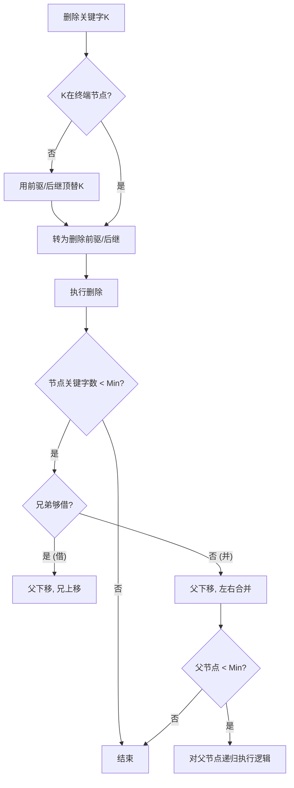

---
tags:
  - 考研
  - 数据结构
  - B树
  - 查找
  - 算法
priority: 10
difficulty: 9
---

## 一、 核心考点提炼 (m阶B树)

> [!important] **考研通关公式 ($m=5$ 为例)**
> **定义域：**
> *   **根节点**关键字数：$[1, m-1]$ (除非树只有一层)
> *   **非根节点**关键字数：$[\lceil m/2 \rceil - 1, m-1]$
> *   **子树指针**数：关键字数 $+ 1$
>
> **本例 (5阶)：**
> *   Max关键字 = $4$
> *   Min关键字 = $\lceil 5/2 \rceil - 1 = 3 - 1 = 2$
> *   **分裂点**：第 $\lceil m/2 \rceil = 3$ 个元素
> *   **特性保持**：左子树 < 根 < 右子树

---

## 二、 B树的插入 (Insertion)

**核心原则：** 新元素一定插入到**最底层的终端节点 (叶子节点)**。

### 1. 插入流程
1.  **查找**：利用B树查找算法确定插入位置。
2.  **插入**：放入终端节点。
3.  **检查分裂 (Overflow)**：
    *   若关键字数 $\le m-1$：结束。
    *   若关键字数 $> m-1$：进行**分裂**。

### 2. 分裂操作 (Split)
*   **触发条件**：节点关键字达到 $m$ 个（本例为5个）。
*   **操作步骤**：
    1.  取第 $\lceil m/2 \rceil$ 个元素（中间元素）。
    2.  **上提**：将中间元素提到**父节点**中。
    3.  **拆分**：原节点剩余部分分裂为左、右两个新节点。
    4.  **递归**：若父节点因此溢出，继续向上分裂。
    5.  **根分裂**：若根节点分裂，树高度 $+1$。

> [!example] **课程案例重现 (m=5)**
> **场景**：节点已有 `[25, 38, 49, 60]`，插入 `80`。
> **状态**：`[25, 38, 49, 60, 80]` (共5个，溢出)。
> **分裂**：
> *   中间位置：$\lceil 5/2 \rceil = 3$，即元素 **49**。
> *   **49** 提拔到父节点。
> *   左节点：`[25, 38]`
> *   右节点：`[60, 80]`
> *   指针连接：父节点 `49` 左指 `[25,38]`，右指 `[60,80]`。

---

## 三、 B树的删除 (Deletion) - **难点**

**核心原则：** 最终必须转换为对**终端节点**的删除。

### 1. 非终端节点的删除
**转化法**：找到待删关键字的**直接前驱**或**直接后继**，用其**顶替**待删元素，然后转为删除那个前驱/后继（它们必然在终端节点）。

*   **找前驱**：左子指针 -> 及其子树中**最右下**的元素。
*   **找后继**：右子指针 -> 及其子树中**最左下**的元素。

> [!example] **案例**
> 删除根节点的 `80`：
> *   **方案A (前驱)**：找左子树最右下元素 `77` -> 用 `77` 覆盖 `80` -> 删除终端节点中的 `77`。
> *   **方案B (后继)**：找右子树最左下元素 `82` -> 用 `82` 覆盖 `80` -> 删除终端节点中的 `82`。

---

### 2. 终端节点的删除 (三种情况)

删除后检查节点关键字数 $n$：
*   **情况A：合法 ($n \ge \lceil m/2 \rceil - 1$)** -> **直接删除**。
*   **情况B：低于下限 ($n < \text{Min}$)** -> **兄弟够借 (Rotation)**。
*   **情况C：低于下限 ($n < \text{Min}$)** -> **兄弟不够借 (Merge)**。

#### 情况A：直接删除
*   删除后关键字个数仍 $\ge 2$ (5阶标准)。
*   **例**：删除 `60`，剩余元素充足，无需调整。

#### 情况B：兄弟够借 (父亲帮忙，兄弟给钱)
**特征**：左或右兄弟节点关键字数有富余（$> \text{Min}$）。
**口诀**：**"父子换位"** —— 父亲下来填坑，兄弟上去顶替父亲。

1.  **借右兄弟**：
    *   **父节点**的后继关键字 -> 下移到当前节点。
    *   **右兄弟**的第一个关键字 -> 上移到父节点。
    *   *注意保持有序性*。
2.  **借左兄弟**：
    *   **父节点**的前驱关键字 -> 下移到当前节点。
    *   **左兄弟**的最后一个关键字 -> 上移到父节点。

> [!example] **案例：借右兄弟**
> *   当前节点删 `38` 后仅剩1个，不够。
> *   右兄弟很富裕。
> *   操作：父节点 `49` 下来，右兄弟的 `70` 上去变成父节点。

#### 情况C：兄弟不够借 (合并 Merge)
**特征**：左右兄弟都穷（关键字数 $= \text{Min}$），借了它们就不够了。
**口诀**：**"三合一"** —— 当前节点 + 父节点夹层关键字 + 兄弟节点 = 新节点。

**操作步骤**：
1.  将**父节点**中夹在两兄弟之间的关键字**拉下来**。
2.  将当前节点、拉下来的关键字、兄弟节点所有关键字**合并**为一个新节点。
3.  **连锁反应**：父节点失去一个关键字，需检查父节点是否低于下限。若低于，递归执行合并操作。
4.  **根节点消亡**：若合并导致根节点关键字为0，删除根节点，合并后的节点成为新根（**树高度 -1**）。

> [!example] **案例：合并**
> *   删除 `49`，当前节点不足。
> *   右兄弟也不够借。
> *   操作：把父节点的 `82` 拉下来，与当前节点及右兄弟合并。
> *   结果：父节点可能因此需要继续与上层合并。

---

## 四、 考研避坑指南 (易错点可视化)

### 1. 逻辑判断流程图

### 2. 关键数值记忆 (5阶B树)
| 属性 | 数值 | 备注 |
| :--- | :---: | :--- |
| Max Keys | **4** | 超过即分裂 |
| Min Keys | **2** | 低于即借/并 |
| Split Index | **3** | 第3个元素上提 |

### 3. 常见陷阱
1.  **分裂方向**：新元素插入导致分裂是**自下而上**的，唯一能增加树高的方式。
2.  **合并方向**：删除导致合并也是**自下而上**的，唯一能降低树高的方式。
3.  **借位细节**：借位时**绝不能**直接把兄弟的关键字拿过来（会破坏左<中<右的B树序），必须经过**父节点中转**。
4.  **查找**：插入前必须先查找，且新关键字永远落在**失败节点**（NULL指针）的上一层，即终端节点。
