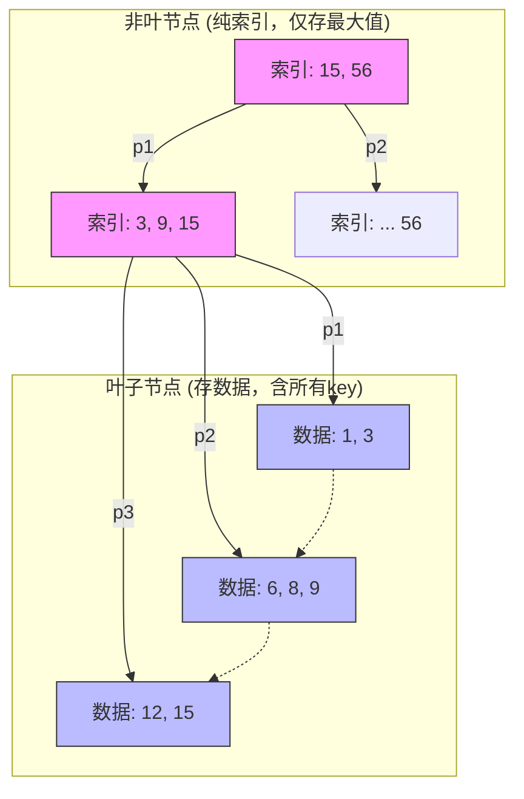

---
tags:
  - 考研
  - 数据结构
  - 查找
  - 树形结构
  - BPlus树
priority: 9
difficulty: 6
---

> [!NOTE] 考研加油站：双非冲985策略
> B+树在408及自主命题中，**极少考察代码实现**，90%的情况考察**选择题（概念辨析、性质比对）**，偶尔涉及**手绘查找/插入过程**。
> 
> **核心拿分策略**：死磕**B树与B+树的差异**，理解其作为**数据库索引**的底层逻辑（减少磁盘I/O）。

### 1. 核心定义与性质 (m阶)

B+树可视作**分块查找**的树形进化版。它满足以下刚性条件（**背诵重点**）：

1.  **节点子树数 = 关键字数**：
    *   若节点包含 $n$ 个关键字，则它有 $n$ 棵子树。（**注意：** B树是 $n$ 个关键字对应 $n+1$ 棵子树）。
2.  **根节点**：
    *   若非叶子，至少有 2 棵子树。
3.  **分支节点（非叶根节点）**：
    *   子树/关键字数量范围：$\lceil m/2 \rceil \le n \le m$。
    *   **作用**：仅作**索引**，不存实际记录的地址，只存关键字和指向子树的指针。
    *   **内容**：包含其子树中关键字的**最大值**（或最小值，视教材而定，STT中为最大值）。
4.  **叶子节点（核心）**：
    *   包含**所有**关键字及指向相应记录的指针。
    *   所有叶子节点从左到右通过**指针链接**成一个单链表（支持顺序查找）。
    *   关键字有序排列。

---

### 2. 结构可视化（逻辑图）

B+树 = **多级分块索引** + **叶子全量链表**

> **直观理解**：
> *   **粉色区域**：目录（索引），为了让你快速找到路。
> *   **蓝色区域**：正文（数据），东西全在这里，且按顺序排好，底部相连。

---

### 3. B树 vs B+树：考研必考差异表 (完全不丢分版)

这是本节最“功利”的内容，**选择题必杀技**。

| 比较维度 | **B树 (B-Tree)** | **B+树 (B+ Tree)** | **记忆口诀/逻辑** |
| :--- | :--- | :--- | :--- |
| **关键字与子树关系** | $n$ 关键字 $\to$ $n+1$ 子树 | **$n$ 关键字 $\to$ $n$ 子树** | B+树一一对应 |
| **节点包含信息** | 关键字 + **数据记录地址** | 分支节点：**仅关键字(索引)** 叶子节点：关键字+数据地址 | B+树分支节点更“轻” |
| **关键字重复性** | 所有节点关键字**不重复** | 分支节点关键字**必在**叶子中重复出现 | B+树叶子包含全集 |
| **查找范围** | 可能在非叶节点命中并结束 | **必须**走到最底层叶子节点 | B+树查找路径长度恒定 |
| **顺序查找支持** | 不支持 (需中序遍历，反复I/O) | **支持** (直接遍历叶子链表) | B+树适合范围查询 (如 `WHERE id > 5`) |
| **查找效率** | 取决于所在的层数 | 稳定（树高） | |

---

### 4. 查找操作逻辑

#### 4.1 随机查找（从根开始）
*   **逻辑**：类似分块查找。
*   **关键点**：即使在分支节点看到了目标关键字（例如找 15，在索引层看到了 15），**不能停！** 必须继续向下，直到找到**叶子节点**中的 15，才能获取数据指针。
*   **失败判定**：必须走到叶子节点层，若未找到才算失败。

#### 4.2 顺序查找（从叶子开始）
*   **逻辑**：利用叶子节点的链表指针 $p$。
*   **场景**：范围查询、全表扫描。直接遍历链表，无视上层索引。

---

### 5. 为什么考研和工程喜欢B+树？(OS结合点)

此部分虽超纲，但有助于理解**应用题**背景：

1.  **树更矮，读盘少**：
    *   磁盘I/O是以**块(Block)**为单位的（如1KB/4KB）。
    *   B+树分支节点**不存数据指针**，只存key，因此一个磁盘块能塞下**更多**的关键字（$m$阶更大）。
    *   $m$ 变大 $\to$ 树高度变低 $\to$ **磁盘I/O次数减少** $\to$ 速度极快。
2.  **范围查询强**：
    *   数据库常需查 `SELECT * FROM table WHERE id BETWEEN 10 AND 100`。
    *   B树需要反复中序遍历（跳跃式I/O）。
    *   B+树只需找到10，然后顺着链表往后跑即可（顺序I/O）。

> [!SUMMARY] 专家总结
> *   **绝对平衡**：所有叶子在同一层。
> *   **一定要到底**：查找无论成败，必达叶子。
> *   **叶子是全集**：所有想找的数据都在叶子层。
> *   **区别记心间**：$n$对$n$（B+） 还是 $n$对$n+1$（B）。
