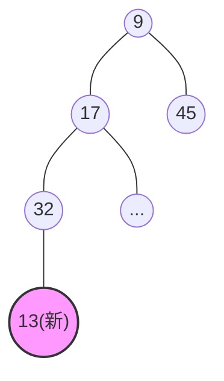

---
tags:
  - 考研
  - 数据结构
  - 树
  - 排序算法
  - 堆排序
priority: 10
difficulty: 7
---

> **🎯 985上岸导读**
> 本节为选择题/大题高频考区。核心绝对不丢分的要求在于：**精准计算关键字对比次数**。考场上不要凭直觉，严格按照“**插入上升比父，删除下坠比子**”的微观操作步骤走。此处以**小根堆**为例（大根堆同理，仅比较符号相反）。

## 一、 堆的插入操作（Insert）
**核心逻辑：表尾插入 $\rightarrow$ 不断上升（Bubble Up）**

### 1. 算法执行步骤
1. **就位**：将新元素直接放入数组末尾（逻辑树的**堆底、表尾**）。
2. **找爹**：当前节点下标为 $i$，其父节点下标为 $\lfloor i/2 \rfloor$。
3. **比爹**：将新元素与父节点对比。
   - 若 **新元素 < 父节点**（小根堆）：两者互换，新元素**上升**。
   - 否则：停止上升，插入完成。
4. **循环**：重复步骤2和3，直到无法上升或到达根节点。

### 2. ⚡ 考场得分点：对比次数计算
- **上升1层 = 对比1次**。
- **陷阱**：插入操作**只和父节点比**，绝对不和兄弟节点比！
- **例证分析**（以插入13为例）：
  - 13插在末尾，父为32 $\rightarrow$ 13 < 32，换！（第1次对比）
  - 13上升，现父为17 $\rightarrow$ 13 < 17，换！（第2次对比）
  - 13上升，现父为9 $\rightarrow$ 13 > 9，停！（第3次对比）
  - **总计对比次数：3次**。

---

## 二、 堆的删除操作（Delete）
**核心逻辑：表尾替代 $\rightarrow$ 不断下坠（Sift Down）**

### 1. 算法执行步骤
1. **摘除**：删除目标节点（通常是根节点，考题也可能让你删中间节点）。
2. **顶包**：将**最底层、最后面（表尾）**的元素移动到被删节点的位置。
3. **下坠（核心调整）**：
   - 找孩子中**最小**的一个（大根堆则找最大的）。
   - 如果 **当前节点 > 最小孩子**：两者互换，当前节点**下坠**。
   - 否则：停止下坠，调整完成。
4. **循环**：重复步骤3，直到无法下坠或成为叶子节点。

### 2. ⚡ 考场得分点：对比次数计算（极易错！）
下坠过程的对比次数，严格取决于当前节点**有几个孩子**。
- **有两个孩子**：每次下坠需要 **2次** 对比。
  - 第1次：左孩子 vs 右孩子（选出更小的一个）。
  - 第2次：当前节点 vs 选出的最小孩子。
- **只有一个孩子（必为左孩子）**：每次下坠需要 **1次** 对比。
  - 第1次：当前节点 vs 左孩子。

**例证分析**（删除节点13，由表尾46顶替并下坠）：
> 初始替换后，46在原13的位置。
- **第1层下坠**：46有两孩子(17和45) $\rightarrow$ 17比45小(**1次**) $\rightarrow$ 46大于17(**1次**)，互换。*(本层累计2次)*
- **第2层下坠**：46下坠后，有两孩子(32和...) $\rightarrow$ 选出最小孩子(**1次**) $\rightarrow$ 46大于32(**1次**)，互换。*(本层累计2次)*
- **总计对比次数：4次**。

---

## 三、 考场图解可视化还原

假设当前小根堆数组（按层序）：`[9, 17, 45, 32, ...]`

### 1. 插入新元素 `13`

*逻辑*：`13`先挂在`32`下面。`13`与其父`32`比(1次)，交换；`13`与其新父`17`比(1次)，交换；`13`与其新父`9`比(1次)，不交换。完毕。

### 2. 删除元素调整
将表尾节点移至空缺处后，必须执行**向下过滤**：

| 节点状态 | 对比对象 | 本次对比次数 | 动作 |
| :--- | :--- | :---: | :--- |
| **存在双子** | 1. 左右子互比   2. 自身与胜出子比 | **2** | 若自身大，则向下交换 |
| **存在单子** | 1. 自身与左子比 | **1** | 若自身大，则向下交换 |
| **叶子节点** | 无 | **0** | 终止调整 |

---

## 🚀 功利复习 CheckList (默诵)
- [ ] 问插入对比次数？答：`上升层数 + 1`（如果没到根节点就停了），或者 `上升层数`（如果一直换到了根节点）。每次比较只看父节点。
- [ ] 问删除对比次数？答：死盯下坠路径！走过双子节点记2次，走过单子节点记1次。
- [ ] 顶包用谁？答：**必须用堆底（表尾）最后一个元素**，绝对不能用树中间的元素去补空！
